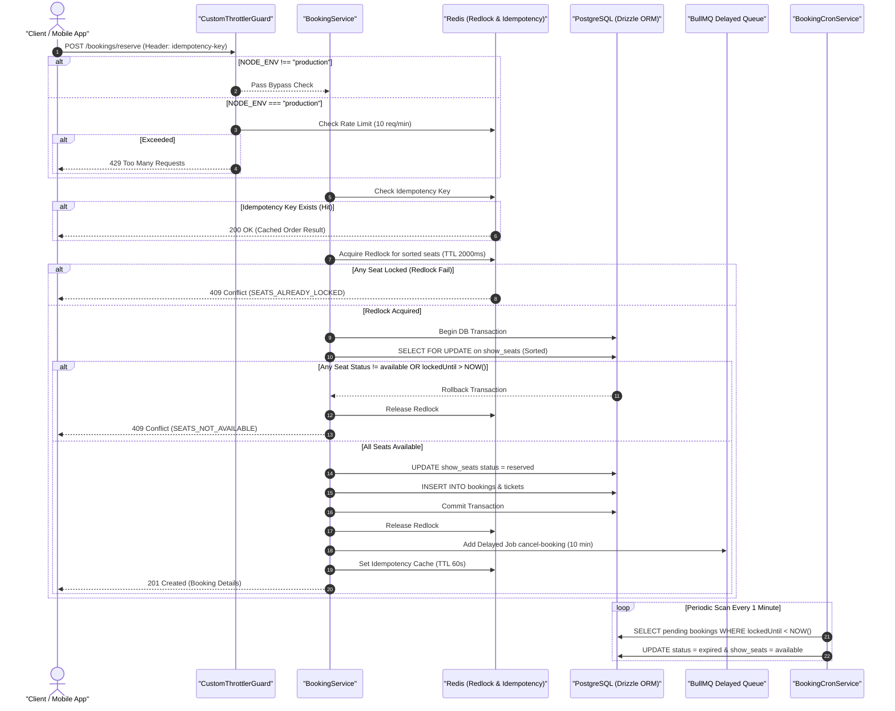

# Core Booking & Concurrency Control SSOT Operational Workflow

---

## Overview & Context

This document is the **Single Source of Truth (SSOT)** describing the operational flow and high-concurrency handling for the Booking module (`src/modules/booking/`).

### State Management & Locking Strategy

- **Layer 1 (RAM Distributed Lock - Redlock)**: Uses Redis key `lock:show_seat:<seatId>` with a 2000ms TTL to block seat contention in memory instantly.
- **Layer 2 (Database Pessimistic Lock - PostgreSQL `FOR UPDATE`)**: Executes inside a DB transaction with seat IDs sorted in ascending order (`[...dto.seatIds].sort()`) to eliminate **Circular Wait (Deadlock)**.
- **Idempotency Buffer**: Uses Redis key `idempotency:booking:<userId>:<key>` with a 60-second TTL.
- **Self-Healing Mechanics**: `BookingCronService` automatically cleans up expired bookings (`lockedUntil` > 10 minutes) and returns seats to `available` status.

---

## Architecture & Work Breakdown Structure (WBS)

| WBS ID | Level 2 (Subsystem) | Level 3 (Component/Task) | Level 4 (Technical Implementation & Boundary) |
| :--- | :--- | :--- | :--- |
| **1.0** | 1.1 DTO & Validation | 1.1.1 ReserveSeatsDto | Validates `@IsUUID("7")`, `@ArrayMinSize(1)`, `@ArrayMaxSize(6)` |
| **1.1** | 1.2 Rate Limiting | 1.2.1 CustomThrottlerGuard | Bypassed in Dev/Test (`NODE_ENV !== "production"`), protects 10 req/min in Prod with 2s timeout |
| **1.2** | 1.3 Concurrency Control | 1.3.1 Seat Sorting | `[...dto.seatIds].sort()` guarantees uniform lexicographical lock order |
| | | 1.3.2 Redlock RAM Layer | Atomic lock `lock:show_seat:<id>` with 2000ms TTL |
| | | 1.3.3 DB Pessimistic Lock | Transaction `SELECT ... FOR UPDATE` on `show_seats` table |
| **1.3** | 1.4 Background Queue | 1.4.1 BullMQ Integration | Pushes 10-minute delayed job for auto-cancellation of expired bookings |
| **1.4** | 1.5 Cron Cleanup | 1.5.1 BookingCronService | Scans and cancels pending bookings with `lockedUntil < NOW()` |

---

## Operational Flow

---

## Technical Decisions & Implementation Details

- **Deterministic Lock Ordering**: Sorting seat IDs (`[...seatIds].sort()`) ensures all concurrent requests lock rows in identical order, avoiding deadlocks.
- **Fail-Safe Fallback**: If Redlock fails or loses Redis connectivity, PostgreSQL pessimistic row locks maintain 100% data consistency.

---

## Security & Defense-in-Depth

- **Layer 1: RAM Redlock Filter**: Intercepts 95%+ of duplicate seat reservation requests before hitting PostgreSQL.
- **Layer 2: PostgreSQL Row-Level Lock**: Guarantees strict transactional atomicity even during Redis failovers.
- **Layer 3: Rate Limiter & Idempotency Key**: Restricts requests to 10 req/min/IP and prevents duplicate transaction processing within 60 seconds.

---

## Verification & Operational Checklist

- [x] Pre-sorting seat IDs prevents PostgreSQL deadlock conditions.
- [x] Redlock release is guaranteed via `finally` blocks.
- [x] Unit tests cover seat lock contention, rate limiting, and idempotency hits.
