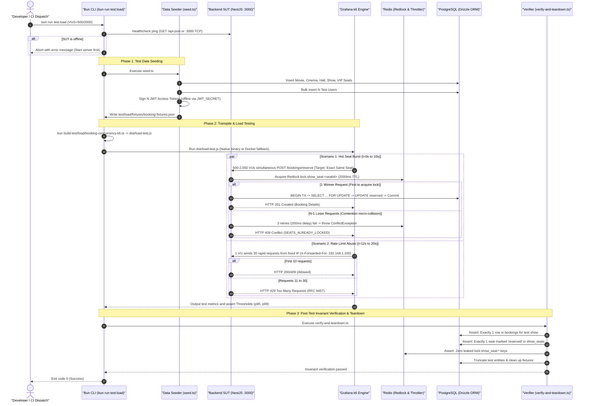

# Booking Load & Stress Testing SSOT Operational Workflow

---

## Overview & Context

This document is the **Single Source of Truth (SSOT)** describing the architecture, operational workflow, test data lifecycle, and metrics verification for the Grafana k6 Load & Stress Testing Suite (`test/load/`) targeting high-concurrency seat reservations (`POST /bookings/reserve`).

### Core Objectives & Concurrency Targets

1. **Mass Contention Stress Simulation**: Simulate 500 to 2,000 Virtual Users (VUs) simultaneously attempting to reserve the exact same VIP seat within a 5-second burst window.
2. **Lock Integrity & Zero Overselling (ACID Validation)**: Strictly verify that Redlock (RAM layer) and PostgreSQL `SELECT ... FOR UPDATE` (Pessimistic DB layer) guarantee:
   - Exactly **1 user receives HTTP 201 Created**.
   - Exactly **$N - 1$ users receive HTTP 409 Conflict** (`SEATS_ALREADY_LOCKED` or `SEATS_NOT_AVAILABLE`).
   - **Zero unhandled HTTP 500 server crashes** or database deadlocks (`40P01`).
3. **Abuse Defense & Rate Limiting Verification**: Verify `CustomThrottlerGuard` triggers `HTTP 429 Too Many Requests` (RFC 9457) when client IPs exceed 10 req/min.
4. **Performance Thresholds**: Assert $p95 \le 700\text{ms}$ (accounting for ADR 0006 Redlock 3-retry delay) and $p99 \le 800\text{ms}$ under peak concurrent burst.

---

## Architecture & Work Breakdown Structure (WBS)

| WBS Code  | Component / Artifact                       | Level             | Technical Implementation & Boundary                                    | Output / Target                                      |
| :-------- | :----------------------------------------- | :---------------- | :--------------------------------------------------------------------- | :--------------------------------------------------- |
| **1.0**   | **Test Data Seeder & Token Factory**       | **L2: Setup**     | TypeScript DB seed script executed via Bun                             | `test/load/seed.ts`                                  |
| **1.1.1** | DAG Fixture Provisioning                   | L3: Logic         | Creates Movie, Cinema, Hall, Seat Type, Seats, Show, ShowSeats         | Database tables                                      |
| **1.1.2** | User Batch Creation & Token Signing        | L3: Logic         | Inserts 500–2,000 users and signs JWT tokens with `JWT_SECRET`         | `test/load/fixtures/booking-fixtures.json`           |
| **2.0**   | **K6 Test Suite & Scenarios**              | **L2: Execution** | TypeScript k6 test script with strong typing                           | `test/load/booking-concurrency.k6.ts`                |
| **2.1.1** | `hot_seat_burst` Scenario                  | L3: Scenario      | `per-vu-iterations` executor (500/2000 VUs, UUIDv7, `X-Forwarded-For`) | Custom metrics & HTTP 201/409                        |
| **2.1.2** | `rate_limit_abuse` Scenario                | L3: Scenario      | `per-vu-iterations` executor (1 VU, 30 reqs, fixed IP)                 | Custom metrics & HTTP 429                            |
| **3.0**   | **Post-Test Invariant Verifier & Cleanup** | **L2: Teardown**  | Post-test verification script inspecting DB state directly             | `test/load/verify-and-teardown.ts`                   |
| **3.1.1** | Database Invariant Assertions              | L3: Validation    | `SELECT count(*) FROM bookings = 1`, `show_seats.status = 'reserved'`  | Invariant report                                     |
| **3.1.2** | Redis Lock & DB Data Teardown              | L3: Cleanup       | Purges Redis `lock:show_seat:*` and deletes test show records          | Clean DB state                                       |
| **4.0**   | **Orchestrator Pipeline & CI/CD**          | **L2: CI/CD**     | Unified npm script and GitHub Actions workflow                         | `package.json` & `.github/workflows/performance.yml` |

---

## Operational Flow



---

## Technical Specifications & Scenarios

### 1. Token Distribution via `SharedArray`

To prevent memory amplification and eliminates false CPU bottlenecks on the Auth service:

- Fixtures are stored in `test/load/fixtures/booking-fixtures.json`.
- Loaded once in the k6 `init` context:
  ```ts
  import { SharedArray } from "k6/data";

  const fixtureData = new SharedArray("fixtures", () => {
    return JSON.parse(open("./fixtures/booking-fixtures.json"));
  });
  ```

### 2. K6 Scenarios & Custom Metrics Definition

```ts
import { Counter, Trend } from "k6/metrics";

export const reserveSuccess201 = new Counter("reserve_success_201");
export const reserveConflict409 = new Counter("reserve_conflict_409");
export const reserveThrottled429 = new Counter("reserve_throttled_429");
export const unexpectedErrors = new Counter("reserve_unexpected_errors");
export const reserveDuration = new Trend("reserve_duration_ms");
```

### 3. Scenario Thresholds

```ts
export const options = {
  scenarios: {
    hot_seat_burst: {
      executor: "per-vu-iterations",
      vus: Number(__ENV.VUS) || 500,
      iterations: 1,
      maxDuration: "10s",
      exec: "hotSeatScenario",
      startTime: "0s",
    },
    rate_limit_abuse: {
      executor: "per-vu-iterations",
      vus: 1,
      iterations: 30,
      maxDuration: "10s",
      exec: "rateLimitScenario",
      startTime: "12s",
    },
  },
  thresholds: {
    reserve_success_201: ["count==1"],
    reserve_conflict_409: [`count==${(Number(__ENV.VUS) || 500) - 1}`],
    reserve_unexpected_errors: ["count==0"],
    "http_req_duration{scenario:hot_seat_burst}": ["p(95)<=700", "p(99)<=800"],
  },
};
```

---

## Security & Test Data Isolation

1. **Offline Token Signing Isolation**:
   - Test JWT tokens are signed locally using ephemeral test users created during the seeding phase, preventing password brute-force or real user credential exposure.
2. **Rate Limiter Bypass Protection**:
   - Production environments strictly enforce `CustomThrottlerGuard` with Redis storage, while load testing scripts use controlled `X-Forwarded-For` injection solely to verify rate limiting thresholds under `trust proxy` configuration.
3. **Deterministic Teardown**:
   - Post-test verification automatically cleans up temporary shows, halls, and bookings to prevent stale test data pollution.

---

## Domain Invariants & Verification Checklist

- [x] **INV-1 (Single Winner)**: Under 500–2,000 concurrent reservation attempts for the exact same seat, strictly 1 request succeeds (HTTP 201).
- [x] **INV-2 (Zero Overselling)**: Database table `bookings` contains exactly 1 booking record for the hot seat, and table `show_seats` contains exactly 1 seat in `reserved` status.
- [x] **INV-3 (Conflict Integrity)**: Exactly $N-1$ competing requests receive HTTP 409 Conflict without causing unhandled HTTP 500 errors or database deadlock exceptions (`40P01`).
- [x] **INV-4 (Rate Limit Protection)**: Excessive requests from a single client IP exceed 10 req/min trigger HTTP 429 Too Many Requests in accordance with RFC 9457.
- [x] **INV-5 (Lock Hygiene)**: All distributed Redis locks (`lock:show_seat:*`) are cleanly released upon transaction completion.
