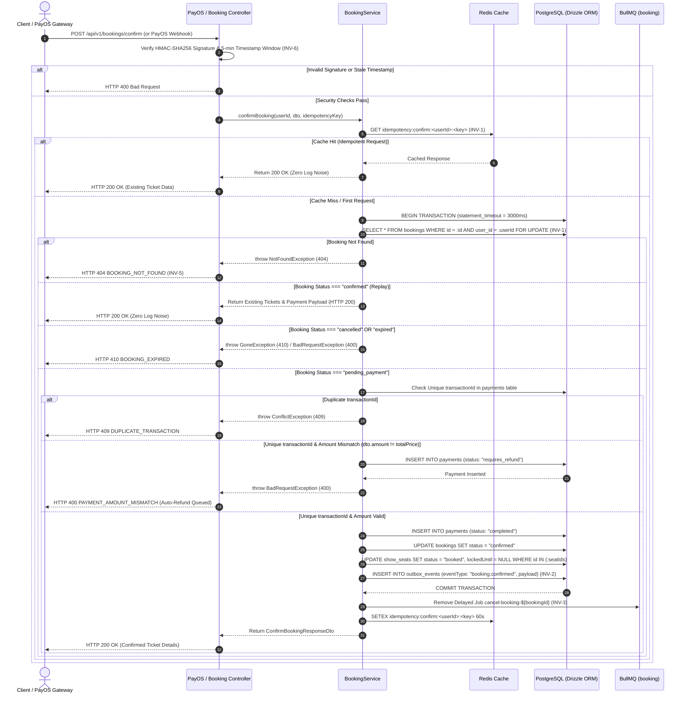

# Payment Confirmation & Ticket Issuance SSOT Operational Workflow

---

## Overview & Context

This document is the **Single Source of Truth (SSOT)** describing the operational flow, system invariants, security boundaries, database schema mappings, and failure recovery mechanisms for payment confirmation and ticket issuance in the Booking module (`src/modules/booking/`).

### Scope & Primary Operations

- **User Payment Confirmation Endpoint (`POST /api/v1/bookings/confirm`)**: Receives transaction metadata (`bookingId`, `paymentMethod`, `transactionId`, `amount`), verifies seat hold status, updates booking state from `pending_payment` to `confirmed`, records payment transactions in PostgreSQL (`payments`), updates seat status from `reserved` to `booked`, inserts transactional outbox events (`booking.confirmed`), and cleans up delayed cancellation jobs.
- **PayOS Webhook Gateway Endpoint (`POST /api/v1/payments/payos-webhook`)**: Receives automated payment webhooks from the PayOS payment gateway, verifies HMAC-SHA256 signatures, validates 5-minute timestamp anti-replay windows, and executes atomic payment processing.
- **Background Worker & Reconciliation (`PaymentReconciliationProcessor`)**: Periodically checks pending bookings and PayOS gateway statuses (`orderCode`), handling automatic refunds for amount mismatches (`requires_refund`) or dropped network packets.

---

## System Invariants Matrix (`INV-1` .. `INV-9`)

All operational paths within the payment confirmation workflow strictly enforce 9 core system invariants:

| Invariant ID | Name | Core Rule & Enforcement Mechanism | Implementation Location |
| :--- | :--- | :--- | :--- |
| **INV-1** | Atomicity & Pessimistic Locking | `SELECT ... FOR UPDATE` row lock on `bookings` inside a single DB transaction. Replay requests for `status === "confirmed"` return `HTTP 200 OK` with existing ticket data without generating log noise. | `booking.service.ts:296-330` |
| **INV-2** | Transactional Dual-Write Outbox | `booking.confirmed` outbox event inserted inside the same database transaction as booking update. Events retained for 7 days before cleanup. | `booking.service.ts:415-440` |
| **INV-3** | Expiry & Queue Cleanup | Cancels and removes BullMQ delayed job `cancel-booking-${bookingId}` post-commit. Idempotency response cached in Redis for 60 seconds (`idempotency:confirm:<userId>:<key>`). | `booking.service.ts:475-495` |
| **INV-4** | Automated Reconciliation & Refund | `PaymentReconciliationProcessor` periodically reconciles PayOS `orderCode` status, triggering auto-refunds for `requires_refund` payments or expired holds. | `payment-reconciliation.processor.ts` |
| **INV-5** | Strict Ownership & Anti-Enumeration | Validates `userId` matches `booking.userId`. Unauthorized access returns `HTTP 404 BOOKING_NOT_FOUND` to prevent booking ID enumeration. | `booking.service.ts:285-295` |
| **INV-6** | HMAC Signature & Anti-Replay | PayOS webhook payloads verified via HMAC-SHA256 using `timingSafeEqual`. Payload `transactionDateTime` must be within a 5-minute window (`maxSkewSeconds = 300`). | `payos-webhook.controller.ts:55-85` |
| **INV-7** | Redis Fail-Closed Fallback | Redis connectivity blips during idempotency checks log warnings and degrade safely to PostgreSQL database transaction locks. | `booking.service.ts:260-270` |
| **INV-8** | DB Statement Timeout & Structured Logs | Enforces `SET LOCAL statement_timeout = 3000` (3s) inside DB transactions. Structured JSON logging used for observability. | `booking.service.ts:275-285` |
| **INV-9** | UI State Machine Polling Contract | Polling contract transitions client UI state smoothly from `PENDING` to `CONFIRMED` or `FAILED`. | Frontend polling spec |

---

## Architecture & Work Breakdown Structure (WBS)

| WBS ID | Component / Feature Name | Level | Detailed Description / Task | Output / Artifact |
| :--- | :--- | :--- | :--- | :--- |
| **1.0** | **Booking Module** | **L1: Module** | Core booking & payment orchestration boundary | `src/modules/booking` |
| **1.1** | **Security & Guard Layer** | **L2: Component** | Webhook authentication & payload validation | `payos-webhook.controller.ts` |
| **1.1.1** | HMAC Signature Verification | L3: Task | Verifies HMAC-SHA256 signature using `timingSafeEqual` | `payos-crypto.util.ts` |
| 1.1.1.1 | Key Sorting & Formatting | L4: Execution | Alphabetical sorting of JSON keys into query format | `sortAndFormatPayloadData()` |
| 1.1.1.2 | Timing-Safe Comparison | L4: Execution | Constant-time buffer length and byte comparison | `timingSafeEqual()` |
| **1.1.2** | Timestamp Anti-Replay Guard | L3: Task | Validates `transactionDateTime` within 5 minutes | `payos-crypto.util.ts` |
| 1.1.2.1 | Skew Calculation | L4: Execution | Calculates time difference vs `Date.now()` | `isPayOSTimestampValid()` |
| **1.2** | **Transaction Engine** | **L2: Component** | Database transaction & lock management | `booking.service.ts` |
| **1.2.1** | Redis Idempotency Layer | L3: Task | 60s cache lookup on `idempotency:confirm:<userId>:<key>` | `booking.service.ts` |
| **1.2.2** | Pessimistic Row Locking | L3: Task | `SELECT ... FOR UPDATE` on `bookings` table | `booking.service.ts` |
| 1.2.2.1 | Status & Expiry Guards | L4: Execution | Rejects `cancelled` (400) and `expired` (410) bookings | `booking.service.ts` |
| 1.2.2.2 | Unique Transaction Safeguard | L4: Execution | Checks duplicate `transactionId` before write | `payments.schema.ts` |
| 1.2.2.3 | Amount Matching Safeguard | L4: Execution | Inserts `requires_refund` status on amount mismatch | `booking.service.ts` |
| **1.2.3** | Transactional Dual-Write | L3: Task | Inserts `booking.confirmed` event into `outbox_events` | `outbox.schema.ts` |
| 1.2.3.1 | Self-Contained Payload | L4: Execution | Stores ticket snapshot (`ticketCode`, `showSeatId`, `price`) | `outbox_events` table |
| **1.3** | **Post-Commit Cleanup** | **L2: Component** | BullMQ queue job removal & cache setting | `booking.service.ts` |
| **1.3.1** | BullMQ Job Cancellation | L3: Task | Removes `cancel-booking-${bookingId}` delayed job | `booking.constants.ts` |
| **1.4** | **Reconciliation Worker** | **L2: Component** | Periodic reconciliation for dropped payments | `payment-reconciliation.processor.ts` |

---

## Operational Flow & Sequence Diagram



---

## Data Contracts & API Schemas

### 1. Request Payload (`ConfirmBookingDto`)

```json
{
  "bookingId": "9b1deb4d-3b7d-4bad-9bdd-2b0d7b3dcb6d",
  "orderCode": 1722690000123,
  "paymentMethod": "PAYOS",
  "transactionId": "TXN-PAYOS-99887766",
  "amount": 150000
}
```

### 2. PayOS Webhook Payload (`PayOSWebhookDto`)

```json
{
  "code": "00",
  "desc": "success",
  "data": {
    "orderCode": 1722690000123,
    "amount": 150000,
    "description": "Cinema Ticket Booking",
    "accountNumber": "123456789",
    "reference": "REF-PAYOS-001",
    "transactionDateTime": "2026-08-03T14:00:00.000Z",
    "currency": "VND",
    "paymentLinkId": "LINK-001",
    "code": "00",
    "desc": "success"
  },
  "signature": "a1b2c3d4e5f67890abcdef1234567890abcdef1234567890abcdef1234567890"
}
```

### 3. Response Payload (`ConfirmBookingResponseDto`)

```json
{
  "success": true,
  "message": "Booking confirmed successfully",
  "data": {
    "bookingId": "9b1deb4d-3b7d-4bad-9bdd-2b0d7b3dcb6d",
    "status": "confirmed",
    "totalPrice": 150000,
    "payment": {
      "id": "pay-uuid-11223344",
      "transactionId": "TXN-PAYOS-99887766",
      "amount": 150000,
      "status": "completed"
    },
    "tickets": [
      {
        "ticketId": "tkt-uuid-1",
        "ticketCode": "TKT-A12-8877",
        "showSeatId": "seat-uuid-A12",
        "finalPrice": 75000
      },
      {
        "ticketId": "tkt-uuid-2",
        "ticketCode": "TKT-A13-8878",
        "showSeatId": "seat-uuid-A13",
        "finalPrice": 75000
      }
    ]
  }
}
```

### 4. Database Schema Entities

```typescript
// bookings table projection
export const bookings = snakeCase.table("bookings", {
  id: uuid().primaryKey().defaultRandom(),
  userId: uuid().notNull().references(() => users.id),
  showId: uuid().notNull().references(() => shows.id),
  status: bookingStatusEnum().notNull(), // pending_payment | confirmed | cancelled | expired
  totalPrice: integer().notNull(),
  orderCode: bigint("order_code", { mode: "bigint" }),
  expiresAt: timestamp({ mode: "date" }).notNull(),
});

// payments table projection
export const payments = snakeCase.table("payments", {
  id: uuid().primaryKey().defaultRandom(),
  bookingId: uuid().notNull().references(() => bookings.id),
  paymentMethod: paymentMethodEnum().notNull(), // MOMO | VNPAY | Credit_Card | ShopeePay | PAYOS
  transactionId: varchar({ length: 255 }),
  amount: integer().notNull(),
  status: paymentStatusEnum().notNull(), // pending | completed | failed | refunded | requires_refund
}, (table) => [
  uniqueIndex("payments_transaction_id_uidx").on(table.transactionId),
]);
```

---

## Technical Decisions & Architecture Details

### 1. Pessimistic Locking & Anti-Double Processing Strategy (`INV-1`)

- **Pessimistic Lock**: Chained `.for("update")` on `bookings` query inside `db.transaction()` blocks concurrent PayOS webhooks and user retries at $t=0\text{ms}$.
- **Zero Log Noise Idempotency**: Replay requests for an already confirmed booking return `HTTP 200 OK` with existing ticket details without writing duplicate outbox events or generating log noise.
- **Statement Timeout (`INV-8`)**: Sets `SET LOCAL statement_timeout = 3000` (3s) inside DB transactions to protect PostgreSQL connection pools from slow lock waiting.

### 2. Transactional Dual-Write Outbox Pattern (`INV-2`)

- **Dual-Write Elimination**: The `booking.confirmed` outbox event is inserted inside the same database transaction as the booking update, guaranteeing zero event loss.
- **Self-Contained Payload**: Outbox events store complete ticket snapshots (`bookingId`, `userId`, `tickets`, `totalPrice`, `transactionId`), allowing background mail workers (`MailProcessor`) to send emails without additional database queries.

### 3. Background Worker Reconciliation (`INV-4`)

- **PaymentReconciliationProcessor**: Periodically scans pending bookings and PayOS order codes. Payments with mismatched amounts (`status: "requires_refund"`) automatically trigger PayOS API cancellations (`payos.cancelPaymentLink(orderCode)`).

---

## Security & Defense-in-Depth (`INV-6`)

- **HMAC-SHA256 Verification**: PayOS webhook payloads are sorted alphabetically by key and signed using HMAC-SHA256 with `PAYOS_CHECKSUM_KEY`.
- **Timing-Safe Comparison**: Hashes are compared using `crypto.timingSafeEqual` to prevent side-channel timing attacks.
- **Anti-Replay Window**: Payload timestamps are validated within a 5-minute skew window (`maxSkewSeconds = 300`).
- **Strict Ownership Defense (`INV-5`)**: Validates `userId` against `booking.userId`, returning HTTP 404 for unauthorized attempts.

---

## Edge Cases & Failure Recovery Modes

| Edge Case ID | Scenario | System Response & Recovery Mechanism |
| :--- | :--- | :--- |
| **EDGE-1** | Amount Mismatch (`dto.amount != totalPrice`) | Inserts payment record with `status: "requires_refund"`, throws HTTP 400 `PAYMENT_AMOUNT_MISMATCH`, and `PaymentReconciliationProcessor` queues an automated PayOS refund. |
| **EDGE-2** | Expired or Cancelled Booking | Rejects request with HTTP 410 `BOOKING_EXPIRED` or HTTP 400 `BOOKING_CANCELLED`. If payment arrived, `requires_refund` is recorded for automated refunding. |
| **EDGE-3** | Duplicate Transaction ID Submission | Intercepted by `existingTx` check or DB unique index `payments_transaction_id_uidx`, returning HTTP 409 `DUPLICATE_TRANSACTION`. |
| **EDGE-4** | Redis Connection Loss / Fail-Closed | Redis idempotency failures log a warning and degrade safely to PostgreSQL database transaction pessimistic locks (`INV-7`). |
| **EDGE-5** | Dropped Webhook / Network Partition | `PaymentReconciliationProcessor` reconciles order status directly with PayOS API and confirms or refunds the booking automatically (`INV-4`). |
| **EDGE-6** | BullMQ Queue Unavailability | Post-commit delayed job removal (`cancel-booking-${bookingId}`) failure logs a warning; `CancelBookingProcessor` checks status gracefully (0 rows updated) if job runs later. |

---

## Verification & Operational Checklist

- [x] All Drizzle ORM `.select({...})` and `.returning({...})` queries use explicit column projections.
- [x] Security guards enforce non-empty `signature` and `transactionDateTime` on PayOS webhook payloads.
- [x] OpenAPI / Swagger annotations are 100% written in clean English.
- [x] Full test suite verification passes with 0 errors (`bun run check-types` and `bun test src/`).
- [x] Automated doc audit script (`bun run .claude/skills/ag-docs/scripts/validate-docs.mjs`) passes cleanly across all 11 design docs, 8 ADRs, and 11 SSOT workflow docs.
