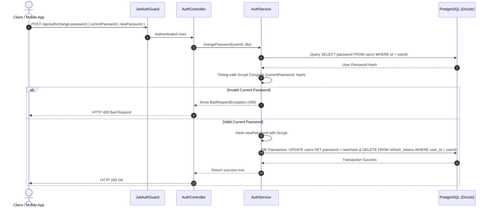

# Change Password Workflow Spec

---

## Overview & Context

This document describes the operational flow for changing passwords of authenticated users. The process verifies the current password using timing-safe Scrypt comparison, updates the new hashed password, and revokes all active Refresh Tokens (logging out all sessions) for account security.

---

## Architecture & Work Breakdown Structure (WBS)

| WBS ID | Component / Feature Name | Level | Detailed Description / Task | Output / Artifact |
| :--- | :--- | :--- | :--- | :--- |
| **1.0** | **Auth Module** | **L1: Module** | Authentication & security management | `src/modules/auth` |
| **1.1** | **Change Password** | **L2: Feature** | Change password & revoke all active sessions | `POST /api/auth/change-password` |
| **1.1.1** | **Verify & Revoke** | **L3: Logic** | Verify current password & delete all refresh tokens | `AuthService.changePassword()` |

---

## Operational Flow

---

## Technical Decisions & Implementation Details

- **Scrypt Password Hashing**: Password hashing uses native `crypto.scrypt` with random salt per password.
- **Atomic Session Invalidation**: Deleting all user refresh tokens inside the DB transaction ensures instant global logout across all devices upon password change.

---

## Security & Defense-in-Depth

- **Auth Guard Enforcement**: Requires `JwtAuthGuard` Bearer token authentication.
- **Timing-Safe Verification**: Verifies current password using timing-safe comparisons to prevent timing attacks.
- **Global Session Revocation**: Deletes all active Refresh Tokens for the user to invalidate existing sessions across devices.

---

## Verification & Operational Checklist

- [x] Incorrect current password returns HTTP 400 Bad Request.
- [x] Successful password change revokes all active refresh tokens in PostgreSQL.
- [x] Unit tests verify timing-safe comparison and transaction atomicity.
