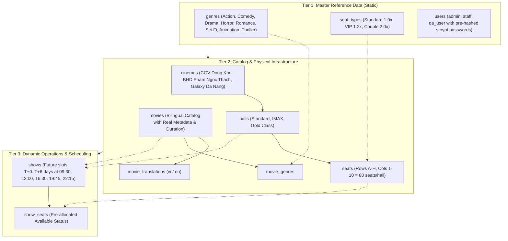
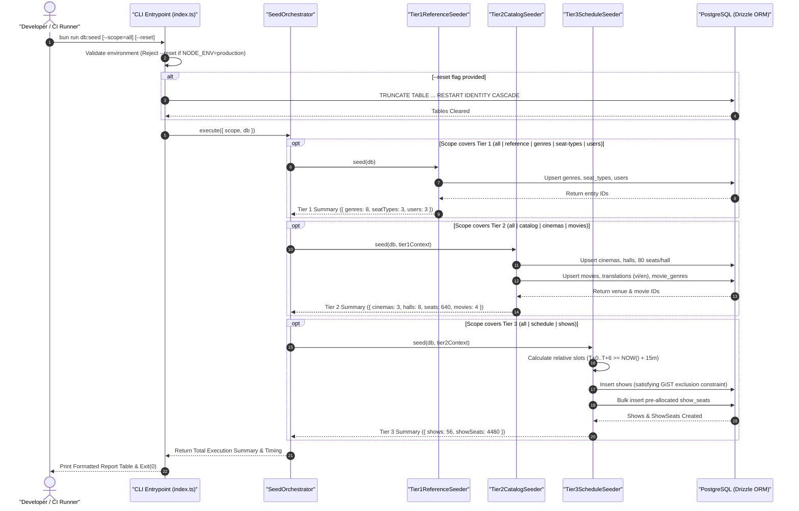

# Database Seeding Engine SSOT Operational Workflow

---

## Overview & Context

This document serves as the **Single Source of Truth (SSOT)** describing the architecture, operational flows, idempotency mechanisms, and tiered execution model for the Typesafe Database Seeding Engine (`src/database/seeds/`).

The Seeding Engine is an internal CLI tool and programmatic module designed to reliably populate development, staging, CI/CD, and local demo environments with realistic, relational cinema booking data (Master Reference Data, Bilingual Movies, Vietnamese Cinemas, Halls, Physical Seat Matrix, and Dynamic Relative Future Showtimes).

---

## Architectural Fundamentals & Design Decisions

### 1. 3-Tier DAG Execution Model

Data insertion follows a strict topological dependency order (Directed Acyclic Graph) to satisfy Foreign Key constraints:

### 2. Database-First ID Generation & Relation Chaining

- **ID Generation**: All primary keys (`id`) and timestamp columns (`createdAt`, `updatedAt`) are delegated to PostgreSQL / Drizzle default generators (`uuidv7`, `defaultNow()`).
- **Relation Chaining**: When seeding parent tables (`cinemas`, `movies`, `halls`, `shows`), operations leverage Drizzle `.returning({ id: ... })` (or natural key lookups on existing rows) to capture live database identifiers in memory and inject them directly into child foreign key references (`halls.cinemaId`, `seats.hallId`, `shows.hallId`, `show_seats.showId`).

### 3. Idempotency & Conflict Resolution

- **Tables with Natural Unique Constraints**:
  - `genres.name` $\rightarrow$ `onConflictDoNothing({ target: genres.name })`
  - `seat_types.name` $\rightarrow$ `onConflictDoNothing({ target: seatTypes.name })`
  - `users.email` $\rightarrow$ `onConflictDoUpdate({ target: users.email, set: { ... } })`
  - `movies.tmdbId` $\rightarrow$ `onConflictDoNothing({ target: movies.tmdbId })`
  - `seats.(hallId, seatNumber)` $\rightarrow$ `onConflictDoNothing({ target: [seats.hallId, seats.seatNumber] })`
  - `show_seats.(showId, seatId)` $\rightarrow$ `onConflictDoNothing({ target: [showSeats.showId, showSeats.seatId] })`
- **Tables without Natural Unique Constraints** (`cinemas`, `halls`):
  - Traversal checks if entity with matching natural attributes exists (`SELECT id FROM cinemas WHERE name = :name AND city = :city`); if present, reuses the existing ID; otherwise, performs `INSERT`.

### 4. Dynamic Show Scheduling & Invariant Compliance (`INV-1`)

- **Future Time Invariant (`INV-1`)**: The seeder generates showtimes dynamically relative to the execution timestamp:
  - Spans 7 days ($T+0 \to T+6$).
  - For $T+0$ (today), only schedules slots where $\text{startTime} \ge \text{NOW}() + 15\text{ minutes}$.
  - Daily fixed slots: `09:30`, `13:00`, `16:30`, `19:45`, `22:15` (Asia/Ho_Chi_Minh UTC+7, persisted as UTC `timestamptz`).
- **PostgreSQL GiST Exclusion Collision Safety**:
  - Before inserting new relative showtimes, existing showtimes for seed halls are inspected. If conflicting slots exist, conflicting or expired past slots are pruned or skipped to prevent `no_hall_schedule_overlap` exclusion constraint violations.

### 5. CLI Interface & Environment Gating

- **CLI Usage**: `bun run db:seed [options]` (or `doppler run -- bun src/database/seeds/index.ts [options]`).
- **Options**:
  - `--scope=all|genres|seat-types|users|cinemas|movies|shows` (Default: `all`).
  - `--reset`: Truncates all transactional and catalog tables before seeding (`TRUNCATE ... RESTART IDENTITY CASCADE`).
  - `--help`: Displays CLI usage and option details.
- **Production Guard**: If `NODE_ENV === "production"` or the target database host indicates a production instance, `--reset` immediately halts with a fatal exit code (`process.exit(1)`).

---

## Architecture & Work Breakdown Structure (WBS)

| WBS Code | Component / Module         | Level             | Description / Task                                                                | Output / Artifact                                     |
| :------- | :------------------------- | :---------------- | :-------------------------------------------------------------------------------- | :---------------------------------------------------- |
| **1.0**  | **Database Seeding Core**  | **L1: Engine**    | Typesafe seeding infrastructure and CLI runner                                    | `src/database/seeds/`                                 |
| **1.1**  | **Constants & Fixtures**   | **L2: Data**      | Curated realistic master data and password hashes                                 | `src/database/seeds/data/`, `constants/`              |
| 1.1.1    | Seed Constants             | L3: Config        | Password hashes, static slot times, batch chunk sizes                             | `src/database/seeds/constants/seed.constant.ts`       |
| 1.1.2    | Reference Fixtures         | L3: Fixtures      | Master genres, seat types, default system users (admin/staff/user)                | `src/database/seeds/data/reference.data.ts`           |
| 1.1.3    | Catalog Fixtures           | L3: Fixtures      | Authentic VN Cinemas (HCM, HN, DN), Hall types, Movies + Translations (`vi`/`en`) | `src/database/seeds/data/catalog.data.ts`             |
| **1.2**  | **Tiered Seeders**         | **L2: Execution** | Modular execution logic per domain tier                                           | `src/database/seeds/tiers/`                           |
| 1.2.1    | Tier 1 Seeder (Reference)  | L3: Seeder        | Seed `genres`, `seat_types`, `users` with upsert idempotency                      | `src/database/seeds/tiers/tier1-reference.seeder.ts`  |
| 1.2.2    | Tier 2 Seeder (Catalog)    | L3: Seeder        | Seed `cinemas`, `halls`, `seats` ($8 \times 10$ matrix), `movies`, translations   | `src/database/seeds/tiers/tier2-catalog.seeder.ts`    |
| 1.2.3    | Tier 3 Seeder (Schedule)   | L3: Seeder        | Generate dynamic relative $T+0 \to T+6$ `shows` and bulk preallocate `show_seats` | `src/database/seeds/tiers/tier3-schedule.seeder.ts`   |
| **1.3**  | **Orchestrator & CLI**     | **L2: Runner**    | CLI entrypoint, argument parsing, environment safety guard, and reporting         | `src/database/seeds/index.ts`, `seed.orchestrator.ts` |
| 1.3.1    | Seed Orchestrator          | L3: Pipeline      | Coordinates DAG execution, measures execution timing, returns structured summary  | `src/database/seeds/seed.orchestrator.ts`             |
| 1.3.2    | CLI Entrypoint             | L3: CLI           | Parses `--scope` and `--reset`, provides colored CLI logging and error formatting | `src/database/seeds/index.ts`                         |
| **1.4**  | **Verification & Quality** | **L2: Tests**     | Integration test asserting data integrity, idempotency, and schedule validity     | `test/integration/database-seeding.spec.ts`           |
| 1.4.1    | Seeding Integration Test   | L3: Quality       | Verifies row creation, FK integrity, consecutive run idempotency, and `INV-1`     | `test/integration/database-seeding.spec.ts`           |
| 1.4.2    | Package Scripts & Docs     | L3: Config        | Add `"db:seed"` to `package.json` and document usage in `README.md`               | `package.json`, `README.md`                           |

---

## Operational Flow

---

## Security & Reliability

### 1. Production Environment Guard

- **Immediate Abort on Production**: Before opening any database connection or executing any queries, the seeder evaluates `NODE_ENV === "production"`. If matched, the process throws a diagnostic error and exits immediately with `process.exit(1)`.
- **Database Target Inspection**: The connection string / host is inspected for production database endpoints to prevent accidental execution against live production instances.
- **Destructive Truncation Protection**: The `--reset` flag is strictly forbidden outside local development and isolated test runner environments.

### 2. Pre-computed Cryptographic Credentials

- System seed accounts (`admin@ticketbooking.com`, `staff@ticketbooking.com`, `user@ticketbooking.com`) use verified, pre-computed Scrypt password hashes matching the production `CryptoUtil` specification (ADR 0007).
- Zero cleartext password storage or unhashed passwords persisted to the database.

### 3. Reliability & Idempotency Invariants

- **Idempotent Upserts**: Repeated executions do not create duplicate rows or corrupt foreign key relationships.
- **Deterministic Fail-Fast**: If a scoped seed command is run for a child entity (e.g. `--scope=shows`) when parent prerequisite tables (`movies`, `halls`) are empty, execution fails fast with an actionable diagnostic message.
