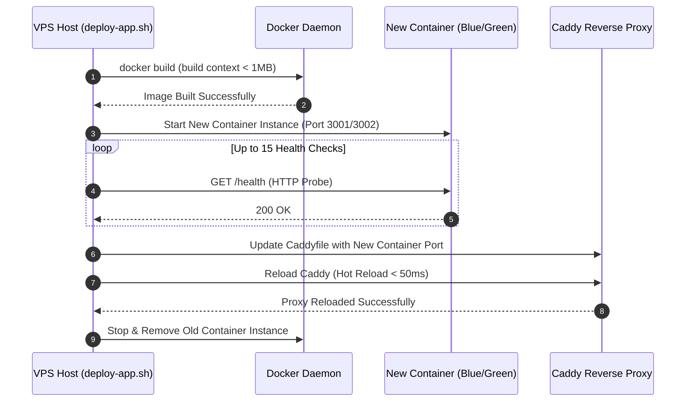

# Docker Blue-Green Deployment Workflow (Azure VPS)

---

## Overview & Context

This document details the CI/CD pipeline, system configurations, and zero-downtime deployment flow for the Ticket Booking NestJS application on the resource-constrained Azure VM.

---

## Architecture & Work Breakdown Structure (WBS)

| WBS ID | Component / Feature Name | Level | Detailed Description / Task | Output / Artifact |
| :--- | :--- | :--- | :--- | :--- |
| **1.0** | **DevOps Infrastructure** | **L1: Infrastructure** | CI/CD pipeline & zero-downtime container deployment | `scripts/` & `.github/workflows` |
| **1.1** | **Build & Package** | **L2: CI Build** | Compiles NestJS app & packages build artifact | `build.tar.gz` |
| **1.2** | **Deploy & Switch** | **L2: CD Deploy** | Blue-Green zero-downtime container swap | `scripts/deploy-app.sh` |
| **1.3** | **Proxy Reload** | **L2: Reverse Proxy** | Reloads Caddy proxy dynamically | `Caddyfile` |

---

## Operational Flow

---

## Technical Decisions & Implementation Details

- **Blue-Green Container Swap**: Deploys the new application container to an alternate port (3001/3002), validates health via HTTP probes, and reloads Caddy for zero-downtime cutover.
- **Minimal Docker Build Context**: Uses `.dockerignore` to restrict build context size under 1MB for fast Azure VPS image compilation.

---

## Security & Defense-in-Depth

- **Non-Root Execution**: Application container runs strictly as non-root `USER bun`.
- **Doppler Plaintext Env**: Downloaded secrets use stdout redirection `--no-file` to bypass symmetric local encryption issues while keeping host filesystem permissions locked (0600).
- **Zero Host Exposure**: Application ports (3001/3002) are bound to internal Docker bridge network only; external access is strictly proxied via Caddy HTTPS.

---

## Verification & Operational Checklist

- [x] Zero-downtime deployment verified via continuous HTTP ping during Caddy reload.
- [x] Container health probe retries up to 15 times before aborting deployment on failure.
