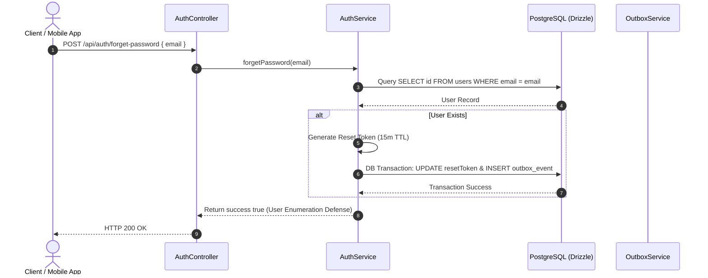

# Forget Password Workflow Spec

---

## Overview & Context

This document describes the operational flow for password recovery when a user forgets their password. The system receives the user's email, generates a secure time-limited reset token (15-minute TTL), inserts an outbox event to dispatch an email via a BullMQ worker, and allows the user to reset their password safely.

---

## Architecture & Work Breakdown Structure (WBS)

| WBS ID | Component / Feature Name | Level | Detailed Description / Task | Output / Artifact |
| :--- | :--- | :--- | :--- | :--- |
| **1.0** | **Auth Module** | **L1: Module** | Authentication & user credentials management | `src/modules/auth` |
| **1.1** | **Forget Password** | **L2: Feature** | Generate reset token & push outbox email event | `POST /api/auth/forget-password` |
| **1.1.1** | **Reset Password** | **L3: Logic** | Verify reset token & update user password | `POST /api/auth/reset-password` |

---

## Operational Flow

---

## Technical Decisions & Implementation Details

- **Transactional Dual-Write Outbox**: The reset token email event `auth.reset_password_email_requested` is written inside the same DB transaction as the reset token update, preventing email loss.
- **Constant-Time Response**: Returns HTTP 200 OK regardless of whether the email exists in the database.

---

## Security & Defense-in-Depth

- **User Enumeration Defense**: Always returns HTTP 200 OK even if the email does not exist in the system.
- **Short Token TTL**: Reset Tokens expire in 15 minutes to minimize attack windows.
- **Transactional Outbox**: Guarantees atomic insertion of `auth.reset_password_email_requested` in the same database transaction.

---

## Verification & Operational Checklist

- [x] Forget password request with unknown email returns HTTP 200 OK without sending email.
- [x] Reset token expires strictly after 15 minutes.
- [x] Unit tests verify outbox event generation and token invalidation after reset.
