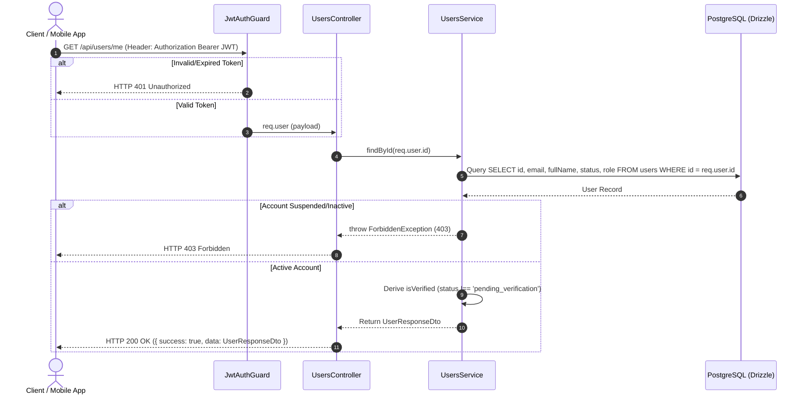

# Get Current User Profile Workflow Spec

---

## Overview & Context

This document describes the operational flow for retrieving the current authenticated user's profile (`GET /api/users/me`). The system verifies the Bearer JWT token using `JwtAuthGuard`, checks account status (`status !== 'suspended'`), and returns a `UserResponseDto` with HTTP 200 OK.

---

## Architecture & Work Breakdown Structure (WBS)

| WBS ID | Component / Feature Name | Level | Detailed Description / Task | Output / Artifact |
| :--- | :--- | :--- | :--- | :--- |
| **1.0** | **Users Module** | **L1: Module** | User profile management & preferences | `src/modules/users` |
| **1.1** | **Get Profile** | **L2: Feature** | Fetch current user account details | `GET /api/users/me` |
| **1.1.1** | **Guard & Derive** | **L3: Logic** | `JwtAuthGuard` verification & derive `isVerified` | `UsersController.getProfile()` |

---

## Operational Flow

---

## Technical Decisions & Implementation Details

- **Strict Column Selection**: The Drizzle ORM query explicitly selects profile fields, excluding sensitive password hash data.
- **Derived Virtual Property**: `isVerified` is derived at runtime from `status !== 'pending_verification'`.

---

## Security & Defense-in-Depth

- **JWT Bearer Authentication**: Protects the endpoint using `JwtAuthGuard`.
- **Status Authorization**: Rejects suspended or inactive accounts with HTTP 403 Forbidden.
- **Data Protection**: Excludes password hash and internal security fields from the response DTO.

---

## Verification & Operational Checklist

- [x] Request without JWT token returns HTTP 401 Unauthorized.
- [x] Suspended account returns HTTP 403 Forbidden.
- [x] Response payload excludes password hash field.
