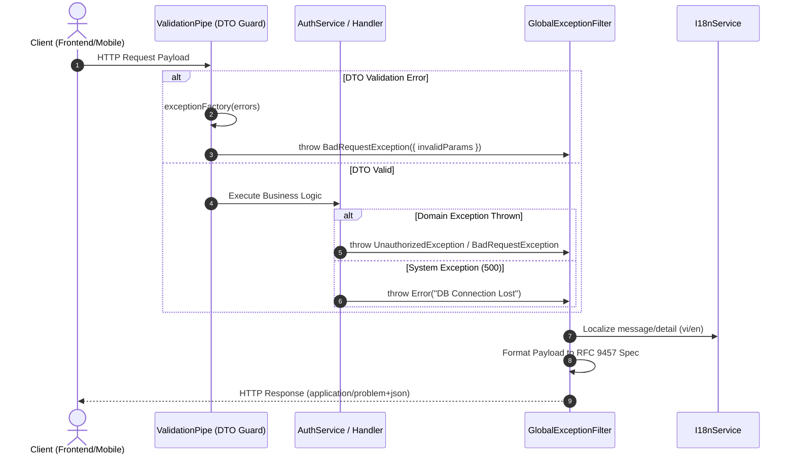

# GlobalExceptionFilter Implementation & Workflow Audit Guide

**Status**: ✅ Approved  
**Scope**: Cross-cutting / Global Error Handling Infrastructure  
**Source Location**: `src/common/filters/global-exception.filter.ts`

---

## Overview & Context

Format mismatches between DTO validation errors (`ValidationPipe` returning constraint arrays) and domain exceptions (`AuthService` returning string messages) require client applications to write complex parsing flags.

Architectural goals of **`GlobalExceptionFilter`**:

1. Standardize 100% of system exceptions (DTO Validation, Auth Service, Database, and Unhandled Errors) into a unified JSON structure adhering to **RFC 9457 Problem Details**.
2. Set response header `Content-Type: application/problem+json`.
3. Mask sensitive internal details (Stack Traces, SQL Errors) in Production environments.

---

## Architecture & Work Breakdown Structure (WBS)

| WBS ID | Component / Feature Name | Level | Detailed Description / Task | Output / Artifact |
| :--- | :--- | :--- | :--- | :--- |
| **1.0** | **Global Exception Infrastructure** | **L1: Module** | System-wide error handling & RFC 9457 standardization | `src/common/filters` |
| **1.1** | **Filter & Validation Component** | **L2: Component** | Global exception filter & DTO error flattening | `GlobalExceptionFilter` |
| **1.1.1** | **Core Filter Implementation** | **L3: Logic** | Catch `HttpException` / `Error`, set `application/problem+json` header | `src/common/filters/global-exception.filter.ts` |
| 1.1.1.1 | Unit Test Suite | L4: Execution | Unit testing logic for 400, 401, 500 status codes | `src/common/filters/global-exception.filter.spec.ts` |
| **1.1.2** | **App Bootstrap Integration** | **L3: Logic** | Register `ValidationPipe.exceptionFactory` & global filter | `src/main.ts` & `test/helpers/app.helper.ts` |
| 1.1.2.1 | E2E Integration Suite | L4: Execution | Supertest E2E specs testing full HTTP exception pipeline | `test/global-exception.e2e-spec.ts` |

---

## Operational Flow

---

## Technical Decisions & Implementation Details

- **RFC 9457 Problem Details Standard**: Standardizes error payloads with `type`, `title`, `status`, `detail`, `instance`, and optional `invalidParams`.
- **Structured Error Logging**: Internal stack traces are logged via Pino Logger (`Logger.error`) while returning sanitized problem details to the client.

---

## Security & Defense-in-Depth

- **Stack Trace Sanitization**: Internal stack traces are logged to `Logger.error` and never exposed to clients in HTTP responses.
- **Database Query Shielding**: Exceptions from Drizzle ORM or PostgreSQL drivers (HTTP 500) are wrapped in a generic message `"An internal system error occurred. Please try again later."` to prevent database schema exposure.
- **Header Protocol Enforcement**: Enforces `Content-Type: application/problem+json` header on all exception responses.

---

## Verification & Operational Checklist

- [x] All exception responses return `Content-Type: application/problem+json`.
- [x] Internal database queries and stack traces are suppressed in HTTP 500 responses.
- [x] Unit and E2E integration test suites pass 100%.
