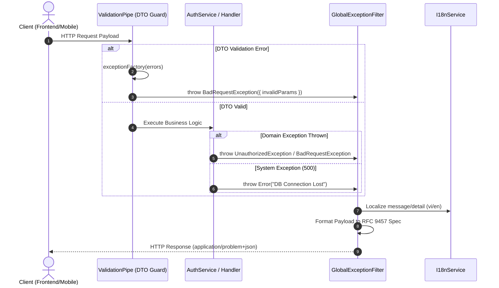

# GlobalExceptionFilter Implementation & Workflow Audit Guide

---

## Overview & Context

Format mismatches between DTO validation errors (`ValidationPipe` returning constraint arrays) and domain exceptions (`AuthService` returning string messages) require client applications to write complex parsing flags.

Architectural goals of **`GlobalExceptionFilter`**:

1. Standardize 100% of system exceptions (DTO Validation, Auth Service, Database, and Unhandled Errors) into a unified JSON structure adhering to **RFC 9457 Problem Details**.
2. Set response header `Content-Type: application/problem+json`.
3. Mask sensitive internal details (Stack Traces, SQL Errors) in Production environments.

---

## Architecture

- **System-Wide RFC 9457 Filter**: Intercepts HTTP and system exceptions, sanitizing internal driver errors and formatting unified problem details.
- **Observability Integration**: Attaches correlated request IDs and Sentry event markers.

---

## Operational Flow

---

## Technical Decisions & Implementation Details

- **RFC 9457 Problem Details Standard**: Standardizes error payloads with `type`, `title`, `status`, `detail`, `instance`, and optional `invalidParams`.
- **Structured Error Logging**: Internal stack traces are logged via Pino Logger (`Logger.error`) while returning sanitized problem details to the client.

---

## Security & Defense-in-Depth

- **Stack Trace Sanitization**: Internal stack traces are logged to `Logger.error` and never exposed to clients in HTTP responses.
- **Database Query Shielding**: Exceptions from Drizzle ORM or PostgreSQL drivers (HTTP 500) are wrapped in a generic message `"An internal system error occurred. Please try again later."` to prevent database schema exposure.
- **Header Protocol Enforcement**: Enforces `Content-Type: application/problem+json` header on all exception responses.

---

## Verification & Operational Checklist

- [x] All exception responses return `Content-Type: application/problem+json`.
- [x] Internal database queries and stack traces are suppressed in HTTP 500 responses.
- [x] Unit and E2E integration test suites pass 100%.
