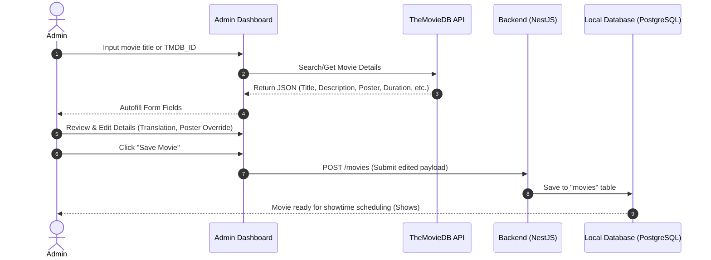

# Movie Data Integration & TMDB Sync Service Workflow

---

## Overview & Context

This process describes how the Admin Dashboard interacts with TheMovieDB (TMDB) API to autofill movie information and store it directly into the local PostgreSQL database via the NestJS Backend, reducing manual entry while ensuring data integrity.

---

## Architecture & Work Breakdown Structure (WBS)

| WBS ID | Component / Feature Name | Level | Detailed Description / Task | Output / Artifact |
| :--- | :--- | :--- | :--- | :--- |
| **1.0** | **Movie Management** | **L1: Module** | TMDB API movie data integration | `src/modules/movies` |
| **1.1** | **TMDB Search & Autofill** | **L2: Feature** | Search & autofill movie details | Admin Dashboard UI |
| **1.2** | **Movie Persistence** | **L2: Feature** | Submit payload & persist to PostgreSQL DB | `POST /api/movies` |

---

## Operational Flow

Movie data is persisted locally in the PostgreSQL database instead of proxying API calls to TMDB during customer browsing to maximize response performance and system reliability.

---

## Technical Decisions & Implementation Details

- **Local Storage Strategy**: Caches external TMDB movie data inside local PostgreSQL tables to eliminate runtime external API dependencies and external rate limits.
- **Admin Review Pipeline**: Allows administrators to inspect and edit autofilled details before final persistence.

---

## Security & Defense-in-Depth

- **Admin Auth Guard**: Protects endpoint `POST /api/movies` using `JwtAuthGuard` + `RolesGuard(['admin'])`.
- **Payload Validation**: Validates all incoming movie attributes using `CreateMovieDto` and `class-validator` prior to database writes.
- **Sanitize Input**: Text attributes (title, description) are sanitized to prevent XSS and script injection attacks.

---

## Verification & Operational Checklist

- [x] Unauthorized users cannot access `POST /api/movies`.
- [x] Invalid TMDB payload fields trigger HTTP 400 Bad Request.
- [x] Movie records persist correctly in PostgreSQL.
