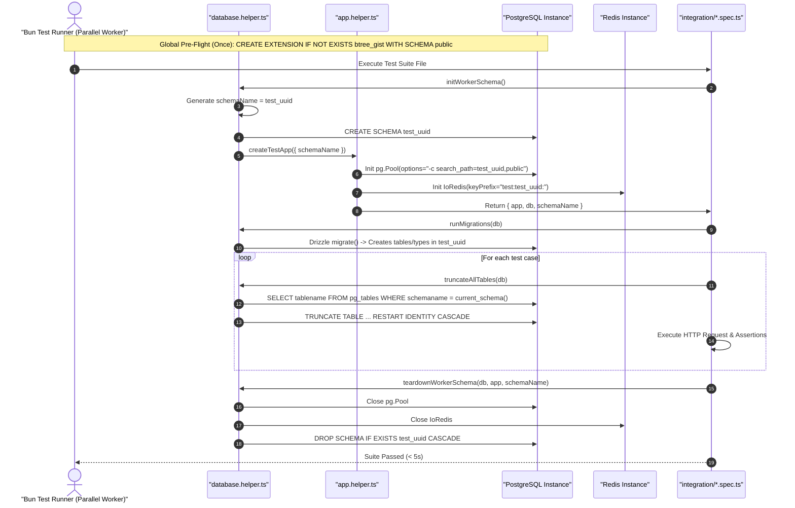

# Parallel Test Isolation and CI RAM-Disk SSOT Operational Workflow

---

## Overview & Context

This document serves as the **Single Source of Truth (SSOT)** describing the architecture, lifecycle management, and isolation mechanisms for high-speed parallel integration testing in local environments (Issue #59) and CI/CD pipelines (Issue #58).

### Architectural Fundamentals & Isolation Strategy

1. **Schema-per-Worker PostgreSQL Virtualization**:
   Each Bun test worker allocates a dynamic, cryptographically secure schema (`test_${randomUUID().replace(/-/g, '_')}`). This isolates all DDL (tables, functions, enums, sequences) and DML operations without the overhead of spinning up separate physical PostgreSQL databases.
2. **PostgreSQL Protocol Startup Search Path**:
   The PostgreSQL client connection pool (`pg.Pool`) binds the search path at startup via `options: "-c search_path=<worker_schema>,public"`. Every client checked out by Drizzle ORM or NestJS services automatically resolves tables within the worker's schema, with `public` retained as fallback for database-level extensions.
3. **Global Pre-Flight Extension Initialization**:
   Database-level extensions (e.g. `btree_gist` for exclusion constraints) are installed once globally in `public` prior to worker spawning. Per-worker Drizzle migrations execute `CREATE EXTENSION IF NOT EXISTS` as an instant no-op.
4. **Current-Schema Truncation & Sanitization**:
   Test state resets between test cases (`beforeEach`) query `pg_tables WHERE schemaname = current_schema()`, filter out `__drizzle_migrations`, and truncate using `sql.identifier()` and `RESTART IDENTITY CASCADE`.
5. **Redis Namespace Isolation**:
   IoRedis client is instantiated with `keyPrefix: "test:${workerSchemaId}:"` to isolate distributed locks (`RedlockService`), cache keys, and idempotency states across parallel workers. BullMQ queues use `prefix: "bull:${workerSchemaId}"`.
6. **Background Scheduler Guardrails**:
   Background `@Cron` schedulers (`BookingCronService`) are suppressed in integration test environments to prevent orphan background queries against closing connections.
7. **Orphan Schema Garbage Collection**:
   Pre-suite cleanup hooks drop any leftover `test_*` schemas older than 1 hour, protecting development and CI databases from disk accumulation caused by aborted processes.
8. **CI RAM-Disk Execution (`tmpfs`)**:
   PostgreSQL in GitHub Actions runs with `PGDATA: /var/lib/postgresql/data/pgdata` over a `tmpfs` RAM-disk mount with `fsync=off` and `--max-concurrency=1` removed, reducing execution time from ~40s to $< 15\text{s}$.

---

## Domain Invariant Matrix (`INV-1..6`)

| Invariant | Name                                 | Rule & Enforcement Mechanism                                                                                                                                                     |
| :-------- | :----------------------------------- | :------------------------------------------------------------------------------------------------------------------------------------------------------------------------------- |
| **INV-1** | **UUID Schema Uniqueness**           | Every test worker MUST generate a unique schema name using `crypto.randomUUID()`. Never rely on `process.pid` due to Bun's shared-process worker threads.                        |
| **INV-2** | **Pool Search Path Binding**         | Connection pool MUST bind `search_path=<worker_schema>,public` at pool creation (`options` parameter) so 100% of checked-out clients inherit the isolated path.                  |
| **INV-3** | **Global Extension Pre-Flight**      | `btree_gist` MUST be pre-installed in `public` via `test/helpers/global-setup.ts` before parallel worker schema migrations to prevent catalog lock contention on `pg_extension`. |
| **INV-4** | **Current-Schema Truncation Safety** | `truncateAllTables(db)` MUST filter `WHERE schemaname = current_schema()` and retain `__drizzle_migrations` exclusion, escaping identifiers via `sql.identifier()`.              |
| **INV-5** | **Redis KeyPrefix Isolation**        | Integration tests running against real Redis MUST use `keyPrefix: "test:${workerSchemaId}:"` to prevent cross-worker lock deletion in `beforeEach`.                              |
| **INV-6** | **Deterministic Lifecycle Teardown** | `afterAll` MUST execute `DROP SCHEMA IF EXISTS <worker_schema> CASCADE;` and close all open Redis/DB connections.                                                                |

---

## Architecture & Work Breakdown Structure (WBS)

| WBS Code | Component / Feature                   | Level          | Description / Task                                                         | Output / Artifact                             |
| :------- | :------------------------------------ | :------------- | :------------------------------------------------------------------------- | :-------------------------------------------- |
| **0.0**  | **Global Pre-Flight Setup**           | **L1: Hook**   | Run once before test suites spawn via `bunfig.toml` preload                | `test/helpers/global-setup.ts`, `bunfig.toml` |
| 0.1      | Global Extension Installation         | L2: DDL        | `CREATE EXTENSION IF NOT EXISTS btree_gist SCHEMA public;`                 | `test/helpers/global-setup.ts`                |
| 0.2      | Orphan Schema Purge                   | L2: Tool       | Purge stale `test_*` schemas older than 1h                                 | `test/helpers/global-setup.ts`                |
| 0.3      | Process Signal Handlers               | L2: Logic      | Register `SIGINT`/`SIGTERM` handlers to drop active worker schema on abort | `test/helpers/global-setup.ts`                |
| 0.4      | Bunfig Preload Configuration          | L2: Config     | Configure `[test] preload = ["./test/helpers/global-setup.ts"]`            | `bunfig.toml`                                 |
| **1.0**  | **Database Helper Isolation**         | **L1: Helper** | Schema-per-worker core infrastructure                                      | `test/helpers/database.helper.ts`             |
| **1.1**  | Schema Provisioning & Teardown        | L2: Logic      | Dynamic schema creation, migration, and `DROP CASCADE`                     | `test/helpers/database.helper.ts`             |
| **1.2**  | Safe Truncate with Sanitization       | L2: Logic      | `current_schema()` query, `sql.identifier()`, `RESTART IDENTITY`           | `test/helpers/database.helper.ts`             |
| **1.3**  | Orphan Schema Garbage Collector       | L2: Tool       | Purge stale `test_*` schemas older than 1h                                 | `test/helpers/database.helper.ts`             |
| **2.0**  | **App Test Helper & State Isolation** | **L1: Helper** | NestJS test harness enhancements                                           | `test/helpers/app.helper.ts`                  |
| **2.1**  | Dynamic Pool & Redis Factory          | L2: Logic      | Inject worker schema pool and `keyPrefix` IoRedis                          | `test/helpers/app.helper.ts`                  |
| **2.2**  | Scheduler & Queue Guardrails          | L2: Logic      | Disable background `@Cron` and scope BullMQ prefixes                       | `test/helpers/app.helper.ts`                  |
| **3.0**  | **Test Suites Cutover**               | **L1: Tests**  | Migrate all integration test files to schema-per-worker                    | `test/integration/*.spec.ts`                  |
| **3.1**  | Suite Lifecycle Modernization         | L2: Execution  | Integrate schema setup in `beforeAll` and drop in `afterAll`               | `test/integration/*.spec.ts`                  |
| **4.0**  | **CI/CD tmpfs RAM-Disk Pipeline**     | **L1: CI**     | High-speed parallel workflow integration                                   | `.github/workflows/integration.yml`           |
| **4.1**  | PostgreSQL tmpfs Mount & PGDATA       | L2: Infra      | Configure `/var/lib/postgresql/data` tmpfs and `PGDATA` subpath            | `.github/workflows/integration.yml`           |
| **4.2**  | Max Concurrency Cutover               | L2: Infra      | Remove `--max-concurrency=1` and enforce $< 15\text{s}$ suite target       | `package.json`, `integration.yml`             |

---

## Operational Flow

---

## Security & Test Tenant Isolation

1. **Per-Worker Schema Isolation**:
   - Parallel test workers operate within dedicated PostgreSQL schemas (`test_<uuid>`), completely isolating database state and preventing cross-worker data leakage.
2. **Redis Key Prefix Scoping**:
   - Redis clients in test suites are scoped with `test:${workerSchemaId}:` prefix, preventing distributed lock collisions or rate-limit contamination across parallel runners.

---

## Edge Case & Anomaly Discovery Matrix

| Anomaly ID | Anomaly Class           | Failure Mode                                                       | Mitigation Rule                                                                     |
| :--------- | :---------------------- | :----------------------------------------------------------------- | :---------------------------------------------------------------------------------- |
| **EDGE-1** | Concurrency Collision   | Two workers generate identical schema name.                        | Use `crypto.randomUUID()` (entropy: $2^{122}$), avoiding shared `process.pid`.      |
| **EDGE-2** | Connection Leak         | `SET search_path` executed on single pooled connection.            | Configure pool-level `options: "-c search_path=..."` at connection creation.        |
| **EDGE-3** | Redis Key Wiping        | `beforeEach` calls `redis.del(keys('lock:*'))` deleting peer keys. | Configure IoRedis `keyPrefix: "test:${workerSchemaId}:"`.                           |
| **EDGE-4** | Unhandled Process Crash | Test process terminates abruptly without running `afterAll`.       | Startup garbage collector `cleanupOrphanTestSchemas` purges stale `test_*` schemas. |
| **EDGE-5** | DDL Catalog Contention  | Multiple workers race on `CREATE EXTENSION btree_gist`.            | Pre-install extension in `public` during pre-flight setup.                          |
