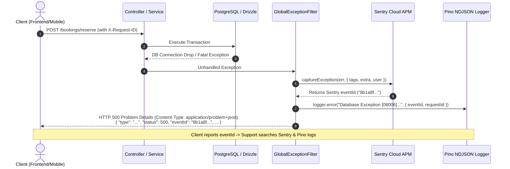
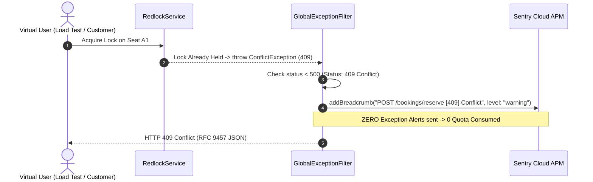
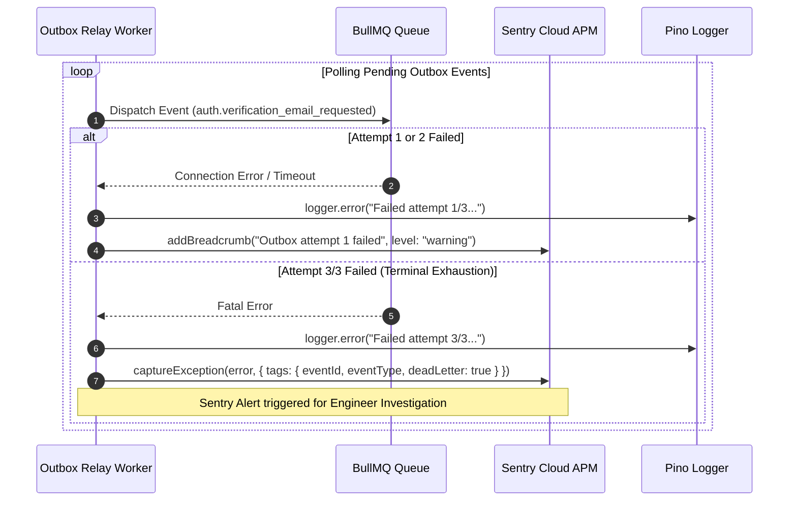

# Sentry Observability, Error Tracking & Performance Monitoring Workflow

**Status**: ✅ Approved  
**Scope**: Cross-cutting / System Observability, APM & Error Tracking  
**Source Location**: `src/common/services/sentry.service.ts`, `src/common/filters/global-exception.filter.ts`, `src/common/interceptors/logging.interceptor.ts`, `src/modules/outbox/outbox.service.ts`, `src/database/database.module.ts`  
**ADR Reference**: `docs/adr/0012-sentry-observability-error-tracking-and-performance-monitoring.md`

---

## 1. Overview & Context

In a high-throughput cinema ticket booking system, unhandled crashes, database connection timeouts, and background worker failures must be captured with actionable stack traces, user journey breadcrumbs, and correlated log identifiers without polluting APM quotas or alerting on expected domain race conditions (e.g. `409 Conflict`).

### Core Objectives

1. **Zero-Noise Error & Exception Filtering**: Capture 5xx server errors and unhandled runtime panics in Sentry while strictly filtering out standard 4xx client errors (`400`, `401`, `403`, `404`, `409`, `422`, `429`).
2. **PII Sanitization & Compliance**: Automatically mask credentials, tokens, cookies, and sensitive payload keys via `beforeSend` and `beforeBreadcrumb` hooks.
3. **Closed-Loop Traceability**: Return the Sentry `eventId` inside the client RFC 9457 JSON response for 500 errors, linked directly to Pino NDJSON `requestId` and `traceId`.
4. **Non-HTTP Background Worker Monitoring**: Capture Outbox relay worker and BullMQ queue dead-letter failures when retry attempts are exhausted.
5. **Database Query Observability**: Capture SQL query breadcrumbs via DrizzleLogger and track end-to-end query execution latency natively via Sentry OpenTelemetry APM Spans.
6. **Graceful Degradation**: Zero test disruption and zero local friction when `SENTRY_DSN` is empty.

---

## 2. Architecture & Work Breakdown Structure (WBS)

| WBS ID  | Component / Task                           | Level             | Detailed Description                                                                                     | Output / Artifact                                            |
| :------ | :----------------------------------------- | :---------------- | :------------------------------------------------------------------------------------------------------- | :----------------------------------------------------------- |
| **1.0** | **Sentry Core Infrastructure**             | **L1: Module**    | Core Sentry SDK setup, configuration & graceful fallback                                                 | `src/common/services/` & `src/common/modules/`               |
| **1.1** | **Environment & Config**                   | **L2: Component** | Define `SENTRY_DSN`, `SENTRY_ENVIRONMENT`, `SENTRY_TRACES_SAMPLE_RATE`                                   | `src/env.ts`, `.env.example`                                 |
| **1.2** | **SentryService & Module**                 | **L2: Component** | Sentry initialization, PII sanitization, breadcrumb API, release tracking & graceful flush               | `sentry.service.ts`, `sentry.module.ts`                      |
| 1.2.1   | Sentry Unit Tests                          | L3: Execution     | Unit tests for SentryService enable/disable, withScope, and PII masking                                  | `src/common/services/sentry.service.spec.ts`                 |
| **2.0** | **HTTP Lifecycle & Filter Integration**    | **L1: Module**    | Exception filtering, RFC 9457 eventId correlation & HTTP breadcrumbs                                     | `src/common/filters/`, `src/common/interceptors/`            |
| **2.1** | **Zero-Noise Filter Hook**                 | **L2: Component** | Capture 5xx in Sentry; route 4xx to warning breadcrumbs; inject `eventId` into JSON                      | `global-exception.filter.ts`                                 |
| 2.1.1   | Filter Sentry Unit Tests                   | L3: Execution     | Test 500 Sentry dispatch, 400/409 breadcrumb routing, and eventId output                                 | `global-exception.filter.spec.ts`                            |
| **2.2** | **Logging & Trace Interceptor**            | **L2: Component** | Attach `requestId` tag, `user` identity, and HTTP latency breadcrumb                                     | `logging.interceptor.ts`                                     |
| 2.2.1   | Interceptor Unit Tests                     | L3: Execution     | Test tag and breadcrumb recording on request completion                                                  | `logging.interceptor.spec.ts`                                |
| **3.0** | **Distributed State & Background Workers** | **L1: Module**    | Concurrency breadcrumbs, slow query profiling & worker dead-letter alerts                                | `src/database/`, `src/modules/outbox/`, `redlock.service.ts` |
| **3.1** | **Redlock Breadcrumbs**                    | **L2: Component** | Record lock attempt, acquisition, and release breadcrumbs                                                | `src/common/services/redlock.service.ts`                     |
| **3.2** | **Drizzle Query Breadcrumbs & Tracing**    | **L2: Component** | Attach SQL query execution breadcrumbs via DrizzleLogger; latency profiling handled via Sentry APM Spans | `src/database/database.module.ts`                            |
| **3.3** | **Outbox Dead-Letter Alerting**            | **L2: Component** | Capture Sentry exception when Outbox relay event exhausts max retries (3/3)                              | `src/modules/outbox/outbox.service.ts`                       |
| 3.3.1   | Outbox Sentry Unit Tests                   | L3: Execution     | Verify Outbox dead-letter exception dispatch on 3rd failure attempt                                      | `src/modules/outbox/outbox.service.spec.ts`                  |

---

## 3. Operational Flows

### A. HTTP 500 Server Crash & RFC 9457 Closed-Loop Traceability

---

### B. High-Concurrency 409 Conflict Zero-Noise Filtering

---

### C. Background Outbox Relay Worker Dead-Letter Alerting

---

## 4. Module-Scoped Domain Invariants (`SentryObservabilityInvariants: INV-1..13`)

| Invariant ID | Name                                            | Architectural Boundary & Edge Case Prevented                                         | Enforcement Mechanism                                                                                          |
| :----------- | :---------------------------------------------- | :----------------------------------------------------------------------------------- | :------------------------------------------------------------------------------------------------------------- |
| **`INV-1`**  | **Zero-Noise Alert Integrity**                  | 409 Conflict/429 Throttling during load tests triggering false alarms                | `GlobalExceptionFilter` filters all status < 500, routing only to warning breadcrumbs.                         |
| **`INV-2`**  | **PII & Deep Cycle Protection Guard**           | Password, token, cookie leakage or circular object reference causing stack overflow  | `sanitizeSensitiveData` uses `Set<string>` blacklist and deep recursion with cycle safety.                     |
| **`INV-3`**  | **Closed-Loop Crash Traceability**              | Support unable to find Sentry crash logs from client RFC 9457 error response         | `GlobalExceptionFilter` attaches Sentry `eventId` directly into 500 JSON payload.                              |
| **`INV-4`**  | **Concurrency Fault Distinction Guard**         | DB connection drop/statement timeout (57014) masked as 409 instead of 5xx            | Strict mapping: only `23505`/`23P01` are 409; `57014` is 504 and all driver crashes trigger 500 Sentry alerts. |
| **`INV-5`**  | **Bounded Span Lifecycle Guard**                | Long-running transactions leaving unclosed OpenTelemetry/Sentry spans leaking memory | Deterministic span finish inside `finally` block of distributed locks and DB sessions.                         |
| **`INV-6`**  | **Worker Error Fingerprinting & Deduplication** | Outbox worker retry storm sending 10,000 duplicate Sentry alerts during Redis outage | Sentry exception capture triggers **only** on terminal exhaustion (`attempt >= 3`) with custom fingerprinting. |
| **`INV-7`**  | **Zero-Overhead Telemetry Bypassing**           | High-frequency Kubernetes `/health` probes (100 Hz) exhausting CPU & Tracing quota   | `tracesSampler` performs O(1) prefix check to immediately drop `/health`, `/metrics`, `/reference`.            |
| **`INV-8`**  | **Graceful Flush Timeout Ceiling**              | Fatal server shutdown exiting before asynchronous Sentry HTTPS buffers drain         | `SentryService.onApplicationShutdown` awaits `Sentry.flush(2000)` with a strict 2s ceiling.                    |
| **`INV-9`**  | **Fail-Safe Telemetry Isolation Guard**         | Exception inside Sentry SDK or SentryService crashing the NestJS HTTP error filter   | Sentry capture calls are wrapped defensively so telemetry failures never disrupt HTTP responses.               |
| **`INV-10`** | **Deterministic Release Signature Guard**       | Environment variable missing locally causing "undefined" release tracking tags       | Deterministic fallback: `${npm_package_name}@${version}+${RENDER_GIT_COMMIT \|\| GITHUB_SHA \|\| 'local'}`.    |
| **`INV-11`** | **Bounded Breadcrumb Payload Size Guard**       | 10MB bulk insert query string causing V8 heap memory exhaustion in breadcrumbs       | SQL strings hard-truncated to 300 characters; parameter arrays record length only.                             |
| **`INV-12`** | **Cross-Tenant Context Isolation Guard**        | Request A's `userId` or `requestId` leaking into Request B's concurrent error report | User and request tags bound strictly to request scope via `Sentry.withScope`, never global scope.              |
| **`INV-13`** | **Memory Ceiling & Ring Buffer Guard**          | High-frequency loops pushing thousands of breadcrumbs into Node.js heap              | `maxBreadcrumbs` strictly capped at 50 with duplicate loop suppression in `beforeBreadcrumb`.                  |

---

## 5. Security & PII Defense-in-Depth

1. **Automatic Credential & Token Masking**:
   - All headers matching `authorization`, `cookie`, and `set-cookie` are automatically replaced with `[REDACTED]` prior to dispatching events to Sentry.
   - All request body and extra fields matching `password`, `confirmPassword`, `token`, `refreshToken`, `accessToken`, `checksumKey`, `apiKey`, and `clientSecret` are recursively redacted.
2. **Database Query Parameter Shielding**:
   - Drizzle ORM query breadcrumbs record only the SQL structure and parameter count (`paramCount: N`). Raw parameter values containing user emails, names, or passwords are never captured.
3. **Cross-Tenant Context Isolation**:
   - User identity (`userId`, `email`, `role`) and request ID tags are strictly bound to isolated execution scopes (`Sentry.withScope` / `AsyncLocalStorage`), preventing cross-tenant data leakage in high-concurrency event loops.

---

## 6. Verification & Test Checklist

- [ ] `SentryService` safely no-ops without error when `SENTRY_DSN` is empty.
- [ ] `GlobalExceptionFilter` captures 5xx errors and attaches `eventId` to response JSON.
- [ ] `GlobalExceptionFilter` suppresses 4xx exceptions from Sentry alerts while appending breadcrumbs.
- [ ] `LoggingInterceptor` attaches `requestId` and `user` context to Sentry scope.
- [ ] `RedlockService` appends `redlock` category breadcrumbs during acquisition and release.
- [ ] `OutboxService` triggers `captureException` only on terminal retry exhaustion (3/3).
- [ ] Unit and E2E test suites pass 100% with zero regressions.
