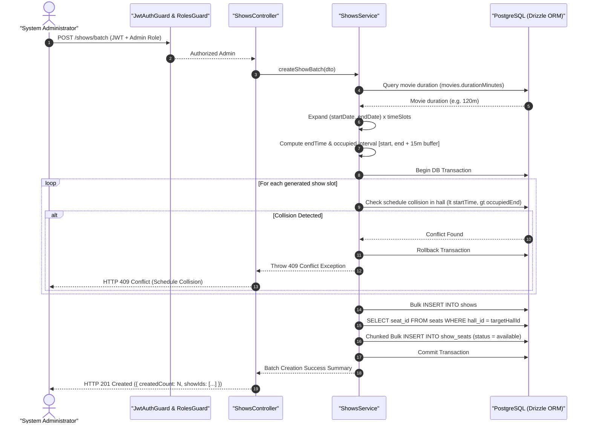

# Shows and Seats Creation SSOT Operational Workflow

---

## Overview & Context

This document serves as the **Single Source of Truth (SSOT)** describing the operational flow, transactional bulk operations, and schedule collision mechanisms for the Show & Seat Management module (`src/modules/shows/`).

### Architectural Fundamentals & Pre-allocation Strategy

1. **Pre-allocated Seat Snapshots**: When a Show is created (`shows` record), the system bulk-inserts all physical seats from `seats` (for the given `hallId`) into `show_seats` as a static snapshot with `status = 'available'`. This avoids runtime lazy allocation latency and simplifies high-concurrency seat reservation locking.
2. **Dynamic Price Calculation**: Seat prices are calculated dynamically using `shows.basePrice * seat_types.priceMultiplier` (e.g., Standard = 1.0, VIP = 1.2, Couple = 2.0).
3. **Automated `endTime` Calculation**: Backend automatically queries `movies.durationMinutes` and computes `endTime = startTime + durationMinutes`.
4. **Schedule Collision Defense (Buffer Time)**: All show scheduling enforces a 15-minute cleaning buffer between shows in the same hall. Overlaps are blocked at both the application level and via a PostgreSQL Exclusion Constraint (`GiST` index on `tsrange`).
5. **Timezone & Locale Invariants**: Show scheduling operates in `Asia/Ho_Chi_Minh` (UTC+7), normalized strictly to UTC `timestamptz` before database persistence.
6. **Lead Time Buffer (Past Slot Guard)**: All generated showtimes must start at least 10 minutes in the future ($\text{startTime} \ge \text{now}() + 10\text{m}$, configured via `SHOW_CREATION_MIN_LEAD_MINUTES = 10`). Past or near-past slots are rejected immediately (`400 Bad Request`).
7. **Intra-Batch Fail-Fast Validation (1D Flat Timeline)**: Before initiating a database transaction, all requested slots across the date range are expanded onto a single chronological timeline. If any two slots overlap or violate the 15-minute buffer, the request fails fast in-memory (`400 Bad Request`).
8. **Batch Size Hard Limits**:
   - Maximum date span: $\le 30$ days (`endDate - startDate <= 30 days`).
   - Maximum slots per day: $\le 10$ timeSlots.
   - Maximum total shows per request: $\le 100$ shows.
9. **Chunked Pre-allocation**: Hall seats are queried exactly once per batch (`SELECT id FROM seats WHERE hall_id = :hallId`), and `show_seats` are inserted in batches of 1,000 rows per chunk within the single transaction.

---

## Architecture & Work Breakdown Structure (WBS)

| WBS Code  | Component / Feature              | Level             | Description / Task                                                                                                                  | Output / Artifact                                |
| :-------- | :------------------------------- | :---------------- | :---------------------------------------------------------------------------------------------------------------------------------- | :----------------------------------------------- |
| **1.0**   | **Shows Module**                 | **L1: Module**    | Core show & seat management module                                                                                                  | `src/modules/shows/`                             |
| **1.1**   | **Single Show Creation**         | **L2: Component** | Create single showtime with pre-allocated seats                                                                                     | `POST /shows`                                    |
| **1.1.1** | DTO Validation                   | L3: Logic         | Validate `movieId`, `hallId`, `startTime`, `basePrice`                                                                              | `src/modules/shows/dto/create-show.dto.ts`       |
| 1.1.1.1   | Schedule Overlap Check           | L4: Execution     | Validate interval overlap + 15m cleaning buffer                                                                                     | `src/modules/shows/shows.service.ts`             |
| 1.1.1.2   | Seat Pre-allocation              | L4: Execution     | Chunked Bulk Insert into `show_seats` (1k rows/chunk)                                                                               | `src/modules/shows/shows.service.ts`             |
| **1.2**   | **Batch Show Creation**          | **L2: Component** | Create recurring showtimes across date range                                                                                        | `POST /shows/batch`                              |
| **1.2.1** | Batch Generator & DTO Validation | L3: Logic         | Validate `movieId`, `hallId`, `startDate`, `endDate`, `timeSlots` ($\le 30\text{d}$, $\le 10\text{ slots}$, $\le 100\text{ shows}$) | `src/modules/shows/dto/create-show-batch.dto.ts` |
| 1.2.1.1   | 1D Flat Timeline Expansion       | L4: Execution     | Chronological expansion, lead-time $\ge 10\text{m}$, intra-batch collision check                                                    | `src/modules/shows/shows.service.ts`             |
| 1.2.1.2   | All-or-Nothing Transaction       | L4: Execution     | Single DB transaction; rollback on any collision                                                                                    | `src/modules/shows/shows.service.ts`             |
| 1.2.1.3   | Chunked Pre-allocation           | L4: Execution     | Bulk insert `show_seats` in 1,000-row chunks                                                                                        | `src/modules/shows/shows.service.ts`             |
| **1.3**   | **DB Exclusion Constraint**      | **L2: Component** | PostgreSQL kernel-level schedule protection                                                                                         | `src/database/schemas/shows.schema.ts`           |
| 1.3.1.1   | GiST Index Exclusion             | L4: Execution     | `tsrange(start_time, end_time + 15m)` constraint                                                                                    | `drizzle/migrations/`                            |

---

## Operational Flow

---

## Security & Defense-in-Depth

- **Layer 1 (Role-Based Access Control - RBAC)**: Endpoints `POST /shows` and `POST /shows/batch` are protected by `JwtAuthGuard` and `@Roles('admin')` decorator. Non-admin users receive `403 Forbidden`.
- **Layer 2 (Input Sanitization & DTO Validation)**: Request payloads are strictly validated using `class-validator` (`@IsUUID()`, `@IsDateString()`, `@IsArray()`, `@Min(0)`).
- **Layer 3 (Database Concurrency & Integrity Guard)**: PostgreSQL `GiST` exclusion constraint `no_hall_schedule_overlap` prevents concurrent race conditions across administrative sessions.

---

## Implementation & Testing Decisions

### 1. Seams & Test Boundaries

- **Highest Seam**: `ShowsController` & `ShowsService` via Supertest (`test/shows.e2e-spec.ts`).
- **Database Seam**: Direct Drizzle ORM integration tests against PostgreSQL test database.

### 2. Test Cases & Invariants

- **Single Show Creation**: Verifies creation of 1 `shows` record and $N$ pre-allocated `show_seats` records.
- **Batch Show Creation**: Verifies batch generation across date range and time slots.
- **Collision Rejection**: Verifies `409 Conflict` when scheduling overlapping shows or violating the 15-minute cleaning buffer.
- **Overnight Showtimes**: Verifies showtimes crossing 00:00 midnight (e.g., 23:30 to 01:30) are handled accurately without false collision errors.
- **All-or-Nothing Rollback**: Verifies zero orphaned records if any show in a batch encounters a conflict.
