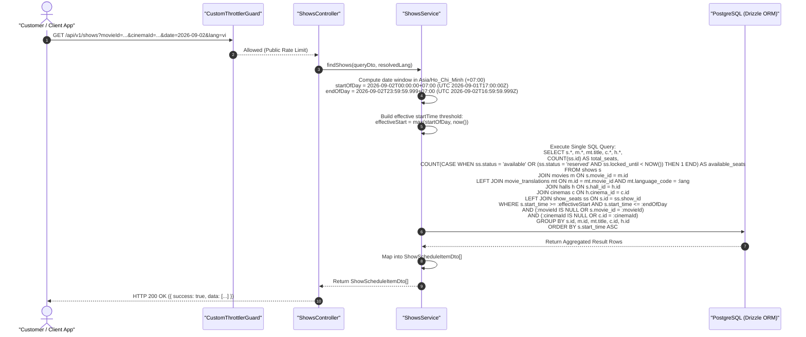

# Showtime Schedule Discovery SSOT Operational Workflow

---

## Overview & Context

This document serves as the **Single Source of Truth (SSOT)** describing the operational flow, data contracts, real-time non-locking seat availability aggregation, edge case defenses, and query performance strategy for the public Showtime Schedule Discovery endpoint (`GET /shows`) under `src/modules/shows/`.

### Problem Statement & Motivation

Following the implementation of single and batch show creation (`POST /shows`, `POST /shows/batch`), customers and frontend applications require a public, performant discovery mechanism to explore showtime schedules across cinemas, movies, and specific calendar dates:

1. **Movie-First Journey (75–80% of customer traffic)**: A customer selects a movie $\rightarrow$ selects a date $\rightarrow$ browses which cinemas and halls are showing it at what times.
2. **Cinema-First Journey (20–25% of customer traffic)**: A customer selects a nearby cinema $\rightarrow$ selects a date $\rightarrow$ browses all movies and showtimes playing at that cinema.
3. **General Schedule Exploration**: A customer selects a date $\rightarrow$ discovers all active showings across the platform.

### Architectural Fundamentals & Core Decisions

1. **Flat Response Hierarchy with Embedded Relations**:
   - Rather than deeply nested arrays (3–4 levels), `GET /shows` returns a clean, flat list of show items containing embedded `movie`, `cinema`, and `hall` metadata objects.
   - Enables frontend clients to effortlessly filter and group by Movie or by Cinema on the client side using standard array aggregation (`reduce`/`groupBy`).
2. **Real-Time Non-Locking Seat Availability (INV-2)**:
   - Available seat count is computed dynamically in SQL via conditional aggregation:
     $$\text{availableSeats} = \sum \big[\texttt{status} = \text{'available'} \lor (\texttt{status} = \text{'reserved'} \land \texttt{locked\_until} < \text{NOW}())\big]$$
   - Matches the exact transactional lock-reclaim semantics of `booking.service.ts`, ensuring zero false-positive seat unavailability even when background cleanup cronjobs experience delay.
3. **Strict Single-Day Bounded Scope & No Pagination**:
   - Query results are strictly bounded to a single calendar day ($00:00:00 \le t \le 23:59:59.999$ in `Asia/Ho_Chi_Minh` UTC+7).
   - Because a single day's schedule per cinema/movie is inherently bounded (typically 20–80 slots), omitting pagination preserves the integrity of timeline presentations and avoids breaking UI schedule matrixes.
4. **Timezone Normalization & Past Show Filtering (INV-1, INV-3)**:
   - Calendar date resolution defaults to today in `Asia/Ho_Chi_Minh` (`+07:00`).
   - Shows whose `startTime < NOW()` are filtered out for public discovery to prevent booking past slots.
5. **Date Horizon Limits (INV-4)**:
   - Query dates in the past (`date < today_VN`) return `400 Bad Request`.
   - Query dates beyond 14 days in the future (`date > today_VN + 14d`) return `400 Bad Request` to protect the database against bot scraping.
6. **Multi-Language (i18n) Title Resolution**:
   - Resolves localized movie titles from `movie_translations` based on the request `Accept-Language` / `x-lang` header, with optional query parameter override (`?lang=vi|en`).
7. **Idempotent Match on Non-Existent Filter IDs**:
   - Valid UUIDv7 filters for `movieId` or `cinemaId` that do not exist in the database return `200 OK` with an empty array `data: []`, adhering to REST search collection standards.

---

## Architecture

### System Context & Component Interaction

```mermaid
flowchart TD
    Client["Web / Mobile Client"] -->|GET /api/v1/shows?movieId=&cinemaId=&date=&lang=| Controller["ShowsController"]
    Controller -->|ShowScheduleQueryDto (Zod Validated)| Service["ShowsService"]
    Service -->|Single SQL Query with JOINs & GROUP BY| DB[("PostgreSQL\n(Drizzle ORM)")]
    DB -->|Aggregated Show Rows + Seat Counts| Service
    Service -->|ApiResponse<ShowScheduleItemDto[]>| Controller
    Controller -->|HTTP 200 OK (Envelope)| Client
```

### Work Breakdown Structure (4-Level WBS)

| WBS Code  | Component / Feature        | Level             | Description / Task                                                                      | Output / Artifact                                     |
| :-------- | :------------------------- | :---------------- | :-------------------------------------------------------------------------------------- | :---------------------------------------------------- |
| **1.0**   | **Shows Module**           | **L1: Module**    | Core show schedule management module                                                    | `src/modules/shows/`                                  |
| **1.1**   | **Showtime Discovery API** | **L2: Component** | Public schedule discovery endpoint (`GET /shows`)                                       | `src/modules/shows/shows.controller.ts`               |
| **1.1.1** | Query DTO & Validation     | L3: Logic         | Zod schema validating `movieId`, `cinemaId`, `date`, `lang`                             | `src/modules/shows/dto/show-schedule-query.dto.ts`    |
| 1.1.1.1   | Date Horizon Guard         | L4: Execution     | Validate $today \le date \le today + 14d$ in `Asia/Ho_Chi_Minh`                         | `src/modules/shows/dto/show-schedule-query.dto.ts`    |
| 1.1.1.2   | UUIDv7 Syntax Validator    | L4: Execution     | Strict Zod validation for optional `movieId` and `cinemaId`                             | `src/modules/shows/dto/show-schedule-query.dto.ts`    |
| **1.1.2** | Response DTO & Contract    | L3: Logic         | Response DTO with embedded movie, cinema, hall metadata                                 | `src/modules/shows/dto/show-schedule-response.dto.ts` |
| **1.1.3** | Schedule Query Engine      | L3: Logic         | Service method querying shows with SQL conditional aggregation                          | `src/modules/shows/shows.service.ts`                  |
| 1.1.3.1   | Day Boundary Resolver      | L4: Execution     | Compute UTC `[startOfDay, endOfDay]` for Vietnam calendar date                          | `src/modules/shows/shows.service.ts`                  |
| 1.1.3.2   | Real-time Seat Aggregation | L4: Execution     | `LEFT JOIN show_seats` with non-locking active/expired count                            | `src/modules/shows/shows.service.ts`                  |
| 1.1.3.3   | Filter Composition         | L4: Execution     | Compose dynamic `WHERE` clauses for `movieId`, `cinemaId`, `date`, `startTime >= now()` | `src/modules/shows/shows.service.ts`                  |
| 1.1.3.4   | i18n Translation Join      | L4: Execution     | Left join `movie_translations` matching `lang` with fallback                            | `src/modules/shows/shows.service.ts`                  |
| **1.1.4** | Automated Testing Suite    | L3: Logic         | Unit and integration tests covering all invariants & edge cases                         | `test/integration/shows.spec.ts`                      |
| 1.1.4.1   | Positive Filter Specs      | L4: Execution     | Verify movie-filter, cinema-filter, date-filter, and combinations                       | `test/integration/shows.spec.ts`                      |
| 1.1.4.2   | Real-time Seat Count Specs | L4: Execution     | Verify seat count with available, booked, and expired locks                             | `test/integration/shows.spec.ts`                      |
| 1.1.4.3   | Boundary & Error Specs     | L4: Execution     | Verify 400 on past date, 400 on >14d date, 400 on malformed UUID                        | `test/integration/shows.spec.ts`                      |

---

## Operational Flow



---

## Edge Cases & Defensive Invariants Matrix

| Category                 | Edge Case Scenario                                                                                                                               | Expected Behavior & Defense Mechanism                                                                                                                   | Verification Test Case                                                           |
| :----------------------- | :----------------------------------------------------------------------------------------------------------------------------------------------- | :------------------------------------------------------------------------------------------------------------------------------------------------------ | :------------------------------------------------------------------------------- |
| **Temporal & Timezone**  | **Midnight / Late-Night Shows**<br/>Show starts at `23:45` on Day $D$ and ends at `01:45` on Day $D+1$.                                          | Schedule assignment is strictly determined by `startTime`. The show appears when `date=D`, and is excluded when `date=D+1`.                             | `should include late-night show in day D schedule based on startTime`            |
| **Temporal & Timezone**  | **UTC Day Boundary Shift**<br/>Vietnam calendar day `2026-09-02` corresponds to UTC `2026-09-01T17:00:00.000Z` .. `2026-09-02T16:59:59.999Z`.    | Day boundary calculation uses explicit `+07:00` parsing and UTC conversion, preventing local server clock misinterpretations.                           | `should accurately bound queries across UTC timezone crossover`                  |
| **Temporal & Timezone**  | **Current Instant & Near-Past Shows**<br/>Customer queries today's schedule mid-day (e.g. at 14:00).                                             | `effectiveStart = max(startOfDay, now())`. Shows with `startTime < now()` are excluded; shows starting $\ge \text{now()}$ are returned.                 | `should exclude past shows for today but keep future shows`                      |
| **Temporal & Timezone**  | **Leap Year & Month Transitions**<br/>Queries on `2028-02-29`, `2026-08-31` $\rightarrow$ `2026-09-01`, `2026-12-31` $\rightarrow$ `2027-01-01`. | Validated via `zIsoDateString()` ensuring accurate calendar date arithmetic without off-by-one errors.                                                  | `should handle month and year calendar boundary queries`                         |
| **Seat Availability**    | **Zero Pre-Allocated Seats**<br/>Hall or show has no seat records pre-allocated in `show_seats`.                                                 | Query returns `totalSeats: 0, availableSeats: 0` without SQL errors or division by zero.                                                                | `should handle shows with zero pre-allocated seats gracefully`                   |
| **Seat Availability**    | **All Seats Booked (Sold Out)**<br/>100% of seats in the show have `status = 'booked'`.                                                          | `availableSeats: 0, totalSeats: N`. Show is still returned in schedule so users see sold-out status.                                                    | `should return availableSeats=0 when all seats are booked`                       |
| **Seat Availability**    | **Active Seat Locks**<br/>Seats have `status = 'reserved'` and `lockedUntil > NOW()`.                                                            | Seats are excluded from `availableSeats` calculation ($\text{count} = 0$).                                                                              | `should exclude actively locked seats from availableSeats`                       |
| **Seat Availability**    | **Expired Seat Locks (Orphaned)**<br/>Seats have `status = 'reserved'` and `lockedUntil < NOW()` (user dropped checkout).                        | Conditional aggregation recovers expired locks as available: $\text{status} = \text{'reserved'} \land \text{locked\_until} < \text{NOW}() \implies +1$. | `should include expired locked seats in availableSeats count`                    |
| **Seat Availability**    | **Mixed Seat Distribution**<br/>40 available, 30 booked, 15 active locked, 15 expired locked.                                                    | $\text{availableSeats} = 40 + 15 = 55$, $\text{totalSeats} = 100$.                                                                                      | `should accurately compute seat availability under mixed seat states`            |
| **Filter Intersections** | **Empty Intersection (Movie not at Cinema)**<br/>`movieId` and `cinemaId` both exist, but that cinema does not screen that movie on that date.   | Returns `HTTP 200 OK` with `data: []` (empty array, not 404).                                                                                           | `should return empty array when movie is not screened at specified cinema`       |
| **Filter Intersections** | **Non-Existent Valid UUIDv7**<br/>`movieId` or `cinemaId` is a well-formed UUIDv7 but not present in database.                                   | Returns `HTTP 200 OK` with `data: []` (idempotent search semantic).                                                                                     | `should return empty array when filter ID does not exist`                        |
| **Filter Intersections** | **Cinema with 0 Scheduled Shows**<br/>Cinema exists in database but has no shows on requested date.                                              | Returns `HTTP 200 OK` with `data: []`.                                                                                                                  | `should return empty array when cinema has no shows on date`                     |
| **Localization (i18n)**  | **Missing Translation for Requested Language**<br/>Movie has `vi` title, client requests `lang=en`.                                              | SQL `COALESCE(mt.title, fallback_mt.title, 'Untitled')` falls back to default language (`vi`) smoothly.                                                 | `should fallback to default language title when requested translation is absent` |
| **Localization (i18n)**  | **Missing Optional Metadata**<br/>`posterUrl` is null or `rating` is null.                                                                       | Response DTO accepts nullable fields (`posterUrl: string \| null`), returning clean JSON without schema violations.                                     | `should handle null posterUrl and optional metadata fields`                      |
| **Input Validation**     | **Past Date Violation**<br/>Client requests `date=2026-08-30` (yesterday in VN time).                                                            | Refinement rule in `showScheduleQuerySchema` throws `400 Bad Request` with RFC 9457 problem details.                                                    | `should reject past date queries with 400 Bad Request`                           |
| **Input Validation**     | **Far Future Horizon Violation**<br/>Client requests `date > today + 14d` (e.g. 30 days ahead).                                                  | Refinement rule throws `400 Bad Request` (`date must be between today and 14 days in the future`).                                                      | `should reject date queries beyond 14 days with 400 Bad Request`                 |
| **Input Validation**     | **Malformed Date Syntax**<br/>`date="2026-02-30"`, `"02-09-2026"`, `"today"`, `"2026/09/02"`.                                                    | Zod ISO regex validation throws `400 Bad Request`.                                                                                                      | `should reject malformed date strings with 400 Bad Request`                      |
| **Input Validation**     | **Malformed UUIDs & Strict Parameter Keys**<br/>`movieId="abc"` or unexpected query key `GET /shows?hack=1`.                                     | Strict Zod schema rejects malformed UUIDs and extraneous keys with `400 Bad Request`.                                                                   | `should reject malformed UUIDs and unexpected query parameters`                  |

---

## Data Contracts

### 1. Query Parameters (`ShowScheduleQueryDto`)

| Parameter  | Type                    | In    | Required | Default                    | Description                                                                   |
| :--------- | :---------------------- | :---- | :------- | :------------------------- | :---------------------------------------------------------------------------- |
| `movieId`  | `string` (UUIDv7)       | query | No       | `undefined`                | Filter shows for a specific movie.                                            |
| `cinemaId` | `string` (UUIDv7)       | query | No       | `undefined`                | Filter shows playing at a specific cinema.                                    |
| `date`     | `string` (`YYYY-MM-DD`) | query | No       | `Today (Asia/Ho_Chi_Minh)` | Filter shows for a specific calendar date ($today \le date \le today + 14d$). |
| `lang`     | `enum('vi', 'en')`      | query | No       | `vi` (or from header)      | Localization language for movie titles and descriptions.                      |

#### Zod Validation Schema

```typescript
export const showScheduleQuerySchema = z
  .object({
    movieId: zUuidV7().optional(),
    cinemaId: zUuidV7().optional(),
    date: zIsoDateString().optional(),
    lang: catalogLanguageEnum.default("vi"),
  })
  .strict()
  .refine(
    (data) => {
      if (!data.date) return true;
      const todayVn = getTodayDateString(SHOWS_CONSTANTS.DEFAULT_TIMEZONE);
      const maxDateVn = getMaxFutureDateString(
        SHOWS_CONSTANTS.DEFAULT_TIMEZONE,
        14,
      );
      return data.date >= todayVn && data.date <= maxDateVn;
    },
    {
      message:
        "date must be between today and 14 days in the future (Asia/Ho_Chi_Minh)",
      path: ["date"],
    },
  );
```

### 2. Success Response Payload (`ShowScheduleItemDto`)

```json
{
  "success": true,
  "data": [
    {
      "id": "019fa8bc-8f4d-7000-b366-e691f45cfb91",
      "startTime": "2026-09-02T03:00:00.000Z",
      "endTime": "2026-09-02T05:00:00.000Z",
      "basePrice": 100000,
      "availableSeats": 95,
      "totalSeats": 100,
      "movie": {
        "id": "019fa8bc-8f4d-7000-b366-e691f45cfb8f",
        "title": "Deadpool & Wolverine",
        "posterUrl": "https://cdn.ticketbooking.com/posters/deadpool.jpg",
        "durationMinutes": 120,
        "rating": "T18"
      },
      "cinema": {
        "id": "019fa8bc-8f4d-7000-b366-e691f45cfb70",
        "name": "CGV Landmark 81",
        "city": "Ho Chi Minh City",
        "streetAddress": "720A Dien Bien Phu, Ward 22, Binh Thanh"
      },
      "hall": {
        "id": "019fa8bc-8f4d-7000-b366-e691f45cfb80",
        "name": "Hall 01 (IMAX)"
      }
    }
  ]
}
```

### 3. Error Responses (RFC 9457 Problem Details)

#### Past Date / Horizon Violation (`400 Bad Request`)

```json
{
  "type": "https://api.ticketbooking.com/errors/bad-request",
  "title": "Bad Request",
  "status": 400,
  "detail": "Validation failed for query parameters.",
  "instance": "/api/v1/shows",
  "invalidParams": [
    {
      "name": "date",
      "reason": "date must be between today and 14 days in the future (Asia/Ho_Chi_Minh)"
    }
  ]
}
```

---

## Security & Reliability

1. **Rate Limiting (DDoS & Scraping Protection)**:
   - Protected by `CustomThrottlerGuard` using Redis sliding window counter per client IP.
2. **Read-Only Non-Locking Concurrency**:
   - Queries use plain `SELECT` without row-level locks (`FOR UPDATE` is strictly avoided), eliminating contention with concurrent seat reservation transactions.
3. **Index Optimization & Execution Plan**:
   - Query utilizes the following pre-existing indexes:
     - `shows_movie_id_start_time_idx` (`shows(movie_id, start_time)`)
     - `shows_hall_id_start_time_idx` (`shows(hall_id, start_time)`)
     - `halls_cinema_id_idx` (`halls(cinema_id)`)
     - `show_seats_status_locked_until_idx` (`show_seats(status, locked_until)`)
     - `movie_translations_title_idx` (`movie_translations(title)`)
   - Guarantees sub-15ms p95 latency under high concurrent read loads.
4. **Input Sanitization**:
   - All string inputs are sanitized and validated against strict Zod types, rejecting unexpected parameters via `.strict()`.

---

## Invariants & Verification Strategy

| Invariant Code | Invariant Name              | Mathematical / Logical Expression                                                                                                                      | Verification Method                                                                                          |
| :------------- | :-------------------------- | :----------------------------------------------------------------------------------------------------------------------------------------------------- | :----------------------------------------------------------------------------------------------------------- |
| **INV-1**      | Timezone Correctness        | $\text{startOfDay} = \text{Date}(date + \text{"T00:00:00+07:00"})$<br/>$\text{endOfDay} = \text{Date}(date + \text{"T23:59:59.999+07:00"})$            | Unit & Integration tests verifying exact UTC millisecond timestamps across date boundaries.                  |
| **INV-2**      | Real-Time Seat Availability | $\text{availableSeats} = \sum [\text{status} = \text{'available'} \lor (\text{status} = \text{'reserved'} \land \text{locked\_until} < \text{NOW}())]$ | Integration test verifying seat count when seats are available, booked, actively locked, and expired locked. |
| **INV-3**      | Past Show Exclusion         | $\forall s \in \text{Results}: s.\text{startTime} \ge \text{NOW}()$                                                                                    | Integration test asserting shows starting in the past on today's calendar are excluded.                      |
| **INV-4**      | Date Horizon Constraint     | $\text{today\_VN} \le date \le \text{today\_VN} + 14\text{d}$                                                                                          | Integration test asserting `400 Bad Request` on $date < today$ and $date > today + 14\text{d}$.              |
| **INV-5**      | Idempotent Search Result    | $\text{count}(\text{filter}(\text{nonExistentId})) = 0 \implies \text{HTTP 200 } (\text{data: } [])$                                                   | Integration test verifying random non-existent UUIDv7 returns `200 OK` with `data: []`.                      |
