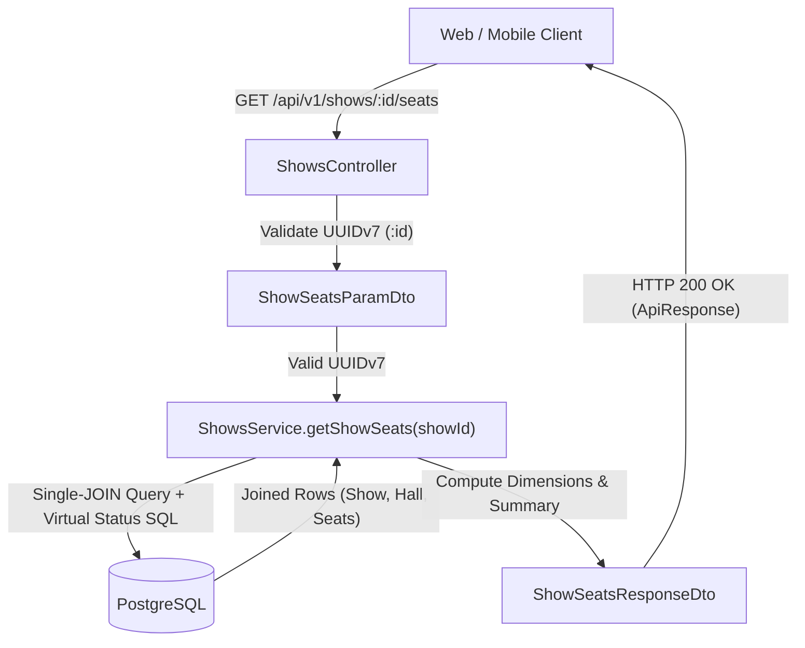
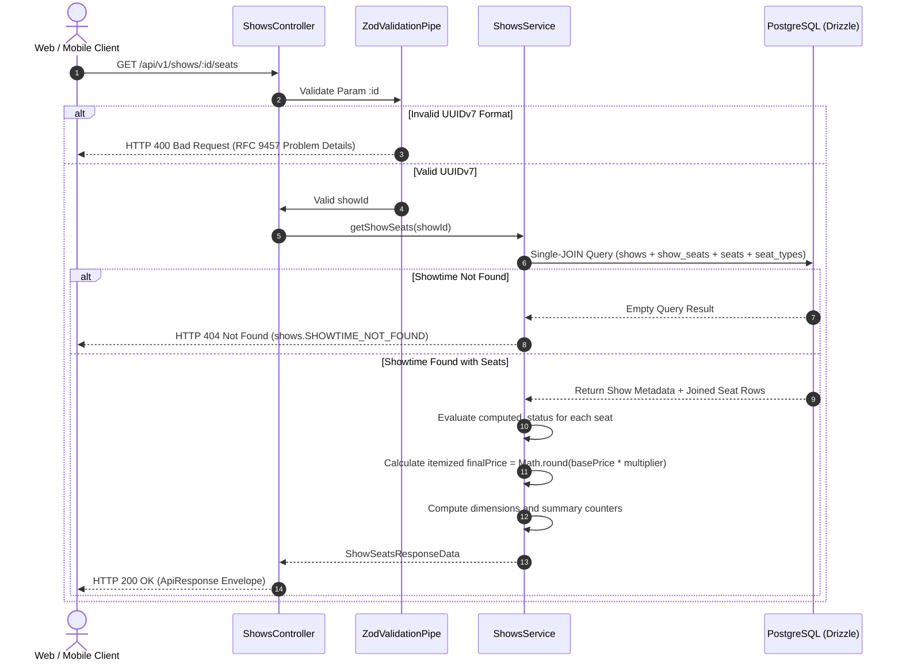
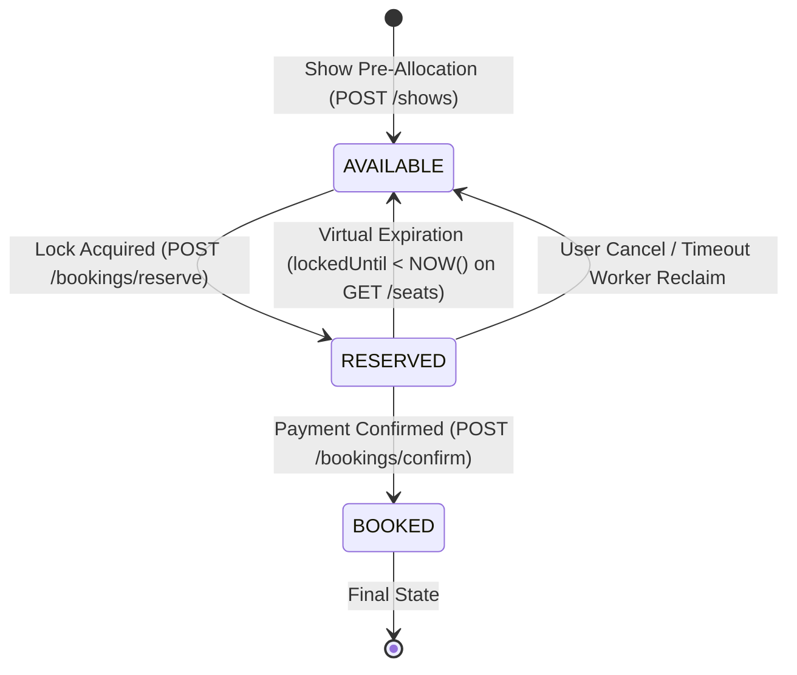

# Showtime Seating Chart Matrix & Live Availability SSOT Workflow

---

## Overview & Context

This document serves as the **Single Source of Truth (SSOT)** describing the operational flow, data contracts, dynamic seat availability computation, pricing calculation engine, and query performance strategy for the public Showtime Seating Chart Matrix endpoint (`GET /api/v1/shows/:id/seats`) under `src/modules/shows/`.

### Problem Statement & Motivation

When a customer navigates to book cinema tickets for a scheduled movie showtime, client applications (Web and Mobile) must render an interactive, accurate 2D seating layout:

1. **Seating Layout Rendering**: Clients require exact physical coordinates (`row`, `number`, `seatNumber`), physical hall dimensions (`totalRows`, `totalCols`), and seat categories (`Standard`, `VIP`, `Couple`) to draw interactive canvas grids.
2. **Real-Time Seat Availability**: Clients must immediately distinguish between seats that are `available`, temporarily held by other users (`reserved`), or permanently purchased (`booked`).
3. **Itemized Final Pricing**: Seat prices vary based on hall seat tier multipliers. The backend must compute and return exact final prices (`finalPrice`) in VND without floating-point inaccuracies.
4. **Zero Stale Locks**: Seats held by abandoned checkout sessions whose lock time has expired (`lockedUntil < NOW()`) must be instantly visible as `available` to incoming customers without waiting for background cleanup cronjobs.

### Architectural Fundamentals & Core Decisions

1. **Initial Snapshot Pattern (HTTP) + Delta Broadcast (WebSockets #37)**:
   - `GET /api/v1/shows/:id/seats` provides the **Initial Layout & State Snapshot** when a user opens the seating chart.
   - Subsequent state updates are streamed via WebSocket rooms (`show:${showId}`) per Issue #37, eliminating the need for continuous HTTP polling.
2. **Virtual Computed Status (Zero-Stale Holds - INV-3)**:
   - Evaluates seat availability dynamically in SQL:
     $$\text{status}_{\text{computed}} = \begin{cases} \text{'available'} & \text{if } \text{status} = \text{'reserved'} \land \text{locked\_until} < \text{NOW}() \\ \text{status} & \text{otherwise} \end{cases}$$
   - Guarantees immediate reallocation of lapsed seat holds.
3. **Catalog Multiplier Standardization (Zero-Fraction Currency - Option A, INV-2)**:
   - `shows.basePrice` is strictly configured in multiples of 10,000 VND (e.g. 80,000, 90,000, 100,000 VND).
   - `seatTypes.priceMultiplier` is strictly configured with clean decimal multiples (`1.00`, `1.20`, `1.40`, `1.50`, `2.00`).
   - Guarantees `finalPrice = Math.round(basePrice * multiplier)` produces exact integer VND values without fractional cents or sub-thousand remainders across PayOS QR codes and physical POS cash transactions.
4. **Single-JOIN Database Query with B-Tree Index Utilization (INV-1)**:
   - Retrieves the entire show layout in a single SQL operation joining `shows`, `movies`, `halls`, `cinemas`, `show_seats`, `seats`, and `seat_types`.
   - Utilizes `uniqueIndex("show_seats_show_id_seat_id_uidx")` on `(show_id, seat_id)` for $O(\log N)$ B-Tree Index Seek latency (< 1.5ms).
5. **Structured Layout Envelope (`dimensions`, `summary`, `seats`)**:
   - Encapsulates layout metadata (`dimensions: { totalRows, totalCols }`) and aggregate counters (`summary: { total, available, reserved, booked }`) alongside the itemized `seats` array, optimizing client-side rendering.

---

## Architecture

### System Context & Component Interaction



### Work Breakdown Structure (4-Level WBS)

| WBS Code  | Component / Feature          | Level             | Description / Task                                                                    | Output / Artifact                                  |
| :-------- | :--------------------------- | :---------------- | :------------------------------------------------------------------------------------ | :------------------------------------------------- |
| **1.0**   | **Shows Module**             | **L1: Module**    | Core show schedule & seating chart management                                         | `src/modules/shows/`                               |
| **1.1**   | **Seating Chart API**        | **L2: Component** | Public seating chart layout & availability endpoint (`GET /shows/:id/seats`)          | `src/modules/shows/shows.controller.ts`            |
| **1.1.1** | DTO Schemas & Route Constant | L3: Logic         | Zod schemas for request param and response envelope with OpenAPI metadata             | `src/modules/shows/dto/show-seats-*.dto.ts`        |
| 1.1.1.1   | Route Path Constant          | L4: Execution     | Register `SEATS: ":id/seats"` in route definitions                                    | `src/modules/shows/shows.routes.ts`                |
| 1.1.1.2   | Param Validation DTO         | L4: Execution     | Zod schema validating `:id` as strict RFC 9562 UUIDv7 (`zUuidV7`)                     | `src/modules/shows/dto/show-seats-param.dto.ts`    |
| 1.1.1.3   | Response Envelope DTO        | L4: Execution     | Zod schemas for `dimensions`, `summary`, `seatType`, and itemized `seats`             | `src/modules/shows/dto/show-seats-response.dto.ts` |
| **1.1.2** | Service Layer & Query Engine | L3: Logic         | High-performance Single-JOIN query with dynamic virtual status computation            | `src/modules/shows/shows.service.ts`               |
| 1.1.2.1   | Single-JOIN Query Execution  | L4: Execution     | Join `shows`, `movies`, `halls`, `cinemas`, `show_seats`, `seats`, `seat_types`       | `src/modules/shows/shows.service.ts`               |
| 1.1.2.2   | Virtual Status Evaluation    | L4: Execution     | Implement SQL `CASE WHEN status = 'reserved' AND locked_until < NOW() THEN ...`       | `src/modules/shows/shows.service.ts`               |
| 1.1.2.3   | Dimension & Summary Metrics  | L4: Execution     | Aggregate distinct rows/columns, total seats, available, reserved, and booked counts  | `src/modules/shows/shows.service.ts`               |
| 1.1.2.4   | 404 Show Guard               | L4: Execution     | Throw `NotFoundException` with `shows.SHOWTIME_NOT_FOUND` if show ID does not exist   | `src/modules/shows/shows.service.ts`               |
| **1.1.3** | Controller Integration       | L3: Logic         | Mount endpoint with OpenAPI 3.1 decorators and RFC 9457 error response schemas        | `src/modules/shows/shows.controller.ts`            |
| **1.1.4** | Automated Test Suite         | L3: Logic         | Integration tests asserting complete layout, price calculation, and expired fallbacks | `test/integration/shows.spec.ts`                   |

---

## Operational Flow

### Sequence Diagram: Seating Chart Retrieval (`GET /api/v1/shows/:id/seats`)



### State Machine: Seat Availability & Virtual Expiration Transition



---

## Data Contracts

### 1. Database Schema Reference

```sql
-- shows table
CREATE TABLE shows (
    id UUID PRIMARY KEY DEFAULT gen_random_uuid(),
    movie_id UUID NOT NULL REFERENCES movies(id) ON DELETE RESTRICT,
    hall_id UUID NOT NULL REFERENCES halls(id) ON DELETE RESTRICT,
    start_time TIMESTAMPTZ NOT NULL,
    end_time TIMESTAMPTZ NOT NULL,
    base_price INTEGER NOT NULL,
    created_at TIMESTAMPTZ NOT NULL DEFAULT NOW(),
    updated_at TIMESTAMPTZ NOT NULL DEFAULT NOW()
);

-- show_seats table (runtime state)
CREATE TABLE show_seats (
    id UUID PRIMARY KEY DEFAULT gen_random_uuid(),
    show_id UUID NOT NULL REFERENCES shows(id) ON DELETE CASCADE,
    seat_id UUID NOT NULL REFERENCES seats(id) ON DELETE RESTRICT,
    status VARCHAR(20) NOT NULL DEFAULT 'available', -- 'available' | 'reserved' | 'booked'
    locked_until TIMESTAMPTZ,
    created_at TIMESTAMPTZ NOT NULL DEFAULT NOW(),
    updated_at TIMESTAMPTZ NOT NULL DEFAULT NOW(),
    CONSTRAINT show_seats_show_id_seat_id_uidx UNIQUE (show_id, seat_id)
);
```

### 2. Request Param DTO (`ShowSeatsParamDto`)

```typescript
export const showSeatsParamSchema = z
  .object({
    id: zUuidV7.meta({
      description: "Showtime unique identifier (UUIDv7)",
      example: "01923456-789a-7bc0-8123-456789abcdef",
    }),
  })
  .strict();

export class ShowSeatsParamDto extends createZodDto(showSeatsParamSchema) {}
```

### 3. Response DTO (`ShowSeatsResponseDto`)

```json
{
  "success": true,
  "data": {
    "showId": "01923456-789a-7bc0-8123-456789abcdef",
    "movieId": "01923456-1111-7bc0-8123-456789abcdef",
    "movieTitle": "Lật Mặt 7: Một Điều Ước",
    "cinemaId": "01923456-2222-7bc0-8123-456789abcdef",
    "cinemaName": "CGV Landmark 81",
    "hallId": "01923456-3333-7bc0-8123-456789abcdef",
    "hallName": "Cinema 01 (IMAX)",
    "startTime": "2026-09-30T19:30:00.000Z",
    "endTime": "2026-09-30T21:45:00.000Z",
    "basePrice": 90000,
    "dimensions": {
      "totalRows": 10,
      "totalCols": 12
    },
    "summary": {
      "total": 120,
      "available": 102,
      "reserved": 10,
      "booked": 8
    },
    "seats": [
      {
        "id": "01923456-seat-01",
        "seatNumber": "A01",
        "row": "A",
        "number": 1,
        "type": {
          "id": "01923456-type-01",
          "name": "Standard",
          "priceMultiplier": "1.00"
        },
        "finalPrice": 90000,
        "status": "available",
        "lockedUntil": null
      },
      {
        "id": "01923456-seat-02",
        "seatNumber": "A02",
        "row": "A",
        "number": 2,
        "type": {
          "id": "01923456-type-02",
          "name": "VIP",
          "priceMultiplier": "1.20"
        },
        "finalPrice": 108000,
        "status": "reserved",
        "lockedUntil": "2026-09-30T19:15:00.000Z"
      }
    ]
  }
}
```

---

## Security & Reliability

1. **Rate Limiting Protection (`CustomThrottlerGuard`)**:
   - Endpoint is guarded by `CustomThrottlerGuard` with public tier limits (120 requests/minute per IP) to prevent automated scraping bots from overwhelming the database connection pool.
2. **Public Read Access**:
   - Anonymous customers can view seating charts without prior authentication. Reservation and booking actions (`POST /bookings/reserve`) remain strictly guarded by `JwtAuthGuard`.
3. **Zero Floating-Point Drift**:
   - All price multiplications use exact decimal parsing and `Math.round()` integer conversion to prevent JavaScript IEEE-754 precision issues (e.g. `112500.00000000001`).
4. **Graceful Handling of Empty Shows**:
   - If a showtime exists but has zero pre-allocated seats (e.g., interrupted batch creation), returns `200 OK` with `dimensions: { totalRows: 0, totalCols: 0 }`, `summary: { total: 0, available: 0, reserved: 0, booked: 0 }`, and `seats: []`.

---

## Domain Invariant Taxonomy (INV-N)

| Invariant ID | Domain Invariant Name            | Formal Mathematical Condition                                                                                                                          | Verification Test Strategy                                                                                                 |
| :----------- | :------------------------------- | :----------------------------------------------------------------------------------------------------------------------------------------------------- | :------------------------------------------------------------------------------------------------------------------------- |
| **INV-1**    | Hall Grid Completeness           | $\text{count}(\text{seats}) = \text{halls}.\text{totalSeats} \land \forall s \in \text{seats}: s.\text{row} \ne \emptyset \land s.\text{number} > 0$   | Integration test verifying 100% of physical hall seats are returned with non-null coordinates.                             |
| **INV-2**    | Price Multiplier Precision       | $\forall s \in \text{seats}: s.\text{finalPrice} = \text{round}(\text{show}.\text{basePrice} \times s.\text{type}.\text{multiplier}) \in \mathbb{Z}^+$ | Integration test asserting itemized prices match exact multiplier calculation with zero fractional VND remainders.         |
| **INV-3**    | Virtual Hold Lapsed Reallocation | $(\text{status} = \text{'reserved'} \land \text{lockedUntil} < \text{NOW}()) \implies \text{computedStatus} = \text{'available'}$                      | Integration test seeding an expired reserved seat and asserting it returns `status: "available"` in response.              |
| **INV-4**    | 404 Showtime Existence Guard     | $\neg\exists \text{show} \implies \text{HTTP 404 } (\text{detail: 'shows.SHOWTIME\_NOT\_FOUND'})$                                                      | Integration test passing a non-existent UUIDv7 and asserting `404 Not Found` with RFC 9457 Problem Details schema.         |
| **INV-5**    | Strict UUIDv7 Syntax Enforcement | $\text{id} \notin \text{UUIDv7} \implies \text{HTTP 400 } (\text{detail: 'common.INVALID\_INPUT'})$                                                    | Integration test passing malformed string (`"invalid-uuid"`) and asserting `400 Bad Request` with `invalidParams` details. |
