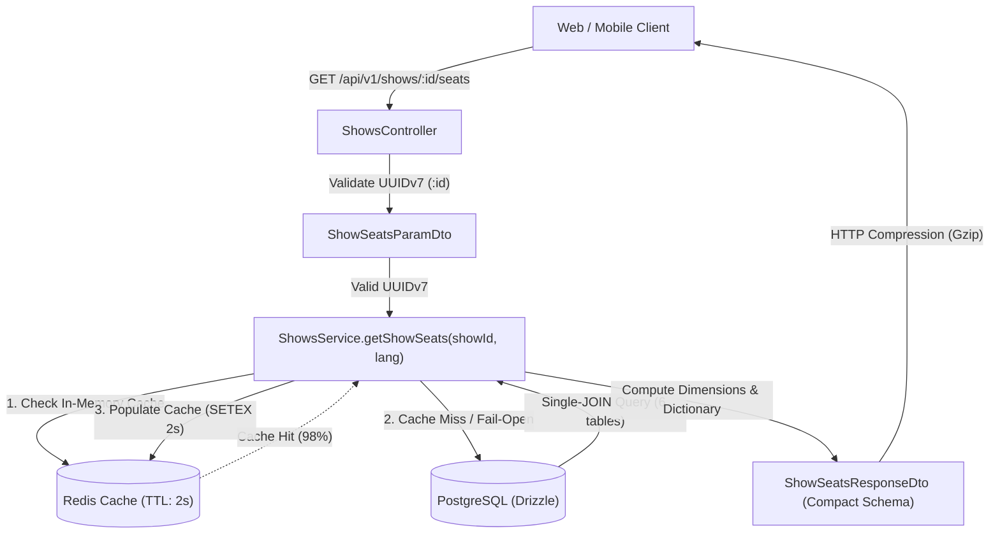
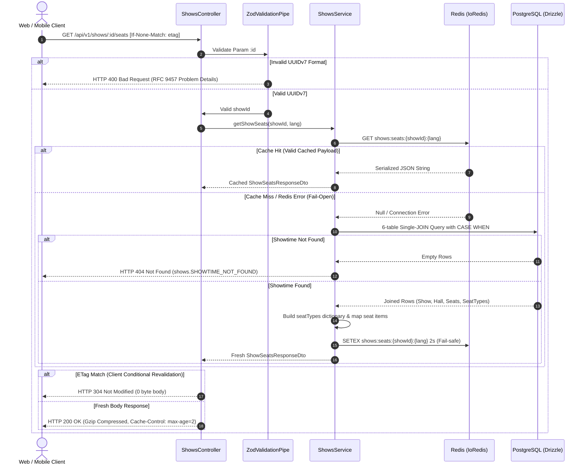
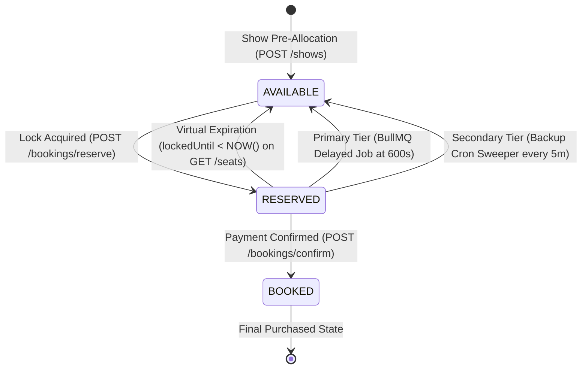

# Showtime Seating Chart Matrix & Live Availability SSOT Workflow

---

## Overview & Context

This document serves as the **Single Source of Truth (SSOT)** describing the operational flow, data contracts, dynamic seat availability computation, pricing calculation engine, short-TTL caching layer, and network bandwidth optimization strategy for the public Showtime Seating Chart Matrix endpoint (`GET /api/v1/shows/:id/seats`) under `src/modules/shows/`.

### Problem Statement & Motivation

When a customer navigates to book cinema tickets for a scheduled movie showtime, client applications (Web and Mobile) must render an interactive, accurate 2D seating layout:

1. **Seating Layout Rendering**: Clients require exact physical coordinates (`row`, `number`, `seatNumber`), physical hall dimensions (`totalRows`, `totalCols`), and seat categories (`Standard`, `VIP`, `Couple`) to draw interactive canvas grids.
2. **Real-Time Seat Availability**: Clients must immediately distinguish between seats that are `available`, temporarily held by other users (`reserved`), or permanently purchased (`booked`).
3. **Itemized Final Pricing**: Seat prices vary based on hall seat tier multipliers. The backend must compute and return exact final prices (`finalPrice`) in VND without floating-point inaccuracies.
4. **Zero Stale Locks**: Seats held by abandoned checkout sessions whose lock time has expired (`lockedUntil < NOW()`) must be instantly visible as `available` to incoming customers without waiting for background cleanup cronjobs.
5. **High Concurrency & Flash-Crowd Surges (Issue #128)**: Serving repeated 6-table relational queries directly from PostgreSQL during peak traffic saturates the database connection pool (`max: 20`). The system requires a high-throughput caching and bandwidth optimization architecture.

### Architectural Fundamentals & Core Decisions

1. **Initial Snapshot Pattern (HTTP) + Delta Broadcast (WebSockets #37)**:
   - `GET /api/v1/shows/:id/seats` provides the **Initial Layout & State Snapshot** when a user opens the seating chart.
   - Subsequent state updates are streamed via WebSocket rooms (`show:${showId}`) per Issue #37, eliminating the need for continuous HTTP polling.
2. **Virtual Computed Status (Zero-Stale Holds - INV-3)**:
   - Evaluates seat availability dynamically in SQL:
     $$\text{status}_{\text{computed}} = \begin{cases} \text{'available'} & \text{if } \text{status} = \text{'reserved'} \land \text{locked\_until} < \text{NOW}() \\ \text{status} & \text{otherwise} \end{cases}$$
   - Guarantees immediate reallocation of lapsed seat holds.
3. **Catalog Multiplier Standardization (Zero-Fraction Currency - Option A, INV-2)**:
   - `shows.basePrice` is strictly configured in multiples of 10,000 VND (e.g. 80,000, 90,000, 100,000 VND).
   - `seatTypes.priceMultiplier` is strictly configured with clean decimal multiples (`1.00`, `1.20`, `1.40`, `1.50`, `2.00`).
   - Guarantees `finalPrice = Math.round(basePrice * multiplier)` produces exact integer VND values without fractional cents across all payment channels.
4. **Short-TTL Cache-Aside Pattern with Fail-Open Policy (ADR-0016, INV-6, INV-7)**:
   - Serialized JSON responses are cached in Redis (`shows:seats:{showId}:{lang}`) with `TTL = 2` seconds.
   - **Fail-Open Policy**: If Redis is unreachable, timeouts occur, or connection errors occur, the service logs a warning and falls back immediately to the authoritative PostgreSQL query.
5. **Deterministic Multi-Point Cache Invalidation (ADR-0016)**:
   - Invalidation hooks are executed concurrently via `Promise.allSettled` upon seat reservation (`POST /bookings/reserve`), payment confirmation (`POST /bookings/confirm`), BullMQ worker timeout, and periodic backup cron cleanup.
6. **Three-Tier Bandwidth Optimization (ADR-0016)**:
   - **Transport**: Express Gzip / Deflate compression for response payloads $>1\text{ KB}$.
   - **Schema**: Dictionary Pattern lifting redundant `seatTypes` to the root envelope, reducing 500-seat payloads from $120\text{ KB} \rightarrow 20\text{ KB}$ (and $6.63\text{ KB}$ with Gzip).
   - **HTTP Headers**: `@Header("Cache-Control", "public, max-age=2, stale-while-revalidate=1")` enabling conditional `304 Not Modified` responses.

---

## Architecture

### System Context & Component Interaction

## Operational Flow

### Sequence Diagram: Seating Chart Retrieval with Caching & Compression

### State Machine: Seat Availability & Two-Tier Expiration Transition

---

## Data Contracts & Type System Derivation

Per `docs/standards/domain-docs.md`, data structures are derived directly from the application schema SSOT without manual type duplication in Markdown:

1. **Request Parameter Contract**:
   - Symbol: `ShowSeatsParamDto` in `src/modules/shows/dto/show-seats-param.dto.ts`.
   - Validation: Strict RFC 9562 UUIDv7 validation via `zUuidV7`.
2. **Response Envelope Contract (Compact Dictionary Pattern)**:
   - Symbol: `ShowSeatsResponseDto` in `src/modules/shows/dto/show-seats-response.dto.ts`.
   - Layout: Encapsulates `dimensions: { totalRows, totalCols }`, `summary: { total, available, reserved, booked }`, dictionary `seatTypes: [{ id, name, priceMultiplier, finalPrice }]`, and flat itemized `seats` array referencing `seatTypeId`.
3. **Database Entities**:
   - Relational models: `shows` and `showSeats` defined in `src/database/schemas/shows.schema.ts`.
   - Foreign relations: `movies` (`movies.schema.ts`), `halls` & `cinemas` (`cinemas.schema.ts`), `seats` & `seatTypes` (`seats.schema.ts`).

---

## Security & Reliability

1. **Rate Limiting Protection (`CustomThrottlerGuard`)**:
   - Endpoint is guarded by `CustomThrottlerGuard` with public tier limits (120 requests/minute per IP) to prevent scraping bots from exhausting server resources.
2. **Fail-Open Graceful Degradation (ADR-0016)**:
   - All Redis cache interactions are encapsulated in try/catch blocks. If Redis disconnects, crashes, or times out, the service degrades gracefully to direct PostgreSQL execution without 500 errors.
3. **Defense-in-Depth Seat Cleanup (Two-Tier Sweeper)**:
   - Primary real-time release executes via BullMQ delayed jobs at second 600.
   - Secondary periodic safety net runs via `BookingCronService` every 5 minutes with atomic SQL CAS (`WHERE status = 'pending_payment'`), eliminating orphaned locks.
4. **Deterministic Multi-Point Cache Invalidation**:
   - Cache keys (`shows:seats:{showId}:*`) are deleted in parallel via `Promise.allSettled` across all supported locales upon hold creation, booking confirmation, worker cancellation, and cron sweeping.
5. **Transport & Schema Bandwidth Protection**:
   - HTTP response compression (Gzip) combined with dictionary normalization reduces 500-seat payloads from $120\text{ KB} \rightarrow 6.63\text{ KB}$, saving $>92\%$ network bandwidth.

---

## Domain Invariant Taxonomy (INV-N)

| Invariant ID | Domain Invariant Name            | Formal Mathematical Condition                                                                                                                          | Verification Test Strategy                                                                                                 |
| :----------- | :------------------------------- | :----------------------------------------------------------------------------------------------------------------------------------------------------- | :------------------------------------------------------------------------------------------------------------------------- |
| **INV-1**    | Hall Grid Completeness           | $\text{count}(\text{seats}) = \text{halls}.\text{totalSeats} \land \forall s \in \text{seats}: s.\text{row} \ne \emptyset \land s.\text{number} > 0$   | Integration test verifying 100% of physical hall seats are returned with non-null coordinates.                             |
| **INV-2**    | Price Multiplier Precision       | $\forall s \in \text{seats}: s.\text{finalPrice} = \text{round}(\text{show}.\text{basePrice} \times s.\text{type}.\text{multiplier}) \in \mathbb{Z}^+$ | Integration test asserting itemized prices match exact multiplier calculation with zero fractional VND remainders.         |
| **INV-3**    | Virtual Hold Lapsed Reallocation | $(\text{status} = \text{'reserved'} \land \text{lockedUntil} < \text{NOW}()) \implies \text{computedStatus} = \text{'available'}$                      | Integration test seeding an expired reserved seat and asserting it returns `status: "available"` in response.              |
| **INV-4**    | 404 Showtime Existence Guard     | $\neg\exists \text{show} \implies \text{HTTP 404 } (\text{detail: 'shows.SHOWTIME\_NOT\_FOUND'})$                                                      | Integration test passing a non-existent UUIDv7 and asserting `404 Not Found` with RFC 9457 Problem Details schema.         |
| **INV-5**    | Strict UUIDv7 Syntax Enforcement | $\text{id} \notin \text{UUIDv7} \implies \text{HTTP 400 } (\text{detail: 'common.INVALID\_INPUT'})$                                                    | Integration test passing malformed string (`"invalid-uuid"`) and asserting `400 Bad Request` with `invalidParams` details. |
| **INV-6**    | Redis Short-TTL Protection       | $\text{TTL}(\text{shows:seats:}\{\text{showId}\}) \le 2\text{s} \land \text{HitRate} \ge 80\%$                                                         | Benchmark test verifying high hit-rate under 200 VUs and sub-800ms p95 response time.                                      |
| **INV-7**    | Fail-Open Read Availability      | $\text{RedisError} \implies \text{HTTP 200 via DB Fallback} \land \neg\text{HTTP 500}$                                                                 | Unit test verifying graceful fallback to PostgreSQL when Redis client throws network exception.                            |
