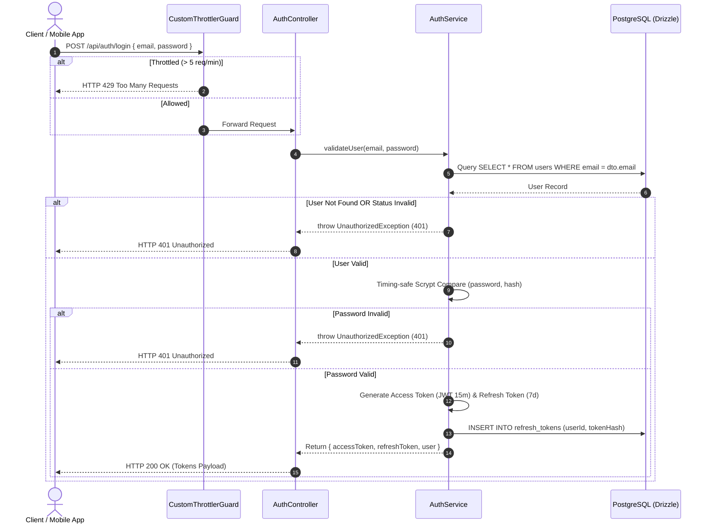

# Login User Workflow Spec

---

## Overview & Context

This document describes the design and operational flow for user authentication (Login Flow) in the Authentication Module. The system enforces rate limiting, verifies account status, and issues secure Access/Refresh token pairs after verifying the password hash using timing-safe Scrypt comparisons.

---

## Architecture & Work Breakdown Structure (WBS)

| WBS ID | Component / Feature Name | Level | Detailed Description / Task | Output / Artifact |
| :--- | :--- | :--- | :--- | :--- |
| **1.0** | **Auth Module** | **L1: Module** | Authentication & credentials management | `src/modules/auth` |
| **1.1** | **Login Feature** | **L2: Feature** | User account authentication endpoint | `POST /api/auth/login` |
| **1.1.1** | **Input Validation** | **L3: Logic** | Validate email & password DTO schema | `LoginDto` |
| **1.1.2** | **Credential Verification** | **L3: Logic** | Scrypt timing-safe password hash comparison | `AuthService.login()` |
| **1.1.3** | **Token & Session** | **L3: Logic** | Issue Access JWT & persist hashed Refresh Token | `refresh_tokens` DB table |
| **1.1.4** | **Rate Limiting** | **L3: Security** | `CustomThrottlerGuard` restricting to 5 req/min per IP | `CustomThrottlerGuard` |

---

## Operational Flow

---

## Technical Decisions & Implementation Details

- **Hashed Refresh Token Persistence**: Refresh tokens are hashed using SHA-256 (`tokenHash`) prior to PostgreSQL storage, preventing plain-token leakage on DB compromise.
- **Constant-Time Verification**: Scrypt verification runs timing-safe comparisons to prevent timing attacks.

---

## Security & Defense-in-Depth

- **Timing-Attack Defense**: Compares Scrypt password hashes using timing-safe operations.
- **User Enumeration Defense**: Returns a generic HTTP 401 Unauthorized error message for invalid credentials.
- **Token Hash Storage**: Stores SHA-256 hashed refresh tokens (`tokenHash`) in PostgreSQL.
- **Rate Limiting**: Restricts attempts to 5 requests/minute per IP via `CustomThrottlerGuard` and Redis.

---

## Verification & Operational Checklist

- [x] Invalid credentials return HTTP 401 Unauthorized.
- [x] Refresh token is stored as SHA-256 hash in `refresh_tokens` table.
- [x] Exceeding 5 requests/minute triggers HTTP 429 Too Many Requests.
