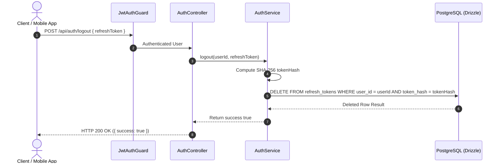

# Logout User Workflow Spec

---

## Overview & Context

This document describes the operational flow for user logout (Logout Flow). Upon logging out, the system terminates the active session by deleting the corresponding Refresh Token record in PostgreSQL based on `tokenHash`, preventing any further token refreshes.

---

## Architecture & Work Breakdown Structure (WBS)

| WBS ID | Component / Feature Name | Level | Detailed Description / Task | Output / Artifact |
| :--- | :--- | :--- | :--- | :--- |
| **1.0** | **Auth Module** | **L1: Module** | Authentication & session lifecycle management | `src/modules/auth` |
| **1.1** | **Logout Feature** | **L2: Feature** | Revoke current user session endpoint | `POST /api/auth/logout` |
| **1.1.1** | **Token Hash & DB Delete** | **L3: Logic** | Hash incoming refresh token & delete DB record | `AuthService.logout()` |

---

## Operational Flow

---

## Technical Decisions & Implementation Details

- **SHA-256 Lookup**: Hashes the incoming refresh token string to match the stored `tokenHash` in PostgreSQL before deletion.
- **Immediate Invalidation**: Session revocation takes effect instantly in PostgreSQL.

---

## Security & Defense-in-Depth

- **Token Revocation**: Immediately revokes the current Refresh Token.
- **Strict Ownership**: Deletes only tokens matching the authenticated `userId` verified by `JwtAuthGuard`.

---

## Verification & Operational Checklist

- [x] Logout deletes the target refresh token from `refresh_tokens` table.
- [x] Revoked refresh token cannot be reused on `POST /api/auth/refresh`.
