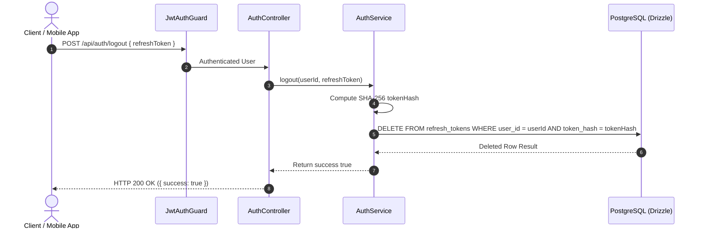

# Logout User Workflow Spec

---

## Overview & Context

This document describes the operational flow for user logout (Logout Flow). Upon logging out, the system terminates the active session by deleting the corresponding Refresh Token record in PostgreSQL based on `tokenHash`, preventing any further token refreshes.

---

## Architecture

- **Session Revocation Endpoint**: Validates JWT session claims and hashes the incoming refresh token.
- **Immediate State Invalidation**: Deletes matching hashed refresh token rows from PostgreSQL to prevent subsequent token refreshment.

---

## Operational Flow

---

## Technical Decisions & Implementation Details

- **SHA-256 Lookup**: Hashes the incoming refresh token string to match the stored `tokenHash` in PostgreSQL before deletion.
- **Immediate Invalidation**: Session revocation takes effect instantly in PostgreSQL.

---

## Security & Defense-in-Depth

- **Token Revocation**: Immediately revokes the current Refresh Token.
- **Strict Ownership**: Deletes only tokens matching the authenticated `userId` verified by `JwtAuthGuard`.

---

## Verification & Operational Checklist

- [x] Logout deletes the target refresh token from `refresh_tokens` table.
- [x] Revoked refresh token cannot be reused on `POST /api/auth/refresh`.
