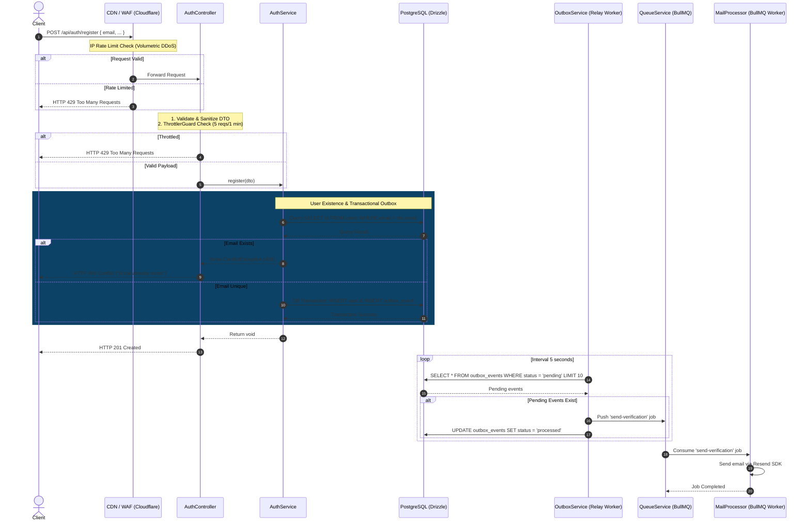

# Register User Existence & Creation Workflow Spec

---

## Overview & Context

This document describes the operational flow for user registration in the Ticket Booking system. The registration process validates email uniqueness, hashes passwords securely using Scrypt, and records an email verification event using the Transactional Outbox Pattern to eliminate the Dual-Write Problem.

---

## Architecture

- **User Registration Flow**: Validates email uniqueness, salts and hashes passwords via Scrypt.
- **Transactional Dual-Write Outbox**: Atomically inserts the new user and an outbox email verification event in a single transaction.

---

## Operational Flow

---

## Technical Decisions & Implementation Details

- **Transactional Dual-Write Outbox**: User account creation and outbox verification email event `auth.verification_email_requested` are executed within a single database transaction.
- **Scrypt Password Hashing**: Hashing uses native `crypto.scrypt` with a cryptographically secure 16-byte salt per user.

---

## Security & Defense-in-Depth

- **Layer 1: CDN / Reverse Proxy**: Protects against global volumetric DDoS attacks.
- **Layer 2: Application Level Throttling**: Restricts attempts to 5 requests/minute per IP via `ThrottlerGuard` and Redis. Prevents **Account Pre-emption DoS** by refraining from hard-locking by email.
- **Layer 3: Progressive Friction**: Supports CAPTCHA verification and exponential backoff during detected spam bursts.
- **Password Protection**: Hashes passwords using `crypto.scrypt` with unique 16-byte random salts.

---

## Verification & Operational Checklist

- [x] Duplicate email registration returns HTTP 409 Conflict.
- [x] Successful registration inserts user record and `auth.verification_email_requested` outbox event atomically.
- [x] Unit and integration tests verify registration, outbox creation, and password hashing.
