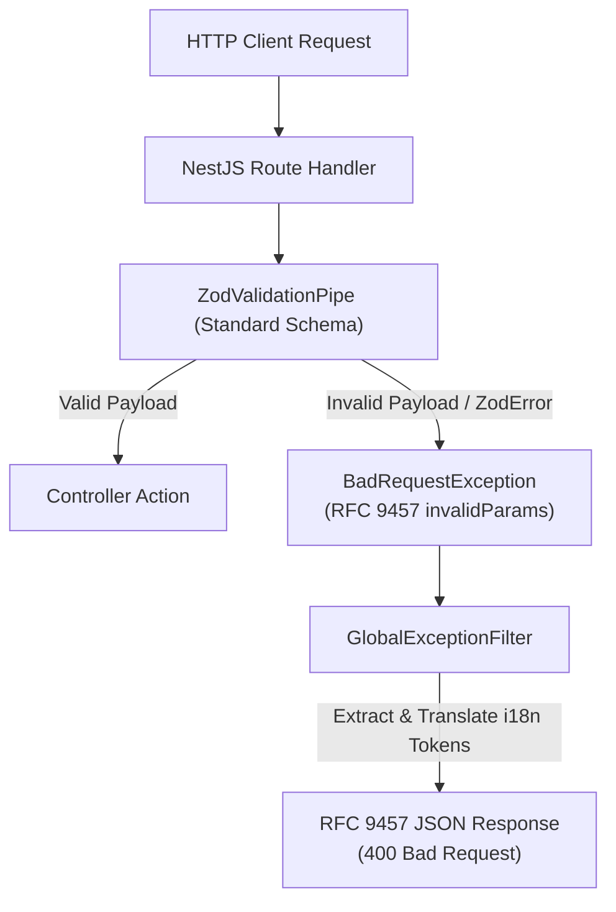
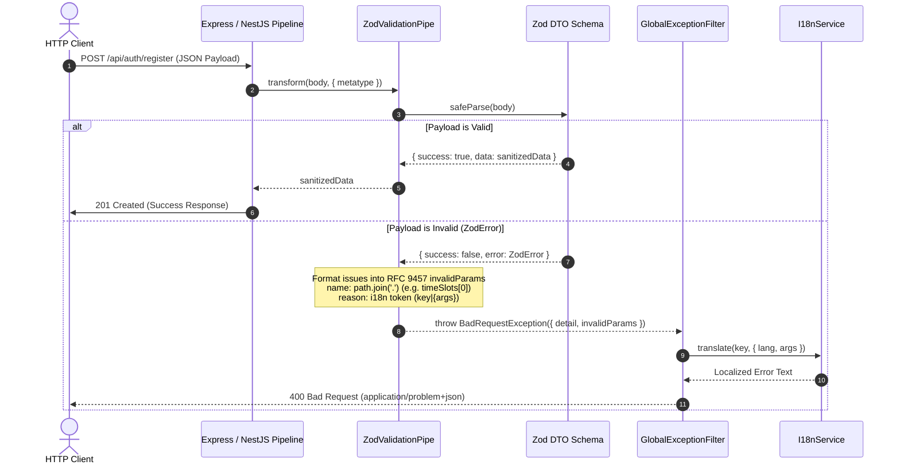

# Zod Standard Schema DTO Validation & RFC 9457 Transformation Workflow

**Status**: ✅ Approved  
**Scope**: Cross-cutting / API Gateway, DTO Validation, Sanitization & RFC 9457 Error Formatting  
**Source Location**: `src/common/pipes/zod-validation.pipe.ts`, `src/common/schemas/zod-primitives.ts`, `src/common/filters/global-exception.filter.ts`, `src/modules/*/dto/`  
**ADR Reference**: `docs/adr/0013-zod-standard-schema-dto-validation-architecture.md`

---

## 1. Overview & Context

In a high-throughput cinema ticket booking platform, request payload validation protects core transaction boundaries (`POST /bookings/reserve`, `POST /shows/batch`) against invalid, malicious, or malformed inputs.

Migrating from the legacy reflection-based `class-validator` + `class-transformer` pipeline to **Zod v4** under NestJS v12 Standard Schema establishes:

1. **Single Source of Truth (SSOT)**: 100% type synchronicity between TypeScript compiler types and runtime validation rules.
2. **Deterministic RFC 9457 Formatting**: Direct transformation of Zod issues into standardized `invalidParams: [{ name, reason }]` with dot/bracket notation for nested paths.
3. **Decoupled i18n Localization**: Zero request-context pollution in schema definitions; dynamic translation handled exclusively by `GlobalExceptionFilter`.
4. **Zero-Overhead Memory Footprint**: Elimination of prototype allocation and dynamic reflection metadata tables.

---

## 2. Architecture & Work Breakdown Structure (WBS)

### Work Breakdown Structure (WBS)

| WBS Code | Component / Task                | Level             | Detailed Description                                                              | Output / Artifact                              |
| :------- | :------------------------------ | :---------------- | :-------------------------------------------------------------------------------- | :--------------------------------------------- |
| **1.0**  | **Zod Core Infrastructure**     | **L1: Module**    | Core Zod validation pipe, primitives & OpenAPI bridge                             | `src/common/pipes/`, `src/common/schemas/`     |
| **1.1**  | **Zod Primitives & Sanitizers** | **L2: Component** | Common reusable Zod schemas (`zEmail`, `zPassword`, `zPhone`, `zSanitizedString`) | `src/common/schemas/zod-primitives.ts`         |
| 1.1.1    | Primitives Unit Tests           | L3: Execution     | Unit tests covering regex, edge bounds, and HTML sanitization                     | `src/common/schemas/zod-primitives.spec.ts`    |
| **1.2**  | **ZodValidationPipe**           | **L2: Component** | Custom Pipe transforming Zod errors to RFC 9457 `invalidParams`                   | `src/common/pipes/zod-validation.pipe.ts`      |
| 1.2.1    | ValidationPipe Unit Tests       | L3: Execution     | Unit tests verifying dot-notation path mapping and RFC 9457 payload format        | `src/common/pipes/zod-validation.pipe.spec.ts` |
| **2.0**  | **Module DTO Migration**        | **L1: Module**    | Migrate all HTTP DTOs across application domains                                  | `src/modules/*/dto/`                           |
| **2.1**  | **Auth Module DTOs**            | **L2: Component** | Migrate `RegisterDto`, `LoginDto`, `ChangePasswordDto`, `ResetPasswordDto`        | `src/modules/auth/dto/`                        |
| **2.2**  | **Shows Module DTOs**           | **L2: Component** | Migrate `CreateShowDto`, `CreateShowBatchDto` with time slot regex                | `src/modules/shows/dto/`                       |
| **2.3**  | **Booking Module DTOs**         | **L2: Component** | Migrate `ReserveSeatsDto`, `ConfirmBookingDto`, `PayOSWebhookDataDto`             | `src/modules/booking/dto/`                     |
| **3.0**  | **Benchmarking & Cleanup**      | **L1: Module**    | Performance baseline verification and package deprecation                         | `test/benchmarks/`, `package.json`             |
| **3.1**  | **DTO Benchmark Suite**         | **L2: Component** | Benchmark throughput comparing class-validator vs Zod on 10k iterations           | `test/benchmarks/dto-validation.bench.ts`      |
| **3.2**  | **Package Deprecation**         | **L2: Component** | Remove `class-validator`, `class-transformer`, and obsolete decorators            | `package.json`, `src/common/decorators/`       |

---

## 3. Operational Flow & Sequence Diagrams

### A. HTTP Request Payload Validation & RFC 9457 Error Transformation

---

## 4. Security & Input Sanitization Invariants

- **INV-01 (Strict Whitelisting Guard)**: All Zod schemas MUST declare `.strict()`. Any unrecognized properties present in the request payload MUST trigger an immediate `400 Bad Request`.
- **INV-02 (HTML Entity Neutralization)**: All string inputs susceptible to XSS (`fullName`, `title`, `description`) MUST pass through `zSanitizedString()` before reaching controllers.
- **INV-03 (Password Complexity Verification)**: `zPassword()` MUST enforce at least 8 characters, 1 uppercase letter, 1 number, and 1 special symbol.
- **INV-04 (UUIDv7 Format Invariant)**: All entity identifiers (`movieId`, `hallId`, `showId`, `seatIds`) MUST strictly validate against RFC 9562 UUIDv7 format.
- **INV-05 (Deterministic RFC 9457 Contract)**: Error responses MUST strictly comply with RFC 9457 `application/problem+json` containing `type`, `title`, `status: 400`, `detail`, `instance`, and `invalidParams`.

---

## 5. Verification & Acceptance Criteria

- [ ] `bun run test:bench` runs `dto-validation.bench.ts` demonstrating $\ge 2\times$ throughput improvement.
- [ ] `bun run openapi:generate` produces 100% compliant OpenAPI 3.1 schema.
- [ ] All unit, integration, and E2E test suites pass with zero regressions (`bun test src/`, `bun run test:e2e`).
- [ ] `class-validator` and `class-transformer` dependencies are completely removed from `package.json`.
