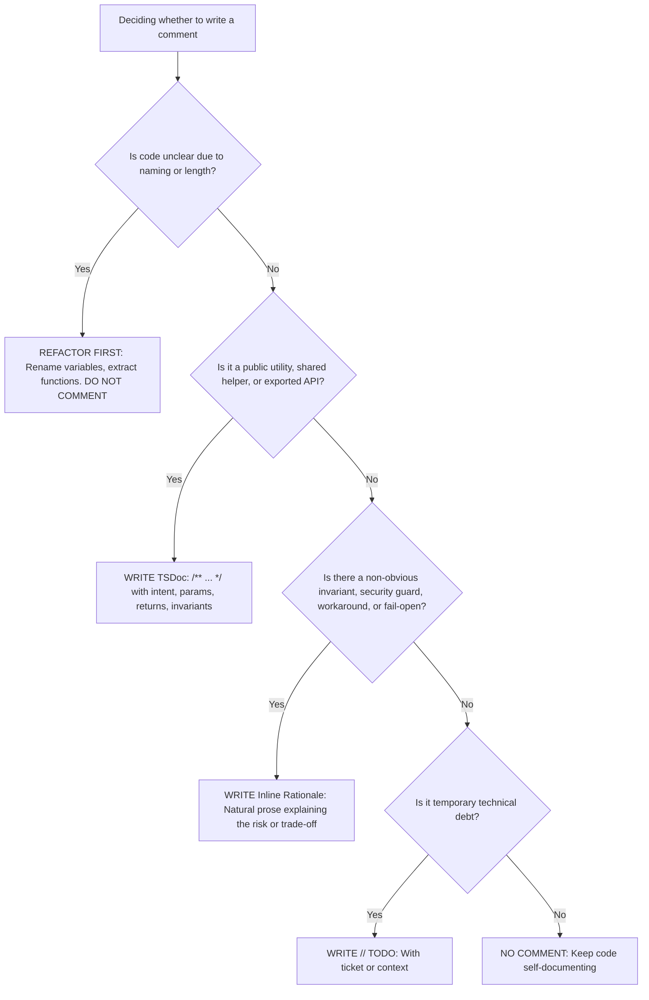

# Code Comment Taxonomy & Standards

## Core Philosophy

> **"Code tells you HOW, Comments tell you WHY."**  
> _(Source code expresses machine execution; Comments explain human intent, trade-offs, and invariants)._

Self-documenting code with expressive naming is always preferred over explanatory comments. Comments do not compensate for bad code; refactor first before commenting.

---

## The 4-Tier Comment Taxonomy



---

### Tier 1: TSDoc / JSDoc (`/** ... */`) — Public & Shared APIs

**Scope**: Exported utilities (`utils/`), shared test helpers (`test/helpers/`, `test/factories/`, `test/mothers/`), custom decorators, pipes, guards, and complex domain service methods.  
**Purpose**: Surface rich IDE IntelliSense tooltips and auto-generated API documentation.

#### Requirements:

- Concise 1–2 sentence summary of intent.
- `@param`, `@returns`, `@throws` tags where signatures require clarification.
- `@invariant INV-N` tag: **Reserved strictly for High-Risk Core Business Logic & Concurrency Engine** (e.g. Booking, Payment, Schedule Collision) as part of the Traceability Triangle. Do NOT annotate generic utilities, test infrastructure, or helpers with artificial `INV-N` codes.

```ts
/**
 * Verifies PayOS Webhook HMAC-SHA256 signature using the checksum key.
 *
 * @param payload Raw webhook payload data
 * @param signature Received signature header
 * @returns true if signature is authentic; otherwise false
 *
 * @invariant INV-6 (Anti-Tampering): Prevents unauthorized payment confirmations
 */
export function verifyPayOSSignature(
  payload: unknown,
  signature: string,
): boolean {
  // ...
}
```

---

### Tier 2: Technical Rationale Comments (Natural Prose) — Why, Not What

**Scope**: Non-obvious architectural decisions, security safeguards, concurrency handling, resilience strategies, and third-party library workarounds.  
**Format**: Concise, natural English sentences explaining the technical reason, invariant, or failure mode prevented. (Do not mandate artificial prefixes like `// WHY:`; write direct, professional prose).

#### 4 Primary Use Cases:

1. **Third-Party Workarounds & Library Edge Cases**:
   ```ts
   // Redlock v5 CJS export fails ESM resolution under verbatimModuleSyntax; ambient declaration bridges ESM import.
   ```
2. **Security Safeguards (Timing attacks, XSS, User Enumeration)**:
   ```ts
   // Split limit of 2 guards against colons inside a base-encoded key segment producing extra parts.
   const [salt, key] = storedHash.split(":", 2);

   // timingSafeEqual throws on length mismatch — guard prevents an uncaught TypeError.
   if (derivedKey.length !== keyBuffer.length) {
     return false;
   }
   ```
3. **Resilience & Fault Tolerance (Fail-Open, Timeouts, Retries)**:
   ```ts
   // Fail-open strategy if Redis rate-limiter is offline or timing out, prioritizing API availability over rate limiting.
   return true;
   ```
4. **Database & Operating System Invariants**:
   ```ts
   // Trust reverse proxy headers (X-Forwarded-For) so throttler correctly identifies client IPs behind WAF/CDN.
   app.set("trust proxy", 1);
   ```

---

### Tier 3: `// TODO:` Comments — Tracked Technical Debt

**Rule**: NEVER write bare `// TODO: fix this`. Every TODO must name the context, issue, or condition:

```ts
// GOOD
// TODO(auth-v2): Replace scrypt with Argon2id once native hardware acceleration is benchmarked in production.

// BANNED
// TODO: refactor later
```

---

### Tier 4: Banned Comments (Strictly Prohibited)

| Banned Category             | Violation Example                                                   | Remediation                                        |
| :-------------------------- | :------------------------------------------------------------------ | :------------------------------------------------- |
| **Echoing Code**            | `// get user by id`<br>`const user = await getUser(id);`            | **Delete**. Code is already self-explanatory.      |
| **Excusing Poor Code**      | `// n: ticket count, s: show time`<br>`function calc(n, s) { ... }` | **Refactor**. Rename to `(ticketCount, showTime)`. |
| **Dead Code**               | `// const oldPrice = basePrice * 1.2;`                              | **Delete**. Git tracks history.                    |
| **Changelog / Author Tags** | `// Updated by Dev on 2026-08-20`                                   | **Delete**. Use `git blame` and `git log`.         |
| **Non-English Comments**    | `// Lấy thông tin user từ database`                                 | **Translate to English** or delete if obvious.     |

---

## Enforcement Checklist

1. [ ] Are all comments written in **English**?
2. [ ] Does any comment merely repeat what the code says? If yes $\rightarrow$ **Remove**.
3. [ ] Does non-obvious security or resilience logic have a `// WHY:` comment?
4. [ ] Are public utilities documented with **TSDoc** (`/** ... */`)?
