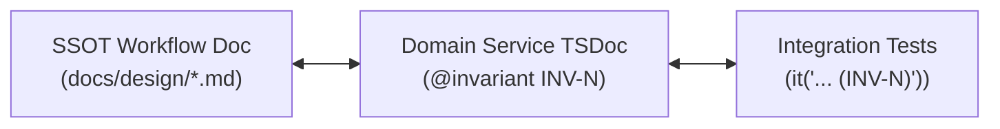

# Domain Documentation Standards

## 1. Domain SSOT: `CONTEXT.md` & Glossary

- **Location**: `CONTEXT.md` at the repository root.
- **Ubiquitous Language**: All code identifiers (entity names, DTO fields, database tables, route segments, test cases) MUST strictly use the terms defined in `CONTEXT.md`.
- **Prohibition**: Do not invent synonyms or translate domain terms arbitrarily.

---

## 2. Architectural Decision Records: `docs/adr/`

- **Location**: `docs/adr/` with zero-padded numbering: `NNNN-<kebab-case-title>.md` (e.g. `0001-redlock-distributed-lock-concurrency-control.md`).
- **Review Requirement**: Before implementing features touching database schema, auth, caching, or locking, MUST read the corresponding ADRs.
- **Handling Contradictions**: If a proposed implementation contradicts an existing ADR, surface the conflict explicitly in PR descriptions and ADR updates rather than overriding silently.

---

## 3. Repository Layout (Single-Context)

```
/
├── CONTEXT.md          # Global domain glossary and ubiquitous language
├── docs/adr/           # Architecture Decision Records (0001-...)
└── src/                # Application modules adhering to the domain model
```

---

## 4. Domain Invariant Taxonomy & Traceability (`INV-N`)

### A. Module-Scoped Invariant Matrix

Domain invariants are scoped per Domain Module (e.g. `ShowsDomainInvariants: INV-1..4`, `BookingDomainInvariants: INV-1..6`, `AuthDomainInvariants: INV-1..4`). Invariant identifiers are unique within the module and shared across all endpoints/operations in that domain:



### B. The Traceability Triangle

1. **SSOT Specification**: `docs/design/<feature>-workflow.md` explicitly enumerates all domain invariants (`INV-1`, `INV-2`, etc.).
2. **Service TSDoc**: Exported service methods MUST document all enforced invariants via `@invariant INV-N (<Name>): <Enforcement Details>` in Tier 1 TSDoc.
3. **Test Assertions**: Test suites MUST tag corresponding test assertions with `(INV-N)` in the `it("...")` description to guarantee continuous verification.
