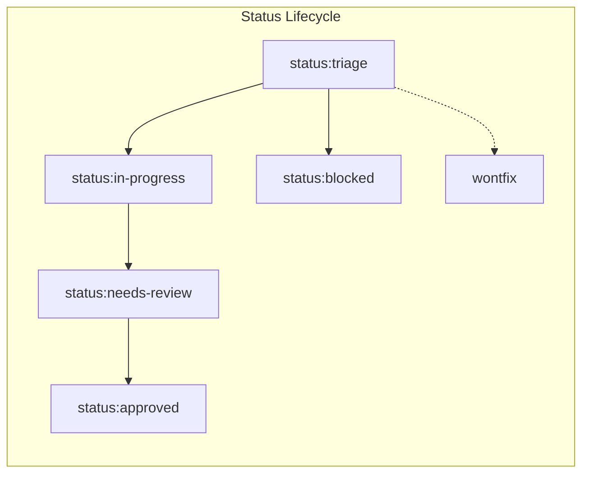

# Issue Tracker & Ticket Standards

## 1. Platform: GitHub Issues

Issues and specifications for this repository are managed via **GitHub Issues**. Use the official `gh` CLI for all operations.

---

## 2. CLI Command Conventions

| Operation        | Command                                       | Notes                                          |
| :--------------- | :-------------------------------------------- | :--------------------------------------------- |
| **Create Issue** | `gh issue create --title "..." --body "..."`  | Use heredocs for structured markdown bodies.   |
| **View Issue**   | `gh issue view <number> --comments`           | Reads issue description, labels, and comments. |
| **List Issues**  | `gh issue list --state open --label "<name>"` | Filter open tickets by status, type, or area.  |
| **Comment**      | `gh issue comment <number> --body "..."`      | Post updates or link PRs.                      |
| **Apply Labels** | `gh issue edit <number> --add-label "<name>"` | Update status or metadata labels.              |
| **Close Issue**  | `gh issue close <number> --comment "..."`     | Close ticket with resolution summary.          |

---

## 3. Repository Label Taxonomy

### A. Status Labels (Lifecycle)

- `status:triage` — Initial state; newly created issue awaiting evaluation.
- `status:in-progress` — Active development in progress.
- `status:blocked` — Blocked on external dependency, missing credentials, or reporter clarification.
- `status:needs-review` — PR submitted, awaiting review.
- `status:approved` — Reviewed and approved for merge.
- `wontfix` — Out of scope or rejected proposal.

### B. Type Labels (Conventional Commits Alignment)

- `type:feat` — New feature or capability.
- `type:fix` — Bug fix or patch.
- `type:refactor` — Code refactoring without behavior change.
- `type:perf` — Performance optimization.
- `type:test` — Adding or updating test suites.
- `type:docs` — Documentation only.
- `type:chore` — Tooling, dependencies, or maintenance.
- `type:ci` — CI/CD workflow updates.
- `type:style` — Formatting or cosmetic changes.

### C. Area Labels (Domain Scopes)

- `area:auth` — Authentication, authorization, tokens, passwords.
- `area:booking` — Booking flow, seat reservations, payments, outbox.
- `area:catalog` — Movies, cinemas, halls, shows, seats.
- `area:api` — REST API routing, pipes, filters, OpenAPI.
- `area:core` — Core application infrastructure, modules, configs.
- `area:db` — Database schemas, Drizzle ORM, migrations, queries.
- `area:infra` — Redis, Redlock, BullMQ, Docker, logging, health.
- `area:harness` — Agent harness, context, skills, prompts.

### D. Priority Labels

- `priority:p0` — Critical blocker (emergency / system down).
- `priority:p1` — High priority (blocks release milestone).
- `priority:p2` — Normal priority (default).

---

## 4. Triage Skill Mapping (`/triage`)

| Canonical Triage Role | Mapped Repo Label                               |
| :-------------------- | :---------------------------------------------- |
| `needs-triage`        | `status:triage`                                 |
| `needs-info`          | `status:blocked`                                |
| `ready-for-agent`     | `status:triage` + `type:*` + `area:*`           |
| `ready-for-human`     | `status:triage` + `priority:p0` / `priority:p1` |
| `wontfix`             | `wontfix`                                       |

---

## 5. Wayfinder Operations (`/wayfinder`)

- **Map Ticket**: Single GitHub issue labeled `wayfinder:map` holding decisions, notes, and fog tracker.
- **Child Tickets**: Linked sub-issues labeled `wayfinder:<type>` (`research`/`prototype`/`grilling`/`task`).
- **Dependency Blocking**: Uses GitHub native issue dependencies (`repos/<owner>/<repo>/issues/<child>/dependencies/blocked_by`). A ticket is unblocked when all blocker issues are closed.
