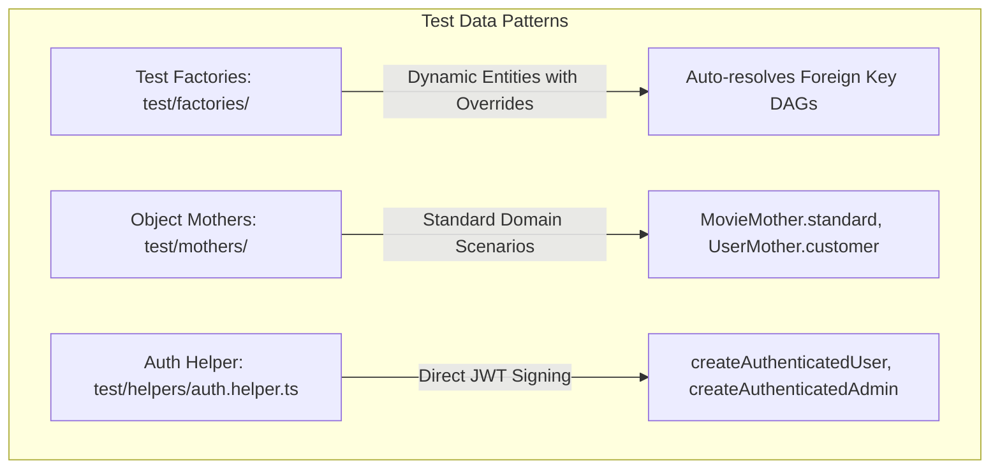

# Testing & Fixture Standards

## 1. 3-Tier Integration Test Hierarchy

All test suites under `test/` MUST adhere to the standardized 3-tier structure:

- **Level 1 (File Root)**: `describe("<Domain> Module Integration", () => { ... })`
- **Level 2 (Endpoint / Scope)**: `describe("<HTTP_METHOD> <route> [(<Context/Focus>)]", () => { ... })` (or `describe("Database Invariants: <Topic>", () => { ... })`)
- **Level 3 (Test Case)**: `it("should <action and expected outcome> when <condition>", async () => { ... })`

```ts
describe("Shows Module Integration", () => {
  describe("POST /shows", () => {
    it("should create a show and bulk pre-allocate available seats (201 Created) when input is valid", async () => {
      // Arrange, Act, Assert
    });
  });
});
```

---

## 2. Test Data Factory & Object Mother Patterns



- **Factory Pattern**: Use `create<Entity>(db, overrides)` with `Partial<TNewEntity> = {}` to automatically resolve parent relationships.
- **Object Mother Pattern**: Centralize domain presets (`MovieMother.standard()`, `UserMother.admin()`).
- **Auth Helper**: Use `createAuthenticatedUser()` to get a ready-to-use `{ user, token, authHeader }` without cross-module HTTP requests.

---

## 3. SUT Boundary & Cross-Module Test Isolation

- **Testing the Auth Module (`auth.spec.ts`)**: Call the HTTP endpoints (`/auth/register`, `/auth/login`) directly because the Auth API itself is the System Under Test (SUT).
- **Testing Other Modules (`shows.spec.ts`, `users.spec.ts`, `booking.spec.ts`)**: DO NOT call `/auth/register` over HTTP to create test users. Seed directly via `UserMother` / `createAuthenticatedUser` to eliminate test coupling and speed up execution.

---

## 4. OpenAPI Contract-First Type Assertions

- **PROHIBITION**: Never declare local, hand-rolled response interfaces inside test files (`interface UserProfile { ... }`).
- **MANDATORY**: Import schema types from the generated OpenAPI specification (`test/generated/api-schema.d.ts`):

```ts
import type { components } from "../generated/api-schema";

type UserProfileData = components["schemas"]["UserResponseDto"];
type GetProfileResponse = components["schemas"]["ApiResponseDto"] & {
  data: UserProfileData;
};
type Rfc9457ErrorResponse = components["schemas"]["Rfc9457ErrorResponseDto"];
```

---

## 5. Database Isolation per Test Run

- **`beforeEach`**: Run `truncateAllTables(db)` to clear transactional tables and reset state.
- **Deterministic Cleanup**: Ensure all background cron timers and Redis connections are closed in `afterAll()`.

---

## 6. Performance Benchmarks & Stress Testing (`test/benchmarks/`)

- **Location**: `test/benchmarks/` with naming convention `<domain>.bench.ts` (e.g. `shows-batch.bench.ts`).
- **Runner**: `bun run test:bench` (or filter by domain: `bun run test:bench shows`).
- **Structure**: Export `runBenchmark(): Promise<BenchmarkMetric[]>` returning metrics (`task`, `iterations`, `minMs`, `avgMs`, `p50Ms`, `p95Ms`, `p99Ms`, `opsPerSec`).
- **Output Standards**: Console table output only — zero emojis, zero ASCII decorative dividers (`===`), machine-readable and CI/CD-friendly.
