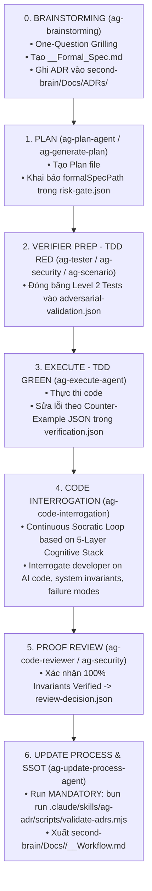

# Architect & Verifier Operational Playbook (Master Workflow Guide)

> **Cẩm Nang Vận Hành Hệ Thống Agent:** Hướng dẫn từng bước từ Ý Tưởng $\rightarrow$ Formal Spec $\rightarrow$ Frozen TDD Tests $\rightarrow$ Counter-Example Loop $\rightarrow$ Operational SSOT Documentation.  
> **Áp dụng cho:** Tất cả các dự án sử dụng `agent-skills-kit` & RIPER-5 framework.

---

## 1. Quick Decision Matrix (Bảng Phân Tầng Rủi Ro)

| Phân Loại Task              | Các Trường Hợp Nhận Diện (Trigger Classes)                                                                                                                                                                             | Luồng Công Việc Bắt Buộc                                                                                                                                  | Artifacts Cần Có                                                                                                                                      |
| :-------------------------- | :--------------------------------------------------------------------------------------------------------------------------------------------------------------------------------------------------------------------- | :-------------------------------------------------------------------------------------------------------------------------------------------------------- | :---------------------------------------------------------------------------------------------------------------------------------------------------- |
| **High-Risk Class**         | • Auth & Identity<br>• Billing & Payment Transactions<br>• DB Schema Migration / Destructive Mutation<br>• Public API Contract Changes<br>• Deploy / Runtime / Gateway / Proxy<br>• Permission, Secret, Trust Boundary | **Formal Architect & Verifier Protocol**<br>(One-Question Grilling $\rightarrow$ Formal Spec $\rightarrow$ Level 2 TDD Freeze $\rightarrow$ Proof Review) | • `<Feature>_<Topic>_Formal_Spec.md`<br>• `risk-gate.json`<br>• `adversarial-validation.json`<br>• `verification.json`<br>• `second-brain/Docs/ADRs/` |
| **Low-Risk / UI / Trivial** | • Sửa lỗi nhỏ (< 15 dòng code)<br>• Tinh chỉnh UI / CSS / Text<br>• Sửa typo / Config không chứa logic                                                                                                                 | **Lightweight RIPER-5 / Fast Mode**<br>(Bỏ qua Formal Spec & Verification Heavyweight)                                                                    | • Direct Plan hoặc Fast Mode Plan                                                                                                                     |

---

## 2. End-to-End Flow & Copy-Paste Prompts Cho Từng Phase



### 🔹 Prompt Phase 0: ARCHITECT (One-Question Grilling & Formal Spec)

> **Copy và dán prompt này vào chat:**

```text
ENTER BRAINSTORMING MODE

Yêu cầu: Tôi muốn phát triển tính năng [Tên tính năng, ví dụ: Chuyển tiền giữa các ví người dùng].
Phát hiện đây là High-Risk Class (Billing/Payment).
Hãy kích hoạt quy trình One-Question Grilling (phỏng vấn dồn từng câu một kèm đáp án đề xuất) để khai phá:
1. System Invariants (Các hằng số logic không được vi phạm)
2. Fail-Safe Boundary (Trạng thái an toàn khi gặp sự cố)
3. Level 2 Edge Cases & Adversarial Scenarios

Sau khi thống nhất, hãy tạo file đặc tả chính thức tại:
process/features/[feature-slug]/active/[Feature]_[Topic]_Formal_Spec.md dựa trên formal-spec-template.md.
Nếu có quyết định kiến trúc lớn, hãy dùng skill ag-adr để ghi file vào second-brain/Docs/ADRs/000X-[name].md.
```

---

### 🔹 Prompt Phase 1: PLAN (Kế Hoạch Thực Thi & Harness Manifest)

> **Copy và dán prompt này vào chat:**

```text
ENTER PLAN MODE

Hãy tạo kế hoạch triển khai cho tính năng tại:
process/features/[feature-slug]/active/[Feature]_[Topic]_Formal_Spec.md

Yêu cầu:
1. Đọc kỹ file Formal Spec và trích xuất các System Invariants.
2. Ghi rõ formalSpecPath trong phần Header của Plan và khởi tạo risk-gate.json tại:
   process/features/[feature-slug]/reports/harness/risk-gate.json
3. Phân tách danh sách công việc theo chuẩn WBS.
```

---

### 🔹 Prompt Phase 2: VERIFIER PREP (TDD RED - Đóng Băng Test Suite)

> **Copy và dán prompt này vào chat:**

```text
Phát động Verifier Prep cho Plan: [Đường dẫn file Plan]

Yêu cầu đối với ag-tester, ag-security, ag-scenario:
1. Đọc formalSpecPath từ risk-gate.json.
2. Sinh bộ Level 2 Property-Based Tests (fast-check) và Adversarial Scenario Matrix dựa trên các System Invariants.
3. ĐÓNG BẰNG bộ test này vào file:
   process/features/[feature-slug]/reports/harness/adversarial-validation.json
4. Xác nhận bộ test ở trạng thái RED (chưa có code triển khai).
```

---

### 🔹 Prompt Phase 3: EXECUTE (TDD GREEN - Viết Code & Phản Ví Dụ)

> **Copy và dán prompt này vào chat:**

```text
ENTER EXECUTE MODE

Plan file selected: process/features/[feature-slug]/active/[Plan_Filename].md

Yêu cầu đối với ag-execute-agent:
1. Đọc bản Formal Spec tại formalSpecPath và bộ test đóng băng trong adversarial-validation.json.
2. Viết code triển khai tuân thủ 100% các System Invariants.
3. Chạy bộ test. Nếu fail, hãy đọc chi tiết Payload Phản Ví Dụ (Counter-Example JSON) trong:
   process/features/[feature-slug]/reports/harness/verification.json
   và tiến hành sửa code cho đến khi 100% test chuyển sang PASS.
```

---

### 🔹 Prompt Phase 4: CODE INTERROGATION (Socratic Review & Cognitive Validation)

> **Copy and paste this prompt into chat:**

```text
Activate Socratic Code Interrogation for feature: [feature-slug]

Requirements for ag-code-interrogation:
1. Inspect the actual git diff and the Formal Spec file at formalSpecPath.
2. Conduct a continuous open-ended Socratic Q&A loop structured across the Embedded 5-Layer Cognitive Stack:
   * Layer 1 (Intuition & Bias Filtering): Challenge Confirmation Bias and Sunk Cost Fallacy regarding AI-generated code.
   * Layer 2 (Inquiry & Deconstruction): Probe First Principles and core System Invariants.
   * Layer 3 (Systems Thinking & Second-Order Effects): Interrogate downstream impacts on memory, concurrency, IO, and API callers.
   * Layer 4 (Innovation & Divergent Thinking): Evaluate Trade-off Analysis and Inversion failure scenarios.
   * Layer 5 (Execution & Proof): Inspect concrete verification evidence and execution logs.
3. Transition to Proof Review / Update Process ONLY when the developer demonstrates mastery and achieves Gate PASS (or types "stop").
```

---

### 🔹 Prompt Phase 5: PROOF REVIEW (Thẩm Định Bằng Chứng)

> **Copy và dán prompt này vào chat:**

```text
Chạy Proof Review cho feature: [feature-slug]

Yêu cầu đối với ag-code-reviewer và ag-security:
1. Đối chiếu lại nguồn code thực tế với các System Invariants trong file Formal Spec.
2. Kiểm tra bộ test verification.json đã pass 100% chưa.
3. Nếu đảm bảo an toàn tuyệt đối, hãy cập nhật review-decision.json với status:
   mustStopBeforeFinalize: false.
```

---

### 🔹 Prompt Phase 6: UPDATE PROCESS (Kiểm Định ADR & SSOT Archival)

> **Copy và dán prompt này vào chat:**

```text
ENTER UPDATE PROCESS MODE

Yêu cầu:
1. Chạy MANDATORY CHECK kiểm định ADRs:
   bun run .claude/skills/ag-adr/scripts/validate-adrs.mjs
2. Di chuyển file Spec từ active/ sang completed/:
   process/features/[feature-slug]/completed/[Feature]_[Topic]_Formal_Spec.md
3. Sử dụng ag-second-brain và ag-workflow-doc để tổng hợp bằng chứng verification và xuất file Hồ sơ Vận hành SSOT lâu dài tại:
   second-brain/Docs/[Topic]/[Feature]_[Topic]_Workflow.md (theo chuẩn workflow-documentation-standard.md).
```

---

## 3. Quy Chuẩn Đặt Tên File & Truy Vết (Traceability Governance)

```
process/features/{feature}/
├── active/
│   ├── [Feature]_[Topic]_Formal_Spec.md     <-- Formal Spec (Pre-Implementation)
│   └── [feature]_PLAN_[dd-mm-yy].md        <-- Plan file
├── reports/
│   └── harness/
│       ├── risk-gate.json                  <-- Khai báo formalSpecPath
│       ├── adversarial-validation.json     <-- Frozen Level 2 Tests (TDD RED)
│       ├── verification.json               <-- Counter-Example Logs (TDD GREEN)
│       └── review-decision.json            <-- Proof Verification Report
└── completed/                              <-- Nơi di chuyển file Spec khi xong

second-brain/Docs/
├── ADRs/
│   └── 000X-<kebab-case-name>.md           <-- Centralized ADR SSOT Directory
└── <Topic>/
    └── <Feature>_<Topic>_Workflow.md       <-- Operational Doc SSOT (Post-Verification)
```

---

## 4. Ví Dụ Payload Phản Ví Dụ TDD (Counter-Example JSON Loop)

Khi `AI Formal Verifier` chạy bộ test đóng băng và phát hiện lỗi, nó xuất payload dạng JSON sau vào `verification.json`:

```json
{
  "status": "FAIL",
  "violatedInvariant": "INV-1 (Data Consistency)",
  "counterExample": {
    "initialState": { "userBalance": 100 },
    "inputs": [
      { "action": "withdraw", "amount": 100 },
      { "action": "withdraw", "amount": 100 }
    ],
    "timing": "concurrent_1ms",
    "expectedOutput": "Error: InsufficientFundsException",
    "actualOutput": "Success: Both transactions processed",
    "actualFinalBalance": -100
  },
  "instructionForCoder": "Fix race condition in withdraw method using pessimistic DB locking or atomic transaction."
}
```

_`ag-execute-agent` đọc payload này, sửa code và re-run cho đến khi `status` chuyển thành `PASS`._

---

## 5. Điểm Tích Hợp ADR (Architectural Decision Records)

1. **Vị Trí Tập Trung Duy Nhất**: `second-brain/Docs/ADRs/000X-<name>.md`.
2. **Quy Trình Tạo**: Được kích hoạt từ `ag-brainstorming` hoặc `ag-innovate-agent` khi chốt một quyết định lớn (ví dụ: Chọn _Outbox Pattern_, _Pessimistic Locking_).
3. **Liên Kết Trong Spec**: Dẫn link ADR vào mục _System Invariants_ của file Spec:

   ```markdown
   - `INV-1`: Giao dịch phải Atomic via Outbox Pattern — [Xem ADR chi tiết tại second-brain/Docs/ADRs/0003-wallet-outbox-pattern.md]
   ```

4. **Kiểm Định Bắt Buộc Khi Đóng Phase**: Run `bun run .claude/skills/ag-adr/scripts/validate-adrs.mjs` trong `UPDATE PROCESS` mode.
