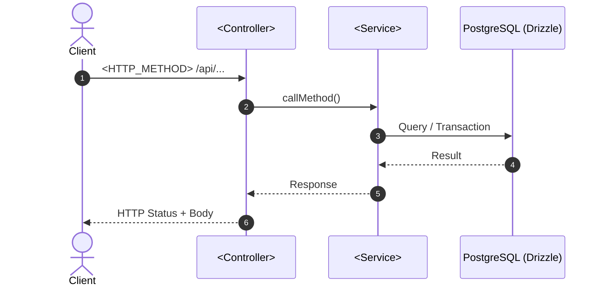
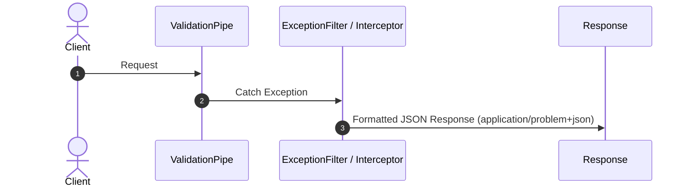

# Workflow Documentation Standard & Templates (Single Source of Truth - SSOT)

This document defines the **Single Source of Truth (SSOT)** standard for authoring all architectural and business process workflow documents (Workflow Docs) located in `second-brain/Docs/` or `process/references/`.

---

## 1. Document Archetypes

The workflow documentation system categorizes all Workflow Docs into **two core archetypes** defined by the frontmatter property `docType`:

| Frontmatter Property               | Document Archetype          | Applicable Scope                                                                     | Core Characteristics                                                                                                                                                                |
| :--------------------------------- | :-------------------------- | :----------------------------------------------------------------------------------- | :--------------------------------------------------------------------------------------------------------------------------------------------------------------------------------- |
| `docType: feature-workflow`        | **Feature Workflow**        | Business features (Auth, Booking, Payment, Ticket management)                        | Focuses on business domain logic, 4-level WBS breakdown table, autonumbered Sequence diagrams, DB/Outbox transaction decisions, Defense-in-Depth security, and Implementation Checklists. |
| `docType: infrastructure-workflow` | **Infrastructure Workflow** | Cross-cutting technical infrastructure (Filters, Interceptors, Guards, Outbox Relay) | Focuses on system architecture, Exception/Middleware flow sequence diagrams, Codebase blueprints, Production data leak audits, and Verification checklists.                     |

---

## 2. Work Breakdown Structure (WBS Table Standard)

All `feature-workflow` (and complex `infrastructure-workflow`) documents **MUST** use a structured Markdown WBS Table as the primary breakdown format instead of wide Mermaid graphs.

### Rationale for Markdown WBS Tables

1. **Explicit Hierarchical Numbering**: Supports structured numbering from L1 through L4 (`1.0` -> `1.1` -> `1.1.1` -> `1.1.1.1`).
2. **Precise Artifact Tracking**: Every row explicitly names the target source file, DTO, Database Schema, or HTTP Status code.
3. **Screen Readability**: Prevents overly horizontal Mermaid diagrams that are difficult to read on smaller displays.

### WBS Table Template

| WBS Code  | Component / Feature Name    | Level             | Detailed Description / Task        | Output / Artifact          |
| :-------- | :-------------------------- | :---------------- | :--------------------------------- | :------------------------- |
| **1.0**   | **[Module Name]**           | **L1: Module**    | Overall module boundary            | `src/modules/[module]`     |
| **1.1**   | **[Feature/Component Name]**| **L2: Component** | Detailed feature or component      | `[HTTP_METHOD] /api/...`   |
| **1.1.1** | **[Logic Layer / Guard]**   | **L3: Logic**     | Middleware / Guard / DTO handling  | `[file.guard.ts / dto.ts]` |
| 1.1.1.1   | Subtask 1                   | L4: Execution     | Specific logic (Validate/Transform)| `src/...`                  |
| 1.1.1.2   | Subtask 2                   | L4: Execution     | Exception / Error handling         | `src/...`                  |
| **1.1.2** | **[Service / Database]**    | **L3: Logic**     | Business logic & DB transactions   | `[service.ts]`             |
| 1.1.2.1   | Query / Transaction         | L4: Execution     | DB Query / Outbox Event            | `src/database/schemas/...` |

---

## 3. Template Type 1: Feature Workflow (`docType: feature-workflow`)

For business features such as `Register`, `Login`, `Change Password`, or `Book Ticket`.

```markdown
---
title: <Feature Name> Workflow & Architecture Spec
tags:
  - type/workflow
  - topic/<module>
docType: feature-workflow
status: draft # draft | approved | implemented
date: YYYY-MM-DD
---

# Workflow Analysis & Architecture Spec: <Feature Name>

**Status**: ⏳ Draft / ✅ Approved / 🚀 Implemented  
**Module**: `src/modules/<module-name>`  
**Route/Endpoint**: `<HTTP_METHOD> /api/<path>`

---

## 1. Work Breakdown Structure (WBS)

| WBS Code  | Component / Feature Name | Detailed Description / Task | Output / Artifact        |
| :-------- | :----------------------- | :-------------------------- | :----------------------- |
| **1.0**   | **<Module Name>**        | Manages ...                 | `src/modules/<module>`   |
| **1.1**   | **<Feature Name>**       | Feature capability ...      | `<HTTP_METHOD> /api/...` |
| **1.1.1** | **Guard & Validation**   | ...                         | `src/...`                |
| 1.1.1.1   | Logic Subtask            | ...                         | `src/...`                |
| **1.1.2** | **Business Logic & DB**  | ...                         | `src/...`                |

---

## 2. Sequence Diagram



---

## 3. Technical Decisions & Code Snippets

### 3.1 Routing & DTO Schema

- Code snippet for DTO Validation & Transformer.

### 3.2 Service Logic & Transaction Strategy

- Code snippet for Service / Transaction / Outbox Pattern.

---

## 4. Defense-in-Depth & Security Strategy

- **Layer 1: Gateway / Rate Limit Guard** (Anti-DDoS)
- **Layer 2: Application Throttler Guard** (Anti-Bruteforce per IP)
- **Layer 3: Business Identity Verification** (Password hashing, Session Revocation)

---

## 5. Implementation Checklist

- [ ] **Step 1**: Create DTO & Validation rules
- [ ] **Step 2**: Implement Service logic & DB Query
- [ ] **Step 3**: Write Unit Tests & Integration Tests

---

## 6. Related Documentation

- [[Link_To_Atomic_Note_1]]
- [[Link_To_Atomic_Note_2]]
```

---

## 4. Template Type 2: Infrastructure Workflow (`docType: infrastructure-workflow`)

For technical infrastructure such as `GlobalExceptionFilter`, `JwtAuthGuard`, or `LoggingInterceptor`.

```markdown
---
title: <Component Name> Implementation & Workflow Audit Guide
tags:
  - type/infrastructure
  - topic/nestjs
docType: infrastructure-workflow
status: approved
date: YYYY-MM-DD
---

# <Component Name> Implementation & Workflow Audit Guide

**Status**: ✅ Approved / 🚀 Implemented  
**Scope**: Cross-cutting / Global Infrastructure  
**Source Path**: `src/common/<type>/<filename>.ts`

---

## 1. Executive Summary & Architectural Goals

- Architectural goal & target problem solved.
- Standard compliance (e.g. RFC 9457 Problem Details, OpenTelemetry, NestJS Spec).

---

## 2. Operational & Exception Sequence Diagram



---

## 3. Detailed Implementation Blueprint

### Step 1: Bootstrap Configuration (`src/main.ts`)

- Code snippet for global registration.

---

### Step 2: Core Class Implementation (`src/common/...`)

- Code snippet for the primary class.

---

## 4. Security & Data Leak Safeguards

- **Sanitization**: Omit Stack Traces in Production environments.
- **SQL Error Shielding**: Shield raw database query errors from client responses.
- **Header Enforcement**: Enforce secure response headers (`Content-Type: application/problem+json`).

---

## 5. Audit & Verification Checklist

- [ ] **Header Audit**: Ensure correct response Content-Type headers.
- [ ] **Parity Check**: Format consistency between DTO errors and Domain exceptions.
- [ ] **Production Leak Audit**: Confirm zero sensitive data leakage.

---

## 6. Related Documentation

- [[Link_To_Atomic_Note_1]]
```

---

## 5. File Naming Conventions

All Workflow Docs in `second-brain/Docs/` or `process/references/` **MUST** follow strict **PascalCase with Underscores**:

| Document Type           | Syntax Pattern                             | Mandatory Suffix  | Concrete Example                                                    |
| :---------------------- | :----------------------------------------- | :---------------- | :------------------------------------------------------------------ |
| **Workflow / Spec**     | `PascalCase_With_Underscores_Workflow.md`  | `_Workflow.md`    | `Change_Password_Workflow.md`, `Global_Exception_Filter_Workflow.md` |
| **Deep Dive / Concept** | `PascalCase_With_Underscores_Deep_Dive.md` | `_Deep_Dive.md`   | `RFC_9457_Problem_Details_Deep_Dive.md`                             |
| **Standard**            | `PascalCase_With_Underscores_Standard.md`  | `_Standard.md`    | `Workflow_Documentation_Standard.md`                                |
| **Template**            | `PascalCase_With_Underscores_Template.md`  | `_Template.md`    | `WBS_Table_Template.md`                                             |

### Formatting Rules:
1. Use **`PascalCase`** for words, separated by **underscores `_`**.
2. Never use hyphens `-` in file names to avoid URL slug ambiguity.
3. Destination Priority: Prefer `second-brain/Docs/<Topic>/`; fallback to `process/features/<topic>/references/` or `process/general-plans/references/`.
