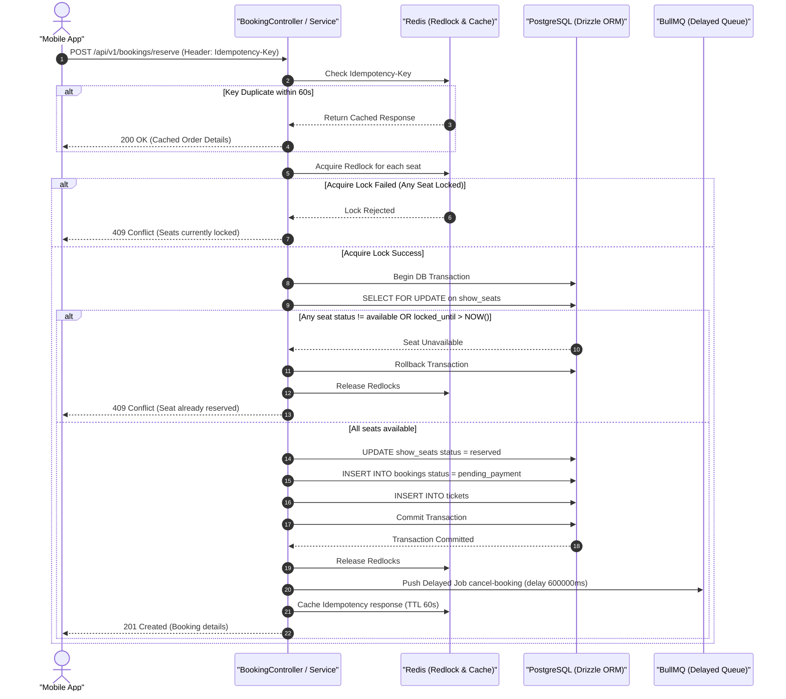

# Đặc Tả Thiết Kế Trang Trọng: Core Booking & Concurrency Control (Formal Spec)

## 1. TL;DR & Mục Tiêu (Objectives & Isolation Boundaries)

### 1.1 Scope & Goal

Đặc tả này định nghĩa hệ thống xử lý **Đặt Vé & Khóa Đồng Thời (Core Booking & Concurrency Control)** cho ứng dụng Đặt vé Rạp phim Độc lập (Standalone Cinema Ticket Booking App).

Hệ thống tập trung giải quyết bài toán Flash Sale / Tải cao khi hàng nghìn người dùng cùng đặt vé tại một suất chiếu (`showtime`), đảm bảo **100% không xảy ra giữ trùng ghế (Double-Booking)** hoặc **bán vượt số vé (Overselling)**, đồng thời giữ vững tính nhất quán dữ liệu bất đồng bộ.

### 1.2 Isolation Boundaries (Ranh Giới Cách Ly)

- **Thuộc Phạm Vi (In Scope):**
  - Giữ chỗ ghế có hạn giờ 10 phút (`POST /api/v1/bookings/reserve`).
  - Xác nhận thanh toán & chuyển trạng thái đặt vé (`POST /api/v1/bookings/confirm`).
  - Hủy giữ chỗ chủ động hoặc tự động quá hạn (`POST /api/v1/bookings/cancel`).
  - Chi tiết tích hợp SDK Cổng thanh toán (VNPay/MoMo Webhook) sẽ được đặc tả riêng trong tài liệu `Payment_Integration_Formal_Spec.md` ở giai đoạn tiếp theo (Phase Payment). Trong giai đoạn này, luồng Booking chỉ định nghĩa giao ước giả lập (mock interface) nhận kết quả thanh toán.
- **Ngoại Phạm Vi (Out of Scope):**
  - Quản lý danh mục rạp/phim (Movie & Cinema CRUD).

---

## 2. Hệ Thống Nguyên Tắc Bất Biến (System Invariants)

Bất kỳ mã nguồn triển khai nào cũng **BẮT BUỘC** tuân thủ 5 nguyên tắc bất biến sau:

| Mã Invariant | Tên Nguyên Tắc                           | Quy Tắc Chi Tiết                                                                                                                                                                                                                                                                                                     |
| :----------- | :--------------------------------------- | :------------------------------------------------------------------------------------------------------------------------------------------------------------------------------------------------------------------------------------------------------------------------------------------------------------------- |
| **`INV-1`**  | **Thời Gian & Giới Hạn**                 | - Thời gian giữ chỗ mặc định (`locked_until`) = **10 phút** kể từ thời điểm tạo `booking`.<br>- Tối đa **6 ghế** cho 1 lượt đặt vé (`maxSeatsPerBooking = 6`).                                                                                                                                                       |
| **`INV-2`**  | **Tính Toàn Vẹn & Idempotency**          | - **All-or-Nothing:** Nếu 1 ghế trong danh sách bị lỗi/kẹt, **Rollback 100%** toàn bộ đơn hàng.<br>- Request Header **BẮT BUỘC** chứa `Idempotency-Key` (UUIDv4/v7) cached 60 giây trong Redis.<br>- **Rate Limiting (Throttling):** Giới hạn tối đa **10 request/phút** cho mỗi IP/User qua `CustomThrottlerGuard`. |
| **`INV-3`**  | **Phòng Ngự 2 Lớp (Double Locking)**     | - **Lớp 1 (Redis Redlock):** Khóa siêu tốc trên RAM (`lock:show_seat:<id>`, TTL 2000ms).<br>- **Lớp 2 (PostgreSQL `SELECT ... FOR UPDATE`):** Khóa bi quan vật lý trong DB Transaction.                                                                                                                              |
| **`INV-4`**  | **Giao Ước Client & Mobile UX**          | - App hiển thị đếm ngược 10:00. Khi đếm về 00:00, App tự hủy giao dịch và quay về sơ đồ ghế.<br>- Nếu tranh chấp ghế thất bại, Backend trả lỗi `409 Conflict`, App cập nhật ghế đó sang màu xám.                                                                                                                     |
| **`INV-5`**  | **Sơ Đồ Trạng Thái Ghế (State Machine)** | - Ghế trải qua các trạng thái: `available` $\xrightarrow{\text{Reserve}}$ `reserved` $\xrightarrow{\text{Pay}}$ `booked`.<br>- Nếu hủy/quá hạn: `reserved` $\xrightarrow{\text{Cancel/Expire}}$ `available`. Không bao giờ nhảy trạng thái trái phép.                                                                |

---

## 3. Sơ Đồ Luồng Xử Lý Đồng Thời (Sequence Diagrams)

### 3.1 Luồng Giữ Chỗ Ghế (Reserve Seats Flow - Redlock + Pessimistic Lock)



---

## 4. Struct & DTO Specification (Inputs & Strict Types)

```typescript
// 1. DTO Giữ Chỗ (Reserve Seats Payload)
export class ReserveSeatsDto {
  showId!: string; // UUIDv7

  // Ràng buộc INV-1: Tối thiểu 1 ghế, tối đa 6 ghế
  seatIds!: string[]; // UUIDv7[] (min 1, max 6)

  voucherCode?: string; // Optional coupon code
}

// 2. Response Giữ Chỗ Thành Công (Actual Implemented Contract)
export class ReserveSeatsResponseDto {
  bookingId!: string;
  showId!: string;
  totalPrice!: number;
  status!: string;
  expiresAt!: string; // ISO 8601 Timestamp (now + 10 minutes)
  seats!: string[]; // Array of seat UUIDs
}
```

---

## 5. Danh Mục Mã Lỗi Chuẩn RFC 9457 (Problem Details Error Catalog)

| HTTP Status             | Type                              | Code / Title              | Message Detail                                                          |
| :---------------------- | :-------------------------------- | :------------------------ | :---------------------------------------------------------------------- |
| `400 Bad Request`       | `/errors/invalid-seat-limit`      | `EXCEED_MAX_SEATS`        | "You can only reserve up to 6 seats per booking."                       |
| `409 Conflict`          | `/errors/seat-already-reserved`   | `SEAT_UNAVAILABLE`        | "Seat A5 is already reserved or booked by another user."                |
| `409 Conflict`          | `/errors/lock-acquisition-failed` | `CONCURRENCY_LOCK_FAILED` | "High concurrency detected. Please try selecting your seats again."     |
| `410 Gone`              | `/errors/booking-expired`         | `BOOKING_EXPIRED`         | "Reservation time (10 minutes) has expired. Seats have been released."  |
| `429 Too Many Requests` | `/errors/too-many-requests`       | `TOO_MANY_REQUESTS`       | "Throttler limit exceeded. Maximum 10 reservation requests per minute." |

---

## 6. Lộ Trình Phục Hồi & Dọn Dẹp Ghế Trôi (Adversarial Matrix & Fail-Safe)

1. **BullMQ Worker Crash:**
   - Nếu tiến trình Worker bị đứt giữa chừng, **Backup Cron Job** sẽ chạy mỗi 5 phút với câu lệnh SQL:

     ```sql
     UPDATE show_seats
     SET status = 'available', locked_until = NULL
     WHERE status = 'reserved' AND locked_until < NOW();
     ```

2. **Double-Click/Spam Submit:**
   - Nhờ `Idempotency-Key` trên Header, request thứ 2 trong vòng 60 giây sẽ lập tức trả về kết quả đã cache mà không tạo ra 2 giao dịch trong DB.
   - Guard `CustomThrottlerGuard` tự động chặn bot/spam script vượt quá 10 request/phút bằng HTTP 429 `TOO_MANY_REQUESTS`.

## 7. Execution Deviations & Discovered Fixes

Trong quá trình triển khai và kiểm thử nghịch bản (Adversarial Validation), các điều chỉnh & sửa lỗi sau đã được ghi nhận và áp dụng để đảm bảo tuyệt đối tính toàn vẹn của System Invariants (`INV-1` đến `INV-5`):

1. **`BUG-1` (CRITICAL - `BookingCancellationProcessor`)**: Loại bỏ lệnh update điều kiện thứ 2 không cần thiết trong processor để tránh ghi đè trạng thái do tranh chấp thời gian (TOCTOU status overwrite).
2. **`BUG-3` (CRITICAL - `BookingCronService`)**: Cập nhật tiến trình Cron dọn dẹp chạy trong DB Transaction, đồng thời chuyển trạng thái đơn đặt vé `pending_payment` tương ứng sang `expired`.
3. **`EDGE-D1-D` (CRITICAL - `BookingService`)**: Xử lý trường hợp biên ghế có trạng thái `reserved` nhưng `lockedUntil` là `NULL` — được đối xử như không khả dụng để chống trôi ghế và lặp giữ chỗ.
4. **Black-Box OpenAPI Schema Generation**: Thêm `scripts/generate-openapi-types.ts` để tự động sinh `test/generated/api-schema.d.ts` từ Swagger spec của NestJS. Refactor `test/integration/booking.spec.ts` dùng trực tiếp type từ OpenAPI schema thay cho các interface gõ tay thủ công.
5. **Config & Rate-Limiting Enablement**: Thêm cờ `ENABLE_RATE_LIMIT` vào `src/env.ts` và cập nhật `CustomThrottlerGuard` (`if (env.NODE_ENV !== "production" && !env.ENABLE_RATE_LIMIT) return true;`) để hỗ trợ kiểm thử HTTP 429 ở môi trường Test.
6. **ESLint Global Ignores**: Cập nhật `eslint.config.ts` bổ sung `"test/generated/**"` vào `globalIgnores`.

## 8. Next Steps & Approval

- [x] Đã hoàn thành thảo luận và thống nhất 5 Nguyên tắc Bất biến (`INV-1` -> `INV-5`).
- [x] Đã hoàn thành kiểm duyệt nội dung bản đặc tả `Booking_Core_Concurrency_Formal_Spec.md`.
- [x] Đã triển khai và nghiệm thu 100% mã nguồn, DTO UUIDv7, Throttling Rate Limit, và RFC 9457 Swagger OpenAPI spec.
