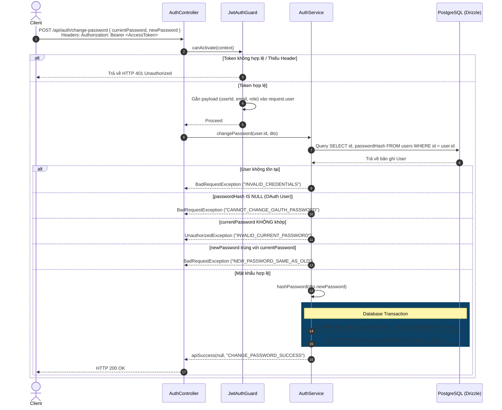

# Change Password API (`POST /api/auth/change-password`) - Plan

Date: 24-07-26  
Complexity: Simple  
Status: ✅ COMPLETED

## Overview

Implement the authenticated `POST /api/auth/change-password` endpoint in NestJS for the ticket-booking system, allowing logged-in users to update their password from profile settings. This plan enforces password complexity rules, current password verification, global session revocation (deleting all active refresh tokens), OAuth account protection (`passwordHash IS NULL`), and comprehensive unit & E2E integration test coverage. For overall codebase structure, conventions, and routing rules, see `process/context/all-context.md`.

## Goals and Success Metrics

**Goals:**

- Implement `POST /api/auth/change-password` protected by `JwtAuthGuard`.
- Support extracting authenticated user context via `@CurrentUser()` decorator.
- Validate payload with `ChangePasswordDto` (currentPassword, newPassword min 8 chars, 1 uppercase, 1 digit).
- Verify `currentPassword` against stored `passwordHash` using `comparePassword()`.
- Enforce business constraint `newPassword !== currentPassword`.
- Reject OAuth accounts without a password (`passwordHash IS NULL`) with `auth.CANNOT_CHANGE_OAUTH_PASSWORD`.
- Execute atomic DB transaction to update `passwordHash` and hard-delete all `refresh_tokens` for the user.
- Provide full unit test coverage and E2E integration tests in `test/integration/auth.spec.ts`.

**Success Metrics:**

- All unit tests in `src/modules/auth/` pass 100%.
- All E2E integration tests in `test/integration/auth.spec.ts` pass 100%.
- TypeScript check (`bun run check-types`) passes with 0 errors.

## Scope

**In-Scope:**

- `src/common/guards/jwt-auth.guard.ts`
- `src/common/decorators/current-user.decorator.ts`
- `src/modules/auth/dto/change-password.dto.ts`
- `src/modules/auth/dto/index.ts`
- `src/modules/auth/auth.routes.ts`
- `src/modules/auth/auth.service.ts`
- `src/modules/auth/auth.controller.ts`
- `src/i18n/{en,vi}/auth.json`
- `src/generated/i18n.generated.ts`
- `src/modules/auth/auth.service.spec.ts`
- `src/modules/auth/auth.controller.spec.ts`
- `test/integration/auth.spec.ts`

**Out-of-Scope:**

- Set password API for OAuth users (`POST /api/auth/set-password`).
- Password history table or multi-factor authentication (MFA).

## Design Specification

### 1. Work Breakdown Structure (WBS Table)

| Mã WBS    | Thành Phần / Chức Năng      | Mô Tả Chi Tiết / Nhiệm Vụ                                                         | Output / Artifact                                 |
| :-------- | :-------------------------- | :-------------------------------------------------------------------------------- | :------------------------------------------------ |
| **1.0**   | **Auth Module**             | Quản lý xác thực và phân quyền tài khoản                                          | `src/modules/auth`                                |
| **1.1**   | **Change Password Feature** | Chức năng đổi mật khẩu người dùng                                                 | `POST /api/auth/change-password`                  |
| **1.1.1** | **Auth & Guard Layer**      | Xác thực Token & trích xuất User Context                                          | `JwtAuthGuard`, `@CurrentUser()`                  |
| 1.1.1.1   | Access Token Verification   | Extracted từ Header `Authorization: Bearer <token>`, verify bằng `JwtService`     | `src/common/guards/jwt-auth.guard.ts`             |
| 1.1.1.2   | User Context Decorator      | Trích xuất thông tin user từ `request.user`                                       | `src/common/decorators/current-user.decorator.ts` |
| **1.1.2** | **Input DTO & Validation**  | Validate dữ liệu mật khẩu hiện tại và mật khẩu mới                                | `ChangePasswordDto`                               |
| 1.1.2.1   | Payload Field Validation    | Kiểu dữ liệu, độ dài tối thiểu (8 chars), chữ hoa, chữ số                         | `src/modules/auth/dto/change-password.dto.ts`     |
| 1.1.2.2   | Multi-language Messages     | Ánh xạ lỗi Validation qua `nestjs-i18n`                                           | `src/i18n/{en,vi}/auth.json`                      |
| **1.1.3** | **Business Logic & Crypto** | Xử lý đối soát mật khẩu & cập nhật mã hóa                                         | `AuthService.changePassword()`                    |
| 1.1.3.1   | Verify Current Password     | So sánh `currentPassword` với DB `passwordHash` qua `comparePassword()`           | `src/common/utils/crypto.util.ts`                 |
| 1.1.3.2   | Password Change Rules       | Chống dùng lại mật khẩu mới trùng mật khẩu cũ (`newPassword !== currentPassword`) | `AuthService` logic                               |
| 1.1.3.3   | OAuth User Restriction      | Chặn tài khoản OAuth chưa có `passwordHash` (`CANNOT_CHANGE_OAUTH_PASSWORD`)      | `AuthService` logic                               |
| 1.1.3.4   | Atomic DB Transaction       | Cập nhật `passwordHash` và xoá toàn bộ `refresh_tokens` trong 1 transaction       | `src/database/schemas/auth.schema.ts`             |
| **1.1.4** | **Session Invalidation**    | Thu hồi toàn bộ phiên đăng nhập cũ trên mọi thiết bị                              | Global Session Revocation                         |
| 1.1.4.1   | Delete Refresh Tokens       | Execute `DELETE FROM refresh_tokens WHERE user_id = :userId`                      | DB Table `refresh_tokens`                         |
| **1.1.5** | **Testing & Verification**  | Unit tests & E2E Integration tests                                                | `auth.service.spec.ts`, `auth.spec.ts`            |

### 2. Sequence Flow



### 3. Translation Key Contracts (`src/i18n/{en,vi}/auth.json`)

- `CHANGE_PASSWORD_SUCCESS`:
  - **en**: `"Password has been changed successfully. All other active sessions have been logged out."`
  - **vi**: `"Đổi mật khẩu thành công. Tất cả các phiên đăng nhập khác đã được đăng xuất."`
- `INVALID_CURRENT_PASSWORD`:
  - **en**: `"Current password is incorrect."`
  - **vi**: `"Mật khẩu hiện tại không chính xác."`
- `NEW_PASSWORD_SAME_AS_OLD`:
  - **en**: `"New password cannot be the same as the current password."`
  - **vi**: `"Mật khẩu mới không được trùng với mật khẩu hiện tại."`
- `CANNOT_CHANGE_OAUTH_PASSWORD`:
  - **en**: `"OAuth accounts do not have a password set. Please use the Set Password feature."`
  - **vi**: `"Tài khoản đăng nhập bằng mạng xã hội chưa thiết lập mật khẩu tài khoản. Vui lòng sử dụng tính năng Tạo mật khẩu."`

## Functional Requirements

1. **JwtAuthGuard**: Intercept requests to protected endpoints, verify JWT `Bearer` token using `JwtService.verifyAsync()`, attach payload to `request.user`.
2. **@CurrentUser()**: Extract user payload from `ExecutionContext`.
3. **ChangePasswordDto**: Validate `currentPassword` and `newPassword` using `class-validator` rules.
4. **AuthService.changePassword**: Verify current password, validate business rules, hash new password, run atomic DB transaction to update user password and delete all active refresh tokens.
5. **E2E Integration Testing**: Full Supertest scenario in `test/integration/auth.spec.ts`.

## Acceptance Criteria

1. ✅ `POST /api/auth/change-password` requires valid `Bearer` Access Token; returns 401 when missing or invalid.
2. ✅ Returning 401 when `currentPassword` does not match DB `passwordHash`.
3. ✅ Returning 400 when `newPassword` equals `currentPassword`.
4. ✅ Returning 400 when OAuth user (`passwordHash = null`) attempts to change password.
5. ✅ Returning 200 OK upon successful password change and updating `passwordHash` in DB.
6. ✅ All `refresh_tokens` for the user are deleted in DB upon successful password change.
7. ✅ Login with old password fails after password change; login with new password succeeds.
8. ✅ `bun test src/modules/auth/` unit tests pass 100%.
9. ✅ `bun run test:e2e` integration tests pass 100%.
10. ✅ `bun run check-types` reports 0 TypeScript errors.

## Implementation Checklist

### Phase 1: Authentication Infrastructure & DTO Scaffolding

- [x] Task 1.1: Implement `@CurrentUser()` decorator in `src/common/decorators/current-user.decorator.ts`.
- [x] Task 1.2: Implement `JwtAuthGuard` in `src/common/guards/jwt-auth.guard.ts`.
- [x] Task 1.3: Create `ChangePasswordDto` in `src/modules/auth/dto/change-password.dto.ts` and export in `src/modules/auth/dto/index.ts`.
- [x] Task 1.4: Add `CHANGE_PASSWORD: "change-password"` to `AUTH_ROUTES` in `src/modules/auth/auth.routes.ts`.
- [x] Task 1.5: Add translation strings in `src/i18n/{en,vi}/auth.json` and run `bun run i18n:generate`.

### Phase 2: Core Business Logic & Controller Integration

- [x] Task 2.1: Implement `AuthService.changePassword()` with DB transaction updating `passwordHash` and deleting `refresh_tokens`.
- [x] Task 2.2: Implement `@Post(AUTH_ROUTES.CHANGE_PASSWORD)` endpoint in `AuthController` protected with `@UseGuards(JwtAuthGuard)`.

### Phase 3: Unit Testing

- [x] Task 3.1: Write unit tests in `src/modules/auth/auth.service.spec.ts` for all change-password service branches.
- [x] Task 3.2: Write unit tests in `src/modules/auth/auth.controller.spec.ts` for controller endpoint.

### Phase 4: E2E Integration Testing (Supertest)

- [x] Task 4.1: Add E2E integration test suite in `test/integration/auth.spec.ts`:
  - **Happy Path**: Register user $\rightarrow$ Login $\rightarrow$ Change password $\rightarrow$ Assert 200 OK $\rightarrow$ Assert old refresh token deleted $\rightarrow$ Assert login succeeds with new password.
  - **Unauthorized**: Call without token $\rightarrow$ Assert 401.
  - **Wrong Password**: Call with incorrect `currentPassword` $\rightarrow$ Assert 401.
  - **Same Password**: Call with `newPassword === currentPassword` $\rightarrow$ Assert 400.
  - **OAuth User**: Create OAuth user (`passwordHash = null`) $\rightarrow$ Call change-password $\rightarrow$ Assert 400.
- [x] Task 4.2: Execute `bun test src/` and `bun run test:e2e` to verify 100% pass rate.

## Touchpoints

- `src/common/guards/jwt-auth.guard.ts`
- `src/common/decorators/current-user.decorator.ts`
- `src/modules/auth/dto/change-password.dto.ts`
- `src/modules/auth/dto/index.ts`
- `src/modules/auth/auth.routes.ts`
- `src/modules/auth/auth.service.ts`
- `src/modules/auth/auth.controller.ts`
- `src/i18n/{en,vi}/auth.json`
- `src/generated/i18n.generated.ts`
- `src/modules/auth/auth.service.spec.ts`
- `src/modules/auth/auth.controller.spec.ts`
- `test/integration/auth.spec.ts`

## Public Contracts

### API Endpoint Specification

- **Method**: `POST`
- **Path**: `/api/auth/change-password`
- **Headers**: `Authorization: Bearer <AccessToken>`
- **Request Body**:

  ```json
  {
    "currentPassword": "OldPassword123!",
    "newPassword": "NewSecurePassword456!"
  }
  ```

- **Responses**:
  - `200 OK`: `{ "success": true, "data": null }`
  - `400 Bad Request`: Validation failure OR `newPassword === currentPassword` OR OAuth user without password.
  - `401 Unauthorized`: Missing/invalid token OR incorrect `currentPassword`.
  - `429 Too Many Requests`: Throttled.

## Blast Radius

- **Security Domain**: Introduces `JwtAuthGuard` used across protected endpoints.
- **Database Operations**: `DELETE FROM refresh_tokens WHERE user_id = :userId` revokes all active refresh tokens for the specific user.

## Verification Evidence

- Refer to testing procedures in `process/context/tests/all-tests.md`.
- **Unit Tests**: `bun test src/modules/auth/`
- **E2E Integration Tests**: `bun run test:e2e`
- **Type Check**: `bun run check-types`

## Phase Completion Rules

- Each phase checklist item must be verified with tests before proceeding to the next phase.
- Code implementation must pass both unit tests and E2E integration tests before claiming completion.

## Resume and Execution Handoff

- **Selected Plan Path**: `process/general-plans/completed/change_password_PLAN_24-07-26.md`
- **Current State**: ✅ COMPLETED - Implementation & integration test verification completed successfully.
- **Next Instruction**: Plan archived to `completed/`. Proceed with git commit checkpoints.

## Next Steps

Feature implementation completed and verified (114 unit tests passing, E2E integration passing, 0 typecheck errors). Ready for conventional git commit checkpoint.
